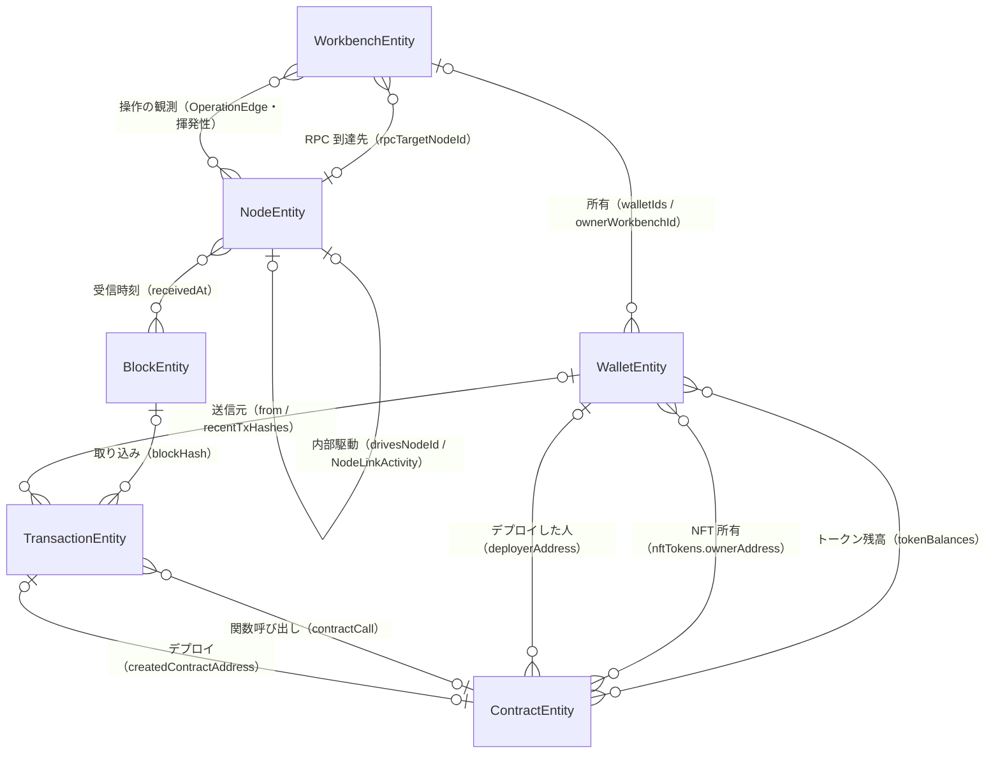
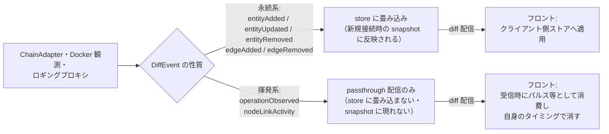
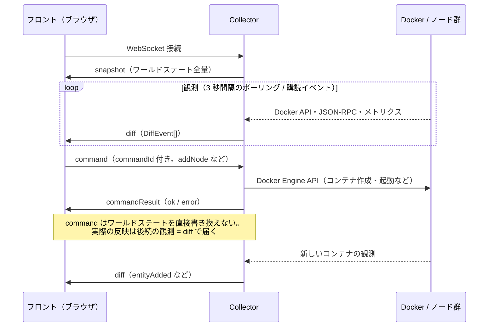
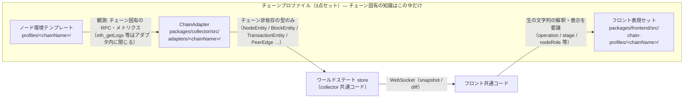
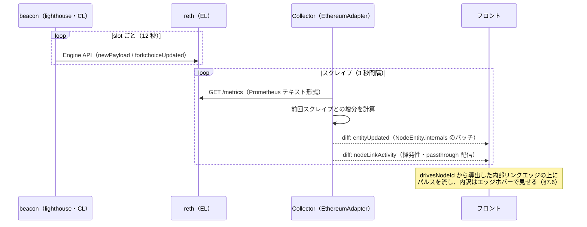

# chainviz アーキテクチャ設計

`docs/CONCEPT.md` の決定事項を実装可能な形に落とし込んだもの。
実装はこのドキュメントの記述に従う。コードとの齟齬は sync-docs スキルで検知する。

## 1. リポジトリ構成

pnpm workspace によるモノレポ。4パッケージ（`shared` / `collector` /
`frontend` / `e2e`）に分割し、`shared` の型を残る 3 パッケージから
参照することで、ワールドステートのスキーマを二重定義しない。

```
chainviz/
  pnpm-workspace.yaml
  tsconfig.base.json
  package.json
  packages/
    shared/          # ワールドステートの型・プロトコル・ChainProfile の型
    collector/        # バックエンド（観察 + 操作）
    frontend/          # GUI（React Flow キャンバス）
    e2e/               # E2E 結合テスト（collector を実 Docker と疎通させて検証）
  profiles/
    ethereum/          # チェーンプロファイル: ノード環境テンプレート（compose）
  glossary/            # 用語解説データ（CONCEPT.md「データの置き場所」参照）
    ethereum/terms/
    services.yaml
    sources.yaml
    cross-chain.yaml
  scripts/             # 開発用の一括起動・停止スクリプト（dev-up.sh / dev-down.sh）
  docs/
```

各パッケージ内部は技術レイヤーではなくドメイン単位でモジュールを切る
（CLAUDE.md の方針）。

**各パッケージ内部のモジュール構成（ディレクトリ単位の責務一覧）は、
各パッケージ直下の README.md を正とし、本ドキュメントでは繰り返さない**
（Issue #223。コードから遠い場所に詳細を重複して置くと乖離するため。実際に
本節にあった旧記載は frontend の `operations/` 追加を反映できておらず、
実在しない `adapters/chain-adapter.ts` を載せたままになっていた）:

- [`packages/shared/README.md`](../packages/shared/README.md)
- [`packages/collector/README.md`](../packages/collector/README.md)
- [`packages/frontend/README.md`](../packages/frontend/README.md)
- [`packages/e2e/README.md`](../packages/e2e/README.md)
- [`profiles/ethereum/README.md`](../profiles/ethereum/README.md)

ドキュメントの役割分担: `docs/CONCEPT.md` = 決定事項と「なぜ」（原典）、
本ドキュメント = パッケージ間の契約（スキーマ・プロトコル・チェーン
プロファイル 3 点セット・E2E 構成）と横断的な設計判断、パッケージ README =
そのパッケージの「今どうなっているか」（役割・境界・モジュール構成・
実行方法）、`docs/worklog/` = 作業の経緯。

## 2. ワールドステートのスキーマ

チェーン非依存の語彙で設計する（CONCEPT.md「ChainAdapter」参照）。
`packages/shared/src/world-state/` に型として定義する。

### エンティティ

```ts
type ChainType = "ethereum"; // 今後 "bitcoin" | "solana" | "cosmos" を追加

interface InfraEntity {
  id: string; // 安定識別子。Docker コンテナ ID は使わない（再起動で変わるため）
  containerName: string;
  ip: string;
  ports: number[];
  resources: { cpuPercent: number; memMB: number };
  process: { name: string; version?: string };
  // collector の addNode/addWorkbench で作成されたコンテナなら true。
  // compose 起動時からある初期構成のコンテナは removeNode/removeWorkbench が
  // 拒否するため false。省略時は false（削除不可）と同義で、フロントは true の
  // ときだけ削除 UI を出す。collector は managed ラベル（Issue #65 の
  // 「Docker のラベルを単一の真実の情報源とする」方針）から値を導出する
  removable?: boolean;
}

interface NodeEntity extends InfraEntity {
  kind: "node";
  chainType: ChainType;
  clientType: string; // "reth" | "lighthouse" など
  // チェーン先端への追従状態。判定方法はチェーン・役割ごとに ChainAdapter が
  // 決める（Ethereum の EL は同期チェックポイントの他ノード比較＝Issue #187、
  // CL は Beacon API の自己申告＝Issue #274。詳細は §7.3）
  syncStatus: "syncing" | "synced";
  // チェーン先端への追従の進み具合を表す高さ。単位・意味づけは役割に応じて
  // チェーンプロファイルが決める（Ethereum の EL はブロック高、CL はヘッド
  // スロット。Issue #274）。役割の異なるノード間で直接比較・集計しない。
  // 表示ラベルもフロントのチェーンプロファイル表現セットが役割で選ぶ
  blockHeight: number;
  // このノードが現在チェーン先端（tip）と認識しているブロックのハッシュ。
  // 観測方法はチェーン・役割ごとに ChainAdapter が決める（Ethereum は EL の
  // newHeads 最新値。CL には同じ論理ノードの EL の tip をエイリアスとして
  // 載せる＝Issue #141 と同じ扱い）。未観測は空文字列（validator 等）。
  // フォークの色分け（§9・Issue #296）はこの値でノードをグルーピングする。
  // blockHeight とは情報源・更新タイミングが異なるため同一時点の観測として
  // 突き合わせない（tip の高さ・親子関係はこのハッシュで BlockEntity を引く)
  headBlockHash: string;
  // P2P ネットワーク上の役割。"bootnode" = 新規参加ノードが最初に接続する
  // 入口役、"peer" = それ以外の通常ピア、"none" = P2P ネットワークに参加
  // しないノード（Issue #214。例: Ethereum の validator client。beacon へ
  // HTTP API で接続するだけで libp2p に参加しないため、これを端点とする
  // PeerEdge は決して観測されない）。bootnode はチェーン非依存の P2P
  // 一般語彙として使う（Bitcoin の seed node 等も同系概念）。collector は
  // Docker ラベル `com.chainviz.p2p-role`（値 "bootnode" のときのみ
  // bootnode）と ChainAdapter 内の分類（Ethereum アダプタは
  // `com.chainviz.role` ラベルの値が厳密に "validator" と一致するコンテナを
  // "none" と判定。Issue #246。旧実装は compose サービス名への "validator"
  // 部分一致だった＝Issue #214）から導出し、
  // どちらにも該当しなければ peer とする（Issue #65 の「ラベルを単一の
  // 真実の情報源とする」方針。Ethereum プロファイルでは compose で
  // reth1/beacon1 にラベルを付与する）。省略時は「不明」（旧スナップ
  // ショット互換）で、フロントは p2pRole === "bootnode" の判定のみ行い、
  // 見つからなければブートノード前提の表示を出さない（Issue #123 / #124）。
  // "none" のノードは「接続確立中」エッジ（Issue #123/#124）の導出対象から除外する
  p2pRole?: "bootnode" | "peer" | "none";
  // ノードの役割（チェーン動作の中で何をする係か。Issue #215）。値はチェーン
  // プロファイル依存の生の文字列（Ethereum では "execution" / "consensus" /
  // "validator"）で、解釈・表示はフロントのチェーンプロファイル表現セット
  // （`chain-profiles/ethereum/nodeRoles.ts`）の責務（OperationEdge.operation /
  // SyncStageProgress.stage と同じパターン。union 型に焼き込まない）。
  // collector は Docker ラベル `com.chainviz.role`（既存。addNode の動的
  // コンテナには lifecycle が付与済み、compose の静的コンテナにはノード環境
  // テンプレートが付与する）から導出する（Issue #65 のラベル方針）。
  // p2pRole とは別軸（validator client は nodeRole="validator" かつ
  // p2pRole="none"）。省略 = 不明（ラベル未付与・旧スナップショット互換）で、
  // フロントは役割表示を出さない側に倒す。表現セットに無い未知の値も同様
  nodeRole?: string;
  // D層: このノードが内部 API で駆動する相手ノード（同じ論理ノードを構成する
  // 相方クライアント）の id。チェーン固有語彙はスキーマに持ち込まず
  // 「駆動する側→される側」の一般関係だけを載せる。Ethereum プロファイル
  // では 2 種類の関係に入る: beacon（CL）→ Execution（EL）の Engine API
  // 駆動（Issue #186）と、validator → beacon の Beacon API 接続
  // （Issue #285）。役割の組ごとの意味づけ・文言は端点の nodeRole を見て
  // フロントのチェーンプロファイル表現セットが決める。
  // collector がインフラ観測から毎回解決する（rpcTargetNodeId と同じ考え方）。
  // 駆動関係を持たない・解決不能・旧スナップショットでは省略。フロントは
  // この値から常設の「内部リンク」エッジを導出して描画する（§7）
  drivesNodeId?: string;
  // D層: ノード内部の観測状態。メトリクス非公開・観測前・旧スナップショット
  // では省略（省略 = 情報なし）
  internals?: NodeInternals;
}

// ノード内部の同期ステージ 1 件の進行状況（D層）。stage はクライアント依存の
// 生の識別子（例: reth の "Headers"）で、解釈・表示はフロントのチェーン
// プロファイル表現セットの責務（OperationEdge.operation と同じ扱い）
interface SyncStageProgress {
  stage: string;
  checkpoint: number; // そのステージが処理を終えたブロック高
}

// ノード内部の観測状態（D層）。各フィールドは「そのノードが該当する内部構造を
// 持ち、かつ観測できた場合」のみ入る。Ethereum プロファイルでは EL（reth）
// ノードのみが syncStages / mempool を持ち、CL では internals 自体が省略される
interface NodeInternals {
  syncStages?: SyncStageProgress[];
  // このノードローカルの mempool の内訳（pending = 次のブロックに入れる tx 数、
  // queued = 前提条件待ちで保留中の tx 数）
  mempool?: { pending: number; queued: number };
}

interface WorkbenchEntity extends InfraEntity {
  kind: "workbench";
  label: string; // "Alice" 等、ユーザーが付ける表示名
  walletIds: string[]; // 所有ウォレット（基本は 1 件。CONCEPT.md 案B）
  // このワークベンチの RPC 呼び出しが最終的に届くノードのエンティティ id。
  // collector が実効的な RPC 到達先ホスト（ロギングプロキシの転送先
  // CHAINVIZ_PROXY_TARGET の host 部）をノードの ip と突き合わせて解決する
  // （operationObserved の toNodeId 解決と同じ考え方）。解決できない場合と
  // 旧スナップショットでは省略（null は使わず「無い」を省略に一本化）。
  // フロントは常設の「操作先」エッジ・カード詳細の表示に使う（Issue #123）
  rpcTargetNodeId?: string;
}

interface PeerEdge {
  kind: "peer";
  fromNodeId: string;
  toNodeId: string;
  networkId: string;
}

// ワークベンチ → ノードの 1 回の呼び出し（操作）を表すエッジ。
// PeerEdge のような永続的な接続状態ではなく「観測された瞬間の出来事」
// （揮発性）なので、スナップショットには含めず、差分イベント
// operationObserved でのみ流れる（後述）。
interface OperationEdge {
  kind: "operation";
  fromWorkbenchId: string; // 呼び出し元ワークベンチのエンティティ id
  toNodeId: string; // 呼び出し先ノードのエンティティ id
  operation: string; // 呼び出しの種類（JSON-RPC メソッド名などの生の文字列）
  observedAt: number; // ロギングプロキシが観測した時刻（epoch ms）
  // レスポンス観測（Issue #352）。プロキシが転送先のレスポンスから判定
  // できた場合のみ入る（省略 = 判定不能）。"error" はエラー応答・転送失敗
  // の両方を含む。判定の具体規則（JSON-RPC の error フィールド等）は
  // collector のプロキシ側の責務で、この型はプロトコル非依存の語彙のみ持つ
  outcome?: "ok" | "error";
  // 所要時間（ms）。リクエスト受領完了 → 転送先レスポンス受領完了まで。
  // バッチリクエストでは同一バッチ内の全呼び出しが同じ値を共有する
  durationMs?: number;
}

// キャンバス上でエッジ（紐）として描画されるものの総称
type WorldStateEdge = PeerEdge | OperationEdge;

// 内部 API 呼び出し 1 種類ぶんの観測値（D層）。呼び出し 1 回ごとの離散イベント
// ではなく、観測間隔（メトリクスのスクレイプ周期）内の増分として観測される点が
// OperationEdge と異なる。method はチェーン/クライアント依存の生の識別子
// （例: "engine_newPayload"）で、解釈・表示はフロントの表現セットの責務
interface InternalCallStats {
  method: string;
  count: number; // 観測間隔内に増えた呼び出し回数（増分ゼロの種類は載せない）
  latencyMs?: number; // 所要時間の代表値。クライアントが公開し観測できた場合のみ
}

// 駆動リンク（NodeEntity.drivesNodeId）上で観測された呼び出し活動（揮発性）。
// OperationEdge と同じくスナップショットには含めず、差分イベント
// nodeLinkActivity でのみ流れる（後述）
interface NodeLinkActivity {
  fromNodeId: string; // 駆動する側（drivesNodeId を持つ側）
  toNodeId: string; // 駆動される側
  calls: InternalCallStats[];
  observedAt: number; // 観測した時刻（epoch ms）
}

interface TokenBalance {
  contractAddress: string; // トークンを管理する ContractEntity.address に対応
  amount: string; // トークン最小単位の 10 進文字列（精度落ち防止）
}

interface WalletEntity {
  kind: "wallet";
  address: string;
  chainType: ChainType;
  balance: string; // wei を文字列で（精度落ち防止）
  nonce: number;
  isSmartAccount: boolean;
  ownerWorkbenchId: string | null; // ワークベンチ削除後も null にして残す（CONCEPT.md 参照）
  recentTxHashes: string[];
  // 追跡中のトークンコントラクト（コントラクトカタログ掲載分）の残高一覧。
  // symbol / decimals は対応する ContractEntity.token が持ち、ここでは重複させない。
  // トークン未デプロイの環境・旧スナップショットでは省略（省略 = 情報なし）
  tokenBalances?: TokenBalance[];
}

// collector の store は block を無制限には保持せず、観測済み最大ブロック番号
// から一定件数（既定 32。§9.2）の窓に入るものだけを残す。窓から外れた block は
// entityRemoved として配信される（フロントのチェーンリボン表示は直近 8 件を
// 使うため、それより十分大きい窓で足りる。CONCEPT.md「直近のブロック数件分＋
// その伝播タイミングだけを持たせる」方針の具体化。Issue #298）
interface BlockEntity {
  kind: "block";
  hash: string;
  number: number;
  parentHash: string;
  timestamp: number;
  receivedAt: Record<string /* nodeId */, number /* epoch ms */>; // 伝播の波アニメーション用
}

// 復号済みの引数 1 件。値は表示用に文字列化して持つ（大きな数値の精度落ち
// 防止と、チェーンごとの型体系をスキーマに持ち込まないため）
interface DecodedArgument {
  name: string;
  value: string;
}

// tx によるコントラクト関数呼び出しの内容。関数名・引数はコントラクト
// カタログ（後述 §4）で復号できた場合のみ入る。復号できない呼び出しは
// rawFunctionId（チェーン依存の生の識別子。EVM なら 4 バイトセレクタ）だけを
// 持ち、解釈・表示は OperationEdge.operation と同じくフロントのチェーン
// プロファイル表現セットの責務とする
interface ContractCall {
  contractAddress: string;
  functionName?: string;
  args?: DecodedArgument[];
  rawFunctionId?: string;
}

// tx の実行中にコントラクトが発したイベント（ログ）1 件。復号できない
// イベントは rawEventId（EVM なら topic0）だけを持つ
interface ContractEvent {
  contractAddress: string;
  eventName?: string;
  args?: DecodedArgument[];
  rawEventId?: string;
}

interface TransactionEntity {
  kind: "transaction";
  hash: string;
  from: string;
  to: string | null;
  status: "pending" | "included" | "failed";
  blockHash?: string;
  // この tx が使った送信元アカウントの通し番号（送信順序。WalletEntity.nonce
  // は「次に使う値」、こちらは「この tx が消費した値」）。アダプタが tx 本体を
  // 観測できた場合のみ入る（Ethereum アダプタでは pending 検知時の詳細取得
  // から。取り込みだけを観測した tx では receipt 相当に含まれないため省略
  // されることがある。contractCall と同じ性質）。省略 = 情報なしで、フロントは
  // nonce 表示を出さない側に倒す。0 は「最初の送信」の意味ある観測値（Issue #319）
  nonce?: number;
  // 追跡中のコントラクト宛てで、入力データを観測できた場合のみ（pending を
  // 経ずに取り込みだけを観測した tx では省略されることがある。その場合も
  // フロントは to と ContractEntity.address の照合で「コントラクト宛て」の
  // 判定はできる）
  contractCall?: ContractCall;
  // この tx がコントラクトを新規作成（デプロイ）した場合の作成先アドレス
  createdContractAddress?: string;
  // 取り込み確定後（included / failed）にのみ入る
  contractEvents?: ContractEvent[];
}

// カタログ同梱コントラクトのソースコード（表示用。Issue #321）。ABI と違い
// 表示用の不透明なテキストなので、フロントへ渡しても ChainAdapter 境界
// （復号ロジックをアダプタ内に閉じる）は破らない。language は生の識別子で、
// 解釈（シンタックスハイライト方式）はフロントの表現セットの責務
interface ContractSourceCode {
  fileName: string; // 表示用のファイル名（例: "ChainvizToken.sol"）
  language: string; // 例: "solidity"。表現セットが知らない値はプレーン表示
  code: string; // ソース全文
}

// NFT（非代替トークン）1 個の所有記録（Issue #315）。TokenBalance（数量の
// 残高）では表現できない「固有の個体 ID を持つトークンと所有者の 1 対 1
// 対応」を表す。所有台帳はコントラクトの内部状態なので、ウォレット側では
// なく ContractEntity.nftTokens に載せる（ウォレット単位の保有一覧は
// フロントが台帳から導出する。§13）
interface NftToken {
  tokenId: string; // 個体識別子。uint256 全域を表せるよう 10 進文字列
  // 現在の所有者。チェーン側の生の表記（Ethereum アダプタでは小文字正規化
  // 済み）。WalletEntity.address（EIP-55 表記になりうる）との照合は
  // 大文字小文字を無視して行う（TransactionEntity.from と同じ扱い）
  ownerAddress: string;
}

// チェーン上にデプロイされたスマートコントラクト。特定の 1 ノードの中で
// 動くものではなく「チェーンに複製され、全ノードが同じ実行をするプログラム」
// であり、WalletEntity と同じくチェーン側の状態なので、ノード・ワークベンチの
// 削除とは無関係に、一度現れたら削除しない
interface ContractEntity {
  kind: "contract";
  address: string;
  chainType: ChainType;
  name?: string; // カタログで特定できた場合の表示名。無ければ「未知のコントラクト」
  catalogKey?: string; // チェーンプロファイルのコントラクトカタログ上のキー
  deployerAddress?: string; // デプロイを観測できた場合のみ
  createdByTxHash?: string; // デプロイを観測できた場合のみ
  token?: { symbol: string; decimals: number }; // トークンコントラクトの表示メタ情報
  // NFT コントラクトの表示メタ情報（Issue #315）。token（数量ベース）とは
  // 別軸で、数量に decimals の解釈が無いため symbol のみ。カタログで NFT と
  // 特定できた場合のみ入る
  nft?: { symbol: string };
  // 発行済み NFT の所有台帳（tokenId 昇順。Issue #315）。nft メタ情報を持つ
  // 追跡中のコントラクトについて ChainAdapter が所有者を照会できた場合のみ。
  // 省略 = 情報なし、空配列 = 観測できたが未発行（tokenBalances と同じ区別）
  nftTokens?: NftToken[];
  // カタログ同梱のソースコード。カタログで特定できた場合のみ。省略 = ソースが
  // 手元に無い（未知のコントラクト等）で、フロントはその旨を明示する（§12）
  sourceCode?: ContractSourceCode;
}

// AA（発展）
interface UserOperationEntity {
  kind: "userOperation";
  hash: string;
  sender: string; // Smart Account アドレス
  status: "altMempool" | "bundled" | "included";
}
```

エンティティ間の主要な参照関係を図にすると次のとおり（関係名の括弧内は
対応するフィールド・エッジ型。`UserOperationEntity`（AA・発展）は未実装の
ため省略）。「操作の観測」「内部駆動の活動」は揮発性（スナップショットに
現れない。差分イベントの節を参照）:



### 差分イベント（`packages/shared/src/events/`）

```ts
type DiffEvent =
  | { type: "entityAdded"; entity: WorldStateEntity }
  | { type: "entityUpdated"; id: string; patch: Partial<WorldStateEntity> }
  | { type: "entityRemoved"; id: string }
  | { type: "edgeAdded"; edge: PeerEdge }
  | {
      type: "edgeRemoved";
      fromNodeId: string;
      toNodeId: string;
      networkId: string; // エッジの同一性キーは from/to/networkId の 3 つ組
    }
  | { type: "operationObserved"; edge: OperationEdge }
  | { type: "nodeLinkActivity"; activity: NodeLinkActivity };
```

イベントは「store の状態に畳み込まれる永続系」と「配信のみで消費される
揮発系」の 2 系統に大別される（各イベントの詳細は後述の箇条書き）:



エンティティ削除時の扱いは CONCEPT.md の決定に従う: `NodeEntity` /
`WorkbenchEntity` は `entityRemoved` で消えるが、`WalletEntity` /
`ContractEntity` はチェーン側の状態なので削除しない（ウォレットは
`ownerWorkbenchId` を `null` に更新する `entityUpdated` を送る。
コントラクトは一度現れたら以後そのまま残る）。

**例外: チェーンリセット時のパージ（Issue #357）**。「削除しない」は
チェーンが生き続けることが前提であり、チェーン自体が破棄されて別の
チェーンとして再作成された（`docker compose down -v` → `up` で genesis が
再生成された）場合は前提ごと崩れる。collector はホスト上の長寿命プロセスで
`down -v` の影響を直接受けないため、放置すると旧チェーンのウォレット・
コントラクトがワールドステートに残留し続ける。そこでアダプタがチェーン
リセットを検知した（`subscribeChainResets`。§4）とき、store は
`purgeChainDerivedState()` で**チェーン由来のエンティティ（wallet /
contract / block / transaction）を全て削除し、それぞれ通常の
`entityRemoved` として配信する**（リセット専用の DiffEvent 種別は
追加しない。フロントの `applyDiff` は既存の `entityRemoved` 処理だけで
追従でき、プロトコルの前方互換も保てるため。対象エンティティ数は保持窓で
有界なのでイベント量も問題にならない）。あわせて block 保持窓の基準
（観測済み最大ブロック番号）もリセットする（リセットしないと、新チェーンの
若い番号のブロックが旧チェーン基準の保持窓に弾かれて取り込めない）。
パージしないもの: `NodeEntity` / `WorkbenchEntity`（Docker の現実は
チェーンリセットでは変わらず、A層ポーリングが引き続き照合する）、
`PeerEdge`（毎 tick の全量突き合わせで自己修復する）、ノード/ワークベンチ
のライフサイクルレジストリ（管理コンテナの実在を映すもので、真実の情報源は
Docker ラベル＝Issue #65。チェーンリセット＝コンテナ消滅ではない）。
旧チェーンのゴーストウォレットが新ワークベンチに「再所有」される副作用も、
ゴースト自体をパージすることで解消する（同じ導出インデックス＝同じ
アドレスの再利用自体は mnemonic 由来の正しい挙動で、パージ後は新チェーンの
観測から作り直される）。

コントラクト関連の観測（新 Phase 4 / C層 拡張）は既存のイベント型に乗せ、
新しい DiffEvent 種別は追加しない:

- コントラクトのデプロイ検知・名前の判明は `ContractEntity` の
  `entityAdded` / `entityUpdated` として流れる（スナップショットにも含まれる）
- 関数呼び出し・イベントログの復号結果は `TransactionEntity` のフィールド
  （`contractCall` / `createdContractAddress` / `contractEvents`）として、
  tx の `entityAdded` / `entityUpdated` に同乗する。フロントは既存の
  tx 状態遷移検知（pending → included/failed）を使って「呼び出しが確定した
  瞬間」「イベントが発生した瞬間」のアニメーションを駆動できるため、
  operationObserved のような揮発性イベントの新設は不要と判断した

エッジ系イベントは性質の違いで 2 系統に分かれる:

- `edgeAdded` / `edgeRemoved` — 永続的なピア接続（`PeerEdge`）の状態遷移。
  store の状態（スナップショットの `edges`）に畳み込まれる
- `operationObserved` — ワークベンチ → ノードの呼び出し（`OperationEdge`）の
  1 回きりの観測イベント（揮発性）。store の状態には畳み込まれず、
  スナップショットにも現れない。対応する削除イベントも存在せず、フロントは
  受信時にエッジ＋パルスのアニメーションとして消費し、自身のタイミングで
  消す（CONCEPT.md「操作がエッジになる」参照）。`OperationEdge.operation` の
  値はチェーン依存の生の文字列であり、その解釈・表示はフロントの
  チェーンプロファイル表現セットの責務とする。
  フロント側の実装は差分適用（`world-state/store.ts` の `applyDiff`）から
  `operationObserved` を分離し（`extractOperations`）、通し番号を付けて
  `useWorldState` の `operations` として別経路へ流す。`entities/useOperationPulses`
  が未処理の観測ごとに一時的な操作エッジ（`OperationFlowEdge`）を生成し、
  `OPERATION_PULSE_DURATION_MS` 経過後にエッジごと消す（パルスが流れている間
  だけ存在する揮発性のエッジ）。端点のワークベンチ／ノードがキャンバス上に
  無い観測は無視する。色は B層のピア接続・C層の所有エッジと混同しないよう
  別系統のマゼンタ（`--op-edge`）にする
- `nodeLinkActivity` — 駆動リンク（`NodeEntity.drivesNodeId`）上の内部 API
  呼び出しの観測イベント（揮発性。D層）。operationObserved と同じく store の
  状態には畳み込まれず、スナップショットにも現れず、`broadcastDiff` 経由で
  passthrough 配信のみ行う。operationObserved との違いは粒度で、こちらは
  「観測間隔（メトリクスのスクレイプ周期）内の増分」として届く（Prometheus
  カウンタからは個々の呼び出しを復元できないため）。フロントは受信時に
  内部リンクエッジ上のパルスとして消費する（§7）

## 3. Collector ⇔ フロントの WebSocket プロトコル

`packages/shared/src/protocol/` にメッセージ envelope を定義する。

```ts
// サーバー → クライアント
type ServerMessage =
  | { type: "snapshot"; payload: WorldStateSnapshot }
  | { type: "diff"; payload: DiffEvent[] }
  | { type: "commandResult"; commandId: string; ok: boolean; error?: string };

// クライアント → サーバー
type ClientMessage = { type: "command"; commandId: string; command: Command };

type Command =
  | { action: "addNode"; chainProfile: string }
  | { action: "removeNode"; nodeId: string }
  | { action: "addWorkbench"; label: string }
  | { action: "removeWorkbench"; workbenchId: string }
  | {
      action: "runWorkbenchOperation";
      workbenchId: string;
      operation: WorkbenchOperation;
    };

// ワークベンチ上で実行する定型操作（新 Phase 4）。amount はチェーン最小単位
// （Ethereum なら wei）の 10 進文字列
type WorkbenchOperation =
  | { type: "transfer"; to: string; amount: string } // ネイティブ通貨の送金
  | {
      type: "deployContract"; // カタログ掲載コントラクトのデプロイ
      contractKey: string;
      constructorArgs?: string[]; // コンストラクタ引数（省略時は引数なし）。
      // callContract.args と同様に文字列で受け渡す
    }
  | {
      type: "callContract"; // デプロイ済みコントラクトの関数呼び出し
      contractAddress: string;
      functionName: string;
      args: string[]; // 型解釈（数値・アドレス等）はカタログを持つアダプタ側が行う
      amount?: string; // 省略時は 0
    };
```

`runWorkbenchOperation` は collector が対象ワークベンチコンテナ内の開発ツール
（Ethereum プロファイルなら Foundry の `cast` / `forge`）を `docker exec` 相当で
実行する方式とする。ワークベンチ内のツールは `ETH_RPC_URL`（ロギングプロキシ）
経由でノードを叩くため、この操作の RPC 呼び出しは既存の観測経路
（操作エッジ `operationObserved`・tx ライフサイクル）に**特別な配線なしで**
そのまま乗る。「操作は必ずワークベンチという実体から発する」という CONCEPT.md
の投影の考え方を GUI 操作でも崩さないための設計判断。コマンドの実行結果
（成功・失敗）は既存の `commandResult` で返し、実際の反映（tx の出現、
コントラクトカードの出現）は後続の観測 = `diff` で届く。

流れ:

1. クライアント接続 → サーバーが `snapshot` を1回送る
2. 以後、状態変化のたびに `diff` を送る（3秒間隔のポーリング結果 or
   購読イベントのたびに反映）
3. クライアントが操作したい場合は `command` を送り、サーバーは処理後に
   `commandResult` を返す。実際の反映は後続の `diff` で届く
   （command 自体はワールドステートを直接書き換えない）



## 4. チェーンプロファイルの構成

CONCEPT.md の「3点セット」を、それぞれ対応するディレクトリ/コードで表現する。

| 要素                   | 置き場所                                                              |
| ---------------------- | --------------------------------------------------------------------- |
| ノード環境テンプレート | `profiles/<chainName>/docker-compose.yml` ＋ genesis 等の設定ファイル |
| ChainAdapter           | `packages/collector/src/adapters/<chainName>/`                        |
| フロント表現セット     | `packages/frontend/src/chain-profiles/<chainName>/`                   |

チェーン固有の知識（RPC メソッド名・メトリクス名・ABI・生の文字列の解釈）は
3点セットの中だけに閉じ、collector / frontend の共通コードとワールドステート
にはチェーン非依存の語彙だけを流す（ChainAdapter 境界）:



```ts
// packages/shared/src/chain-profile/index.ts
interface ChainAdapter {
  chainType: ChainType;
  pollInfra(): Promise<Partial<WorldStateSnapshot>>; // A層
  subscribePeers(onUpdate: (edges: PeerEdge[]) => void): void; // B層
  subscribeBlocks(onBlock: (block: BlockEntity) => void): Promise<void>; // B層
  subscribeTransactions(onTx: (tx: TransactionEntity) => void): Promise<void>; // C層
  // C層: コントラクトのデプロイ検知・内容更新。コントラクトという概念を
  // 持たないチェーン（Bitcoin 等）のアダプタは実装しなくてよい（省略可）
  subscribeContracts?(onContract: (contract: ContractEntity) => void): Promise<void>;
  // D層: ノード内部の観測（内部状態の更新と駆動リンク上の呼び出し活動）。
  // ノード内部という階層を持たないチェーンのアダプタは実装しなくてよい
  // （省略可。CONCEPT.md「非 EVM チェーンでは D層は無いものとして扱う」）
  subscribeNodeInternals?(handlers: {
    onInternals: (nodeId: string, internals: NodeInternals) => void;
    onLinkActivity: (activity: NodeLinkActivity) => void;
  }): Promise<void>;
  // チェーンリセット（チェーン自体の破棄・再作成）の検知。検知手段は
  // チェーンごとにアダプタが決める。実装しなくてよい（省略可。Issue #357）
  subscribeChainResets?(onReset: () => void): void;
}
```

当初は C/D 層の入口として層をまたぐ汎用の
`subscribeChainEvents(onEvent: (e: DiffEvent) => void)` を置いていたが、
実装では層ごとに関心を分けるため**層ごとの型付きコールバック**へ発展させた。
型もそれに合わせ、未使用となった汎用口は削除している（先回り実装をしない）:

- `subscribePeers` — B層。ピア接続を周期ポーリングし、`PeerEdge[]` を渡す。
  Ethereum プロファイルは物理的に別物である 2 つの P2P ネットワークを
  それぞれ観測する（Issue #106）:
  - **CL（libp2p）**: 各 beacon ノードの Beacon API
    （`/eth/v1/node/identity` と `/eth/v1/node/peers`）から自ノードの
    peer_id と接続相手の peer_id 一覧を取り、エッジの端点は beacon
    コンテナの stableId、`networkId` は `<project>-consensus` とする
  - **EL（devp2p）**: 各 Execution ノードの HTTP JSON-RPC
    （`admin_nodeInfo` と `admin_peers`）から自ノードと接続相手の識別子を
    取り、エッジの端点は Execution コンテナ自身の stableId、`networkId` は
    `<project>-execution` とする。識別子は enode URL から抽出した公開鍵
    （小文字 16 進・0x なし）へ正規化して突き合わせる

  どちらも「各ノードが自己申告した P2P 識別子 → stableId」の対応表を作り、
  解決できた相手とのエッジだけを残す（観測対象外ノードとの接続は落とす）。
  CL/EL で `networkId` を分けるのは、実体として別ネットワークである事実を
  フロントの色分け・グルーピング（`networkId` 単位）にそのまま映すため。
  エッジの同一性キーは from/to/networkId の 3 つ組なので、CL/EL のエッジは
  端点が違う（beacon カード間 / Execution カード間）ことと合わせて衝突しない。
  ブロック伝播パルスは `BlockEntity.receivedAt` のキーと両端点が一致する
  エッジ上に乗る。`receivedAt` には同じ `newHeads` 受信 1 回を「対応する
  beacon の stableId」と「Execution ノード自身の stableId」の 2 キー・同一
  時刻で記録するため（Issue #141）、CL エッジ・EL エッジの両方にパルスが
  走る。CL エッジの端点は beacon の stableId だけ、EL エッジの端点は
  Execution の stableId だけなので、ネットワーク種別ごとの分離はフロント側の
  端点照合（`computeBlockPulses` の既存ロジック）だけで成立し、networkId に
  よるフィルタは不要。

  **CL 側の観測ヒステリシス（Issue #288）**: `PeerEdge` は「永続的な
  ピア接続の状態」を表すが、その情報源である Beacon API への問い合わせは
  周期ポーリングによる観測であり、1 回のタイムアウトは「切断の証拠」では
  なく「観測の欠測」にすぎない（実際の P2P 接続は維持されたまま API 応答
  だけが遅延する状況が実測されている）。そのためアダプタは、beacon ノード
  ごとに最後に成功した観測結果（自 peer_id と接続相手一覧）をキャッシュし、
  問い合わせ失敗時は**連続失敗が猶予 tick 数以内ならキャッシュを代用**する
  （猶予はポーリング間隔設定に依存しない「連続失敗回数」ベース。#287 の
  ログ間引きと同じ理由）。猶予を超えて失敗し続けるノード（beacon の恒久
  ハング等）の観測は従来どおり落とし、そのノードが関わるエッジは消える
  （恒久的な不調をいつまでも健全と表示し続けない）。この結果、一時的な
  観測の揺らぎでは表示が一切変化せず、真の不調時のみ「エッジ消滅＋接続
  確立中表示＋連続失敗ログ（#287）」が持続する、という形で両者が見た目で
  区別できる。ノードが Docker の観測対象から外れた（removeNode 等）場合は
  キャッシュも即座に破棄し、猶予による残留は起こさない。トレードオフと
  して、実際の切断のエッジ消滅も最大で猶予 tick 分だけ遅れる。EL 側
  （`admin_peers`）には同様のフラッピングが実測されていないため、この
  ヒステリシスは配線していない（機構自体はノード単位の観測キャッシュと
  して CL/EL 非依存に作ってあり、必要になれば別 Issue で配線する）。
- `subscribeBlocks` — B層。各 Execution ノードの `eth_subscribe(newHeads)` を
  購読し、ブロック受信時刻を束ねて渡す。CL 側のブロック購読は行っておらず、
  受信時刻の唯一のソースは EL の `newHeads`。受信 1 回を `receivedAt` の
  2 キー（対応する beacon / Execution 自身。beacon が見つからなければ
  Execution 自身のみ）へ同一時刻で記録する（Issue #141）。beacon キーの
  時刻は「同じ論理ノードの EL が受信した時刻」のエイリアスであり、CL の
  実受信時刻ではない（CL 実測は本 Issue の範囲外）。

  **動的ノード追従（Issue #301）**: 購読対象は起動時に一度だけ列挙するのでは
  なく、`subscribePeers` / `subscribeNodeInternals` と同じ setTimeout ループで
  毎 tick `executionTargets(observations)` を取り直して差分を突き合わせる
  （リコンサイル）。新しく現れたノードには WebSocket 購読を開き、観測から
  消えたノード（removeNode 等）の購読は `close()` する。二重購読は
  `stableId` をキーにした購読レジストリで防ぐ。ピアポーリングのように毎 tick
  張り直すのではなく、WebSocket は一度張ったら維持し、対象集合が変化した
  ノードについてだけ開閉する（HTTP request/response と違い WS は長寿命の
  接続で、毎 tick の張り直しは無駄なため）。購読の存続には `signature`
  （`wsUrl` + `receivedAtKeys` を連結した文字列）を使い、同じ `stableId` でも
  IP 変更や beacon ペアリング変化で `signature` が変われば購読を張り直す
  （addNode で reth/beacon が同時作成される際、reth のみ先に観測されて
  `receivedAtKeys=[self]` で購読した直後に beacon が観測され
  `[beacon, self]` へ変わるケースに追従する）。個々の WebSocket 購読自体の
  切断→再接続（コンテナ再作成など）は従来どおり `eth-ws-client.ts` の内部
  再接続（Issue #135）が担い、リコンサイルはノードの出現・消滅だけを扱う。
  詳細は `docs/worklog/issue-301.md`。

  **tip 観測（Issue #296）**: newHeads は「そのノードの正準ヘッドが変わった」
  という通知なので、最後に通知されたヘッダ＝そのノードの現在の tip でも
  ある。同じ購読コールバック内でアダプタ内の head キャッシュ（stableId →
  ブロックハッシュ。`receivedAt` と同じ 2 キーへ記録）を更新し、`pollInfra`
  の `toEntity` が `NodeEntity.headBlockHash` をそこから埋める（書き込みは
  購読、読み出しは toEntity、store の書き手は applyInfra 1 本という
  syncStatusCache＝Issue #187 と同じ構造。追加の RPC・購読は発生しない）。
  詳細は §9。
- `subscribeTransactions` — C層。`newPendingTransactions`（pending 検知）と
  `newHeads`（ブロック取り込み検知）を購読し、状態変化した tx を渡す。
  ブロック取り込みの検知では `eth_getBlockReceipts` を 1 ブロックにつき
  1 回だけ呼び、ブロック内 tx 一覧（hash/from/to）と各 tx の実行結果
  （receipt の status）を同時に得る。status が失敗（`0x0`）の tx は
  `failed`、それ以外は `included` へ正規化する。tx ごとに
  `eth_getTransactionReceipt` を呼ぶ方式は採らず、RPC 呼び出し回数は
  failed 判定の導入前（`eth_getBlockByHash` 1 回）から増えない
  （Issue #86）。

- `subscribeContracts` — C層（新 Phase 4）。コントラクトのデプロイ検知と
  内容更新（カタログ照合による名前の判明等）を購読する。Ethereum プロファイル
  では追加の購読・ポーリングを設けず、`subscribeTransactions` が既に
  ブロックごとに 1 回呼んでいる `eth_getBlockReceipts` の正規化を拡張して
  実現する（receipt の `contractAddress` でデプロイを、`logs` でイベントを
  得る。**ブロックあたりの RPC 回数は増やさない**。Issue #86 の方針を維持）:
  - receipt の `contractAddress` が非 null の tx をコントラクト作成として
    検知し、`ContractEntity` を生成・追跡する（`deployerAddress` = from、
    `createdByTxHash` = tx ハッシュ）。カタログとの照合で `name` /
    `catalogKey` / `token` を埋める
  - `deployContract` コマンド経由のデプロイは、コマンド処理側が
    「アドレス → カタログキー」をアダプタの追跡レジストリへ登録するため
    確実に照合できる。手動デプロイ（ユーザーが直接 `forge create` した場合）
    は未知のコントラクトとして表示される（デプロイ済みバイトコードとの
    照合による特定は実装時のオプション。必須にしない）
  - 関数呼び出しの復号（`TransactionEntity.contractCall`）は、pending 検知時に
    既に呼んでいる `eth_getTransactionByHash` の正規化へ `input` を加え、
    宛先が追跡中のコントラクトならカタログの ABI で復号する（viem の
    `decodeFunctionData`。viem は既存依存）。イベントログの復号
    （`contractEvents`）は receipt の `logs` をカタログの ABI で復号する
    （`decodeEventLog`）。復号できないものは raw 識別子だけを載せる
  - 制約: pending を経ずに取り込みだけを観測した tx は入力データを取得
    しないため `contractCall`（関数名）が付かないことがある。フロントは
    `to` と `ContractEntity.address` の照合でコントラクト宛て表示に
    フォールバックする
  - **デプロイ tx 自身のイベントログ**（コンストラクタ内の mint が発する
    Transfer 等）の復号は、2 つのタイミング問題への対処を要する
    （Issue #244。実測に基づく設計は `docs/worklog/issue-244.md` 参照）:
    1. 同一ブロック処理内では、デプロイ検知（追跡レジストリへの登録）を
       ログ復号より**先に**行う（カタログキーの事前登録
       = pendingCatalogKeys が先着しているケースはこれで復号できる）
    2. `deployContract` 経由のカタログ登録はデプロイコマンドの出力解析後に
       届くため、ブロック取り込みより**後着**しうる（実測ではこちらが
       支配的。約 45ms 後着）。この場合に備え、デプロイ検知時点で
       カタログ未照合だったデプロイ tx の生ログをアダプタ内に上限付きで
       保持し、登録によって「未知 → カタログ既知」へ昇格した時点で
       再復号して `TransactionEntity.contractEvents` を更新・entityUpdated
       として再配信する（自己修復）。追加の RPC 呼び出しはしない
       （Issue #86 の方針を維持）。再復号の対象はデプロイ tx のみ
       （登録が届くまでの数十 ms の間に確定した同一コントラクト宛ての
       別 tx は対象外。全 tx の生ログ索引が必要になる複雑さに対して
       発生確率が釣り合わないため）

- `subscribeNodeInternals` — D層（Phase 5）。各ノードの内部メトリクスを周期
  ポーリングし、`NodeInternals`（対象ノードへのパッチとして store が反映）と
  `NodeLinkActivity`（揮発性。passthrough 配信）を渡す。Ethereum プロファイル
  の観測方法・設計判断は §7 参照

- `subscribeChainResets` — チェーンリセットの検知（Issue #357）。「観測対象の
  チェーン自体が破棄され、別のチェーンとして再作成された」ことを検知して
  onReset を呼ぶ。通常のノード再起動・一時的な観測不能はリセットではない。
  Ethereum プロファイルの検知手段は **block 0（genesis）のハッシュの変化**:
  - 周期ポーリング（`subscribePeers` と同型の setTimeout ループ）で、到達
    可能な Execution ノードの HTTP JSON-RPC から block 0 のハッシュを 1 回
    取得し、アダプタ内にキャッシュした前回の観測値と比較する。初回観測は
    キャッシュを埋めるだけ（リセットではない）。**異なるハッシュを実際に
    観測できたときだけ**リセットと判定し、キャッシュを新しい値へ更新する
  - 問い合わせ失敗（チェーン停止中・全ノード到達不能）は「観測の欠測」で
    あって「リセットの証拠」ではないため、リセット判定せずキャッシュを
    保持して次の tick で再試行する（§4 `subscribePeers` の CL 観測
    ヒステリシス＝Issue #288 と同じ「欠測を状態変化と混同しない」原則）。
    したがって `down -v` 中はゴーストが残ったままだが、新チェーンが観測
    可能になってから最大 1 tick でパージされる
  - ブロック番号の後退検知を採らない理由: addNode 直後の追いつき中ノードが
    同一チェーンの過去ブロックを大量に流すケース（§2 の block 保持窓が
    前提とする正常系）と区別できず誤検知するため。genesis ハッシュは
    チェーンの同一性そのものであり、profiles/ethereum の genesis は生成の
    たびにタイムスタンプ（`generate-genesis.sh` の `date +%s`）が変わるので
    `down -v` → `up` で必ず変化する
  - コストは tick あたり固定 1 回の軽量 RPC（ブロック数・tx 数に比例しない。
    Issue #86 の「ブロックあたりの RPC 回数を増やさない」方針と両立）

  リセット検知時の collector（`main` の配線）の処理順序:

  1. アダプタ内部のチェーン由来キャッシュのクリア
     （`resetChainDerivedState()`）: ContractTracker（追跡コントラクト・
     pendingCatalogKeys。これを先にクリアしないと WalletTracker /
     NftTracker が旧チェーンのトークン・NFT アドレスをポーリングし続けて
     エラーを出す）、TransactionLifecycleTracker、
     BlockPropagationTracker、HeadTipCache、EL/CL の syncStatus キャッシュ、
     デプロイ tx 生ログの保持バッファ（Issue #244）
  2. store のパージ（`purgeChainDerivedState()`。§2 の「例外: チェーン
     リセット時のパージ」参照）
  3. パージで生じた `entityRemoved` 群を `broadcastDiff` で配信

  フロント側の対応は不要（既存の `entityRemoved` 処理で追従する）。
  リセットをユーザーへ明示する UI 通知は本設計では追加しない（旧カードの
  消滅とブロック番号の巻き戻りで視覚的に伝わる。必要なら UX 設計を経て
  揮発性イベントとして別 Issue で追加できる形を保つ）

いずれも `BlockEntity` / `TransactionEntity` / `ContractEntity` を返し、
ワールドステートへの反映（差分計算・エンティティ更新）は store 側が担う。
チェーン固有の RPC メソッド名・ABI はアダプタ配下に閉じ込め、これらの
コールバックにはチェーン非依存の型だけを流す。

### コントラクトカタログ（新 Phase 4）

チェーンプロファイルに同梱するサンプルコントラクトと、その表示名・
インターフェース定義（EVM なら ABI）を持つデータファイル。
「データとコードの分離」（CLAUDE.md）に従い、コードはこれを読むだけにする。

```
profiles/ethereum/contracts/
  foundry.toml
  src/
    ChainvizToken.sol   # 最小の ERC20（外部依存なしの自己完結実装）
    ChainvizNFT.sol     # 最小の ERC-721 系 NFT（学習用サブセット。Issue #315。§13）
    Counter.sol         # 最小のカウンタ（もっとも単純な学習用コントラクト）
  catalog.json          # カタログキー → { 表示名, ABI, token/nft メタ情報, ソースコード }
  build-catalog.sh      # forge build の成果物から catalog.json を再生成する開発用スクリプト
```

- ソース（`src/`）と `catalog.json` は両方コミットする。`catalog.json` は
  ビルド成果物由来だが、ソースを変更したときだけ `build-catalog.sh` で
  再生成するデータファイルとして扱う（genesis のような実行時生成にしない。
  ABI はコンパイル時刻に依存せず決定的なため、コミットして差分レビュー
  できる方が安全）
- 各エントリは表示名・ABI・token メタ情報に加えて **`source`
  （`{ fileName, language, code }`。ソースコード全文）を持つ**（Issue #321）。
  `build-catalog.sh` が `src/` の `.sol` をそのまま埋め込んで生成する
  （`src/` が単一の真実の情報源。デプロイに使う実物と表示がずれない）。
  アダプタはカタログ照合時にこれを `ContractEntity.sourceCode` へ転記し、
  フロントのソースコードパネル（§12)が表示する。ABI と違い表示用の不透明な
  テキストなので、ワールドステートに載せても ChainAdapter 境界は破らない。
  `source` を持たないエントリ・形の不正なエントリはソース無し
  （`sourceCode` 省略）として扱い、エントリ自体（名前・復号）は活かす
- `contracts/` はワークベンチコンテナへ bind mount し、`deployContract` は
  ワークベンチ内の `forge create`（ソースからのコンパイル・デプロイ）で行う
- collector は `catalog.json` を既存の profileDir 解決
  （`CHAINVIZ_ETHEREUM_PROFILE_DIR` / 相対パス既定。`values.env` の mnemonic
  読み込みと同じ仕組み）で読む。カタログが無い・読めない場合はコントラクト
  復号を無効にして起動を継続する（ウォレット追跡の mnemonic 欠落時と同じ
  「機能単位の縮退」。エラーはログに残す）
- 環境起動時の自動デプロイは行わない。デプロイはユーザー操作
  （`runWorkbenchOperation` の `deployContract`、または手動の `forge create`）
  で行い、「デプロイという行為そのもの」を可視化の対象にする
- ウォレットのトークン残高（`WalletEntity.tokenBalances`）は、WalletTracker が
  追跡中のトークンコントラクト（カタログ掲載かつデプロイ済みのもの）に対して
  残高照会（EVM では `balanceOf` の `eth_call`）を既存の残高・nonce ポーリングと
  同じ周期で行って得る。トークンが 1 つもデプロイされていなければ何もしない
- NFT の所有台帳（`ContractEntity.nftTokens`）も同じ流儀で得る: カタログの
  `nft` メタ情報（symbol）を持つデプロイ済みコントラクトに対して、所有者照会
  （EVM では `totalSupply` ＋ `ownerOf(tokenId)` の `eth_call`）を同じ周期で
  ポーリングする。NFT コントラクトが 1 つもデプロイされていなければ何もしない
  （設計判断・前提条件は §13）

`ChainAdapter` を実装し、`profiles/<chainName>/` を追加するだけで
新チェーンに対応する。既存プロファイルのコードは変更しない
（CLAUDE.md「チェーンプロファイル単位で増やす」）。

## 5. glossary データ形式

CONCEPT.md「用語解説」「データの置き場所」の設計をそのまま採用する。
スキーマ（1エントリあたり）:

```yaml
# glossary/ethereum/terms/a-infra.yaml の例
mempool:
  name: { ja: "メンプール", en: "Mempool" }
  definition: { ja: "...", en: "..." }
  layer: c-tx
  relatedTerms: [nonce, gas]
```

```yaml
# glossary/services.yaml の例（用語キー → サービス一覧）
mempool:
  - name: "Blocknative Mempool Explorer"
    note: { ja: "...", en: "..." }
    url: "https://..."
```

```yaml
# glossary/sources.yaml の例（リソース名 → url・対象の用語キー一覧）
"EIP-4337":
  url: "https://eips.ethereum.org/EIPS/eip-4337"
  termKeys: [userOperation, bundler, entryPoint]
```

```yaml
# glossary/cross-chain.yaml の例
mempool:
  ethereum: { ja: "待機プールに保持", en: "..." }
  solana: { ja: "リーダーへ直接転送しため込まない", en: "..." }
```

### 5.1 多言語テキストの解決規則（translate / pickLocale。Issue #341）

`{ja, en}` 形式のテキストを現在の言語で解決する経路は、テキストの出所に
よって2つに分かれ、空文字の扱いが異なる（frontend の `src/i18n/i18n.ts`）:

- **UI 文言（`src/i18n/messages.ts`。コード）**: `translate()` で解決する。
  `Localized = Record<Language, string>` により全言語のキーが型検査で強制
  されるため、値が空文字であることは「その言語では何も表示しない」という
  意図的な設計を意味する。`translate()` は空文字をそのまま返し、デフォルト
  言語へフォールバックしない。GlossaryTerm を文中に挟むための
  prefix/term/suffix 3分割で、英語の語順の都合により一部キーが空になる
  ケース（`legend.hint.suffix` の `en` など）がこれに該当する
- **データ由来の文言（glossary YAML・チェーンプロファイルの記述子など）**:
  `pickLocale()` で解決する。データはパース時にトリムのみで空文字を弾か
  ないため、対象言語の値が未定義または空文字の場合はデータ不備とみなして
  デフォルト言語（ja）へフォールバックする（防御的挙動）

Issue #341 以前は `translate()` も `pickLocale()` を経由していたため、
UI 文言の意図的な空文字までフォールバックに巻き込まれ、英語モードで
日本語文言が混ざって表示される不具合があった。

## 6. Phase 4（C層拡張）の UX 設計

`docs/PLAN.md` ステップ8の UX 項目（コントラクトカード・定型操作・イベント
ログ表示の UX 設計）の成果物。frontend 担当はこの節をそのまま着手指示として
使える。設計にあたっては frontend をモックデータで起動し（Playwright での
操作・スクリーンショット確認）、既存 UI の流儀（カードの構成・ポップ
オーバー・GlossaryTerm アンカー・仮カード・新着発光・エッジの色体系）を
実際に確認した。文言（i18n）は初稿であり、実装時に語調を揃える微調整は
frontend の裁量でよい（構成・意味を変える変更は不可）。

### 6.1 何が伝わっていないか（設計の動機）

Phase 3 までの画面を実際に操作して確認した課題:

1. **コントラクトという存在が画面に一切ない**。tx はウォレットカード上の
   hash チップでしか見えず、素の送金なのかコントラクト呼び出しなのか
   区別できない。「どこでスマコンが動いているのか」に答える要素がゼロ
2. **操作の起点が GUI にない**。tx を起こすにはワークベンチコンテナ内で
   cast を手で叩くしかなく、「支払いのような一般的な操作」を体験できない。
   ワークベンチカードは観測結果の表示のみで「操作できる場所」に見えない
3. **tx の中身（何をしたか）がどこにも出ない**。WalletPopover の tx 一覧も
   hash + status のみ
4. 初学者の「スマートコントラクトはどこかのサーバーで動いている」という
   誤解を防ぐ手がかりが（作る前から）必要（CONCEPT.md の決定事項）

### 6.2 キャンバスの情報構造: 「チェーン側の状態」の帯にコントラクト行を足す

現状のキャンバスは上段 = インフラ行（ノード・ワークベンチ、`DEFAULT_GRID`
originY=0）、下段 = ウォレット行（`WALLET_GRID` originY=520）という
「観測対象のマシン／チェーン側の状態」の帯構造になっている。コントラクトは
ウォレットと同じ「チェーン側の状態」（削除されない・コンテナの持ち物では
ない）なので、この帯構造を保ってウォレット行のさらに一段下に
**コントラクト行**を新設する。

- `CONTRACT_GRID` = `DEFAULT_GRID` + originY（ウォレット行のカード実測高さと
  重ならない値。目安 1040。実装時に実測で確定してよい）
- 配置・新着の流儀は Issue #123 の配置ルールに従う: エンティティ初出時に
  空きスロットを確定して即 layout 保存（既存カードを動かさない）、
  到着から一定時間の新着発光（`infra-card--new` と同じ仕組み）を当てる
- レイアウト永続化のキーは `address`（ウォレットと同じ安定識別子）

### 6.3 コントラクトカード

カードの構成（上から。WalletCard と同型の構造）:

- **ヘッダ**: 種別ラベル「コントラクト」（GlossaryTerm: `contract`）＋
  「全ノードで実行」ピル（GlossaryTerm: `evm`。bootnode バッジと同型の
  見た目、コントラクト色）。**削除ボタンは置かない**（チェーン側の状態で
  削除できない。「削除できないものに削除 UI を出さない」Issue #103 の
  流儀と一貫）
- **名前**: `name`（例: ChainvizToken）。無ければ「未知のコントラクト」（6.4）
- **サブタイトル**: `shortHex(address)`。`token` があれば「· トークン
  {symbol}」を続ける（GlossaryTerm: `token`）
- **直近の呼び出し・イベント**: チップ列（6.6）

**「特定ノードではなく全ノードで実行される」の伝え方**は次の3経路で行う:

1. **常設ピル**（視覚）: ヘッダの「全ノードで実行」。ホバーで `evm` の
   用語解説がその場で出る
2. **ポップオーバー冒頭の説明文**（文言）: 「チェーンに複製され、全ノードが
   同じ実行をするプログラムです。特定のサーバーやノードの中では動いて
   いません」を、フィールド一覧より先に 1 行置く
3. **確定の瞬間の同期**（動き）: 呼び出し tx がブロックに取り込まれた瞬間、
   既存のブロック伝播発光で全ノードカードが光る。同じ確定検知でコントラクト
   カードにも確定フラッシュ（6.6）を当てるため、「コントラクトの実行」と
   「全ノードへのブロック到達」が同時の出来事として見える。新しい演出は
   作らず、タイミングの一致だけで見せる

**ノードへのエッジは張らない**。本アプリのエッジ（紐）は「実在する接続・
実在した呼び出し」（P2P ピア・所有・RPC 呼び出し）だけを表す語彙として
確立しており、コントラクト→ノードの恒久エッジはどの実在の通信にも対応
しない。全ノードへ薄いエッジを張る案は「特定ノード群と接続している」という
逆の誤解とノード増加時の線の氾濫を招くため採らない。

**ポップオーバー**（WalletPopover と同型。観測できなかったフィールドは
行ごと省略する既存の流儀に従う）:

| 行 | 内容 |
| --- | --- |
| （説明文） | 上記 2. の誤解防止文（muted 表示） |
| アドレス | `shortHex(address, 10, 6)` |
| デプロイした人 | `shortHex(deployerAddress)`（ラベルに GlossaryTerm: `deploy`） |
| 作成 tx | `shortHex(createdByTxHash)` |
| トークン | `{symbol} / decimals {decimals}`（`token` がある場合のみ） |

**デプロイエッジ（常設）**: `deployerAddress` に一致するウォレットカードが
キャンバス上に存在する場合のみ、ウォレット → コントラクトの細線を描く
（コントラクト色・低彩度。所有エッジのアンバー破線と混同しない見た目に
する）。ホバーで「{address} がデプロイしたコントラクト」のポップオーバー
（PeerEdgePopover と同型、GlossaryTerm: `deploy`）。ダングリング参照
ガード必須（一致するウォレットが無ければ描かない。手動デプロイや追跡外
アドレスからのデプロイはここで自然に落ちる）。

### 6.4 未知のコントラクトの差別化

カタログで特定できないコントラクト（`name` 省略）は「存在は確かだが中身を
解釈できない」ことを見た目で示す:

- カード枠を**破線ボーダー + muted 色**にし、ヘッダに「カタログ外」ピルを
  追加する（既知カードとひと目で区別できる）
- 名前は「未知のコントラクト」（i18n）。アドレスがサブタイトルに出るのは
  既知と同じ
- ポップオーバーの説明文を差し替える: 「chainviz のカタログに載っていない
  ため、関数やイベントの意味（ABI）を復号できません。存在と呼び出しの
  発生だけを表示します」（GlossaryTerm: `abi`）
- アクティビティチップは `rawFunctionId` / `rawEventId` の短縮表示（6.6）
- 「全ノードで実行」ピル・デプロイエッジ・確定フラッシュは既知と同様に
  出す（未知でも事実は同じであり、差別化は「解釈できるか」の一点に絞る）

### 6.5 定型操作（送金・デプロイ・コントラクト呼び出し）の UI フロー

操作は「必ずワークベンチという実体から発する」（§3 の設計判断）ため、
UI の起点もワークベンチカードに置く。ツールバー（環境全体の操作）ではなく
カード（個体への操作）に置くことで、「誰の操作か」が押す前から明確になる。

**起点**: ワークベンチカード下部に全幅ボタン「操作を実行…」（nodrag）。

- ホバー/フォーカスで予告（ActionHint と同型）: 「このワークベンチの中で
  開発ツール（cast / forge）を実行します。RPC 呼び出しは {rpcTarget} に
  送られ、通常の操作と同じように観測・表示されます」。`rpcTargetNodeId` を
  解決できない場合は generic 文言（既存 Issue #123 のフォールバック流儀）

**操作パネル**: ボタン押下でカード脇に開くインタラクティブなポップオーバー
（nodrag / nowheel。Esc・外側クリック・×で閉じる。見た目は infra-popover
系に揃える）。上部に3つの操作タブ:

1. **送金**（`WorkbenchOperation: transfer`）
   - 宛先: キャンバス上の既存ウォレットから選択（表示は `shortHex` ＋
     所有ワークベンチのラベル）。自由入力（アドレス直打ち）も可
   - 金額: **ETH 単位の 10 進入力**（例: `0.5`）。フロントが wei 文字列へ
     変換してコマンドを送る（プロトコルの `amount` は最小単位のまま）
   - 実行ボタン「送金する」。フォーム末尾に予告文: 「tx は mempool に入り、
     ブロックに取り込まれると確定します」（GlossaryTerm: `mempool`）
2. **デプロイ**（`deployContract`）
   - コントラクト選択: カタログ掲載分（表示名＋一言説明。例:
     ChainvizToken「最小の ERC20 トークン」/ Counter「一番単純な学習用
     コントラクト」）
   - 実行ボタン「デプロイする」。予告文: 「ソースからコンパイルした
     コントラクトを配置する tx が送られ、取り込まれるとコントラクト
     カードが現れます」（GlossaryTerm: `deploy`）
3. **コントラクト呼び出し**（`callContract`）
   - 対象: キャンバス上のデプロイ済み・**カタログ既知**のコントラクトのみ
     選択肢に出す（未知のコントラクトはインターフェース不明でフォームを
     作れないため GUI 対象外。cast を手で叩く道は塞がない）。既知の
     コントラクトが 1 つも無い間は、タブ内にその旨と「先にデプロイする」
     導線を出す
   - 関数: フォーム定義（後述）からの選択。引数は引数名をラベルにした
     テキスト入力（アドレス型の引数には既存ウォレットの候補を提示）。
     payable な関数のみ金額欄を出す。掲載するのは状態を変更する関数のみ
     （`view`/`pure` はフォーム定義に含めない。GUI の定型操作は
     `cast send`（tx 送信）が前提で、読み取り専用関数を送っても無駄な
     ガス消費になるだけで観測できる変化（tx 確定・イベント）を生まない
     ため。「残高を読む」ような読み取り専用 UI が必要になった場合は
     `cast call` 相当の別経路が要る。Issue #167 実装時の判断）
   - 実行ボタン「実行する」

**実行後の流れ**:

- パネルを閉じ、ワークベンチカードにスピナー＋「実行中…」を出す
  （ツールバーの pending 表現と同型。`commandResult` で解除。二重送信
  防止ではないので操作は引き続き可能）
- 失敗は既存トースト（`command.error.runWorkbenchOperation` ＋ collector の
  error 詳細）
- **デプロイのみ**、コントラクト行へ仮カード「デプロイ中… {表示名}」を
  置く（Issue #102 の仮カードの流儀）。`entityAdded`（contract）の
  `catalogKey` 一致で置換し、対応が取れないときは FIFO 近似。
  `commandResult` 失敗時は仮カードを消す
- 成功の可視化は**追加配線なし**で既存機構がそのまま見せる: 操作エッジ
  パルス（ロギングプロキシの実測）→ ウォレットの pending チップ → 確定
  フラッシュ → 残高/トークン残高の変化・コントラクトカードの出現。
  「GUI から押しても、cast を手で叩いたときと同じ観測が返ってくる」
  一貫性がこの設計の軸で、確認ダイアログは挟まない（Issue #123 と同じ
  判断。気軽に触れて、結果は観測で必ず見える）

**操作フォーム定義の置き場所**: カタログキー →（表示名・一言説明・関数
フォーム定義（関数名・引数名・入力種別・payable か））の静的データを、
フロントのチェーンプロファイル表現セット `packages/frontend/src/
chain-profiles/ethereum/`（§1 で予約済み。このとき新設）に置く。ABI その
ものではなく「UI フォームの組み立てに必要な最小情報」であり、チェーン固有
語彙の解釈をフロント表現セットが担う既存の責務分担（`OperationEdge.
operation` と同じ）に沿う。カタログ（`profiles/ethereum/contracts/
catalog.json`）との二重管理になる点は許容する（サンプルコントラクトは
学習用に安定しており更新頻度が低い。乖離が問題になったら build-catalog.sh
での生成に寄せる）。

### 6.6 コントラクト呼び出し・イベントログの可視化

- **ウォレットの tx チップのラベルを「意味」優先にする**。優先順:
  `contractCall.functionName`（例: `transfer()`）→ `createdContractAddress`
  があれば「デプロイ」→ `rawFunctionId` の短縮表示 → 従来どおり hash 短縮
  （素の送金・情報なし）。ステータス色・pending 明滅・確定フラッシュは
  従来のまま
- **WalletPopover の tx 一覧**に呼び出し内容を追記する: 関数名（引数の
  先頭 1〜2 個のプレビュー）＋ 宛先コントラクト名（未知なら短縮アドレス）
- **確定時のコントラクトへのパルス**: 既存の確定検知
  （`detectTxSettlements`）を流用し、確定した tx がコントラクト宛て
  （`contractCall.contractAddress`、無ければ `to` と `ContractEntity.
  address` の照合でフォールバック。§4 の制約に対応）またはデプロイ
  （`createdContractAddress`）の場合、from のウォレットカード →
  コントラクトカードへ**揮発パルスを1本**流す（`useOperationPulses` と
  同型の一時エッジ。色はコントラクト色。表示時間は操作パルスと同程度）。
  パルス完了のタイミングでコントラクトカードに**確定フラッシュ**（tx
  チップの is-settling と同系の演出。failed の tx は失敗色のフラッシュ）
  を当てる。ウォレットカードが無い（追跡外アドレスからの呼び出し）場合は
  パルスを省きフラッシュのみ、コントラクトカードが無ければ何もしない
  （ダングリングガード）
- **コントラクトカードのアクティビティチップ列**: ワールドステートの tx
  から `contractAddress` 照合で導出する（確定済みのみ・新しい順・上限は
  ウォレットの tx チップと同じ 6 件）。専用フィールドの追加は不要
  - **呼び出しチップ**: `functionName`（復号不能なら `rawFunctionId`
    短縮）。ホバーで引数一覧（`DecodedArgument` の `name: value` を
    1 行ずつ）
  - **イベントチップ**: `eventName`（復号不能なら `rawEventId` 短縮）。
    呼び出しチップと見分けられるスタイル（イベント側にプレフィックス
    記号を付ける等）。ホバーで引数一覧
  - 復号できていないチップのホバーには「カタログに定義が無いため復号
    できません（生の識別子）」を出す（GlossaryTerm: `abi`）
  - ラベルは「直近の呼び出し・イベント」（GlossaryTerm: `event-log`）。
    1 件も無ければ「まだ呼び出しがありません」

### 6.7 ウォレットのトークン残高

- WalletCard の残高行（`… ETH · nonce n`）の下に**トークン残高チップ列**を
  足す: `tokenBalances` の各件を `ContractEntity.token`（`contractAddress`
  で照合）の `decimals` でフォーマットし「{amount} {symbol}」で表示。
  ラベルは「トークン残高」（GlossaryTerm: `token`）
- 対応する `ContractEntity` が未観測の `tokenBalance` は表示しない
  （ダングリングガードの流儀。symbol 不明の生の数値を出して混乱させない）
- `tokenBalances` が省略・空・全件照合不能なら行ごと出さない（Phase 3 まで
  のカードの見た目を変えない）
- WalletPopover にも「トークン残高」行（コントラクト名＋残高）を足す
- `formatEther` は decimals 可変の `formatUnits` へ一般化して共用する
- 残高変化の専用演出は付けない（ETH 残高の変化にも無く、一貫させる。
  transfer の因果は tx チップ・確定フラッシュ側が示す）

### 6.8 新設する i18n 文言（初稿）

| キー | ja | en |
| --- | --- | --- |
| `card.contract` | コントラクト | Contract |
| `contract.unknown` | 未知のコントラクト | Unknown contract |
| `contract.badge.everyNode` | 全ノードで実行 | Runs on every node |
| `contract.badge.uncataloged` | カタログ外 | Not in catalog |
| `contract.popover.description` | チェーンに複製され、全ノードが同じ実行をするプログラムです。特定のサーバーやノードの中では動いていません | A program replicated on the chain; every node runs the same execution. It does not live on any single server or node. |
| `contract.popover.unknownDescription` | chainviz のカタログに載っていないため、関数やイベントの意味（ABI）を復号できません。存在と呼び出しの発生だけを表示します | Not in the chainviz catalog, so function and event meanings (ABI) cannot be decoded. Only its existence and incoming calls are shown. |
| `field.deployer` | デプロイした人 | Deployed by |
| `field.createdByTx` | 作成 tx | Created by tx |
| `field.token` | トークン | Token |
| `field.tokenBalances` | トークン残高 | Token balances |
| `contract.activity` | 直近の呼び出し・イベント | Recent calls & events |
| `contract.noActivity` | まだ呼び出しがありません | No calls yet |
| `contract.chip.undecoded` | カタログに定義が無いため復号できません（生の識別子） | Not in the catalog, so it cannot be decoded (raw identifier). |
| `tx.chip.deploy` | デプロイ | Deploy |
| `edge.deployedBy` | {address} がデプロイしたコントラクト | Contract deployed by {address} |
| `action.workbenchOperations` | 操作を実行… | Run operation… |
| `action.workbenchOperations.hint` | このワークベンチの中で開発ツール（cast / forge）を実行します。RPC 呼び出しは {rpcTarget} に送られ、通常の操作と同じように観測・表示されます | Runs developer tools (cast / forge) inside this workbench. Its RPC calls go to {rpcTarget} and are observed and displayed like any other operation. |
| `action.workbenchOperations.hint.generic` | このワークベンチの中で開発ツール（cast / forge）を実行します。RPC 呼び出しは通常の操作と同じように観測・表示されます | Runs developer tools (cast / forge) inside this workbench. Its RPC calls are observed and displayed like any other operation. |
| `operation.tab.transfer` | 送金 | Transfer |
| `operation.tab.deploy` | デプロイ | Deploy |
| `operation.tab.call` | コントラクト呼び出し | Call contract |
| `operation.transfer.to` | 宛先 | To |
| `operation.transfer.amount` | 金額（ETH） | Amount (ETH) |
| `operation.transfer.submit` | 送金する | Send |
| `operation.transfer.note` | tx は mempool に入り、ブロックに取り込まれると確定します | The tx enters the mempool and becomes final once included in a block. |
| `operation.deploy.contract` | コントラクト | Contract |
| `operation.deploy.submit` | デプロイする | Deploy |
| `operation.deploy.note` | ソースからコンパイルしたコントラクトを配置する tx が送られ、取り込まれるとコントラクトカードがキャンバス下段（ウォレットの下の段）に現れます | Sends a tx that places the compiled contract on chain; once included, a contract card appears in the bottom row of the canvas (below the wallets). |
| `operation.call.target` | 対象コントラクト | Target contract |
| `operation.call.function` | 関数 | Function |
| `operation.call.amount` | 送金額（ETH、任意） | Amount (ETH, optional) |
| `operation.call.submit` | 実行する | Call |
| `operation.call.empty` | 呼び出せるコントラクトがまだありません。先に「デプロイ」タブからデプロイしてください | No callable contracts yet. Deploy one from the Deploy tab first. |
| `operation.pending` | 実行中… | Running… |
| `ghost.contract.deploying` | デプロイ中… {name} | Deploying… {name} |

（カタログ掲載コントラクトの表示名・一言説明はチェーンプロファイル表現
セット側のデータが持ち、`messages.ts` には入れない）

### 6.9 用語解説（C層拡張）の方針

定義文は既存 `glossary/ethereum/terms/c-transaction.yaml` と同じ3拍子
「定義 → **なぜ必要か** → chainviz ではどう見えるか」で書く（ユーザー要望
「なぜ必要なのかを伝えられるように」への直接の回答をここに置く）。
アンカー（UI 上の登場箇所）が無い用語は存在しないのと同じ（Issue #124 の
教訓）なので、追加する全用語に必ずアンカーを対応させる:

| termKey | 主なアンカー | 定義に必ず含めるポイント |
| --- | --- | --- |
| `contract` | コントラクトカードの種別ラベル | チェーン上に置かれたプログラム。**特定のサーバーではなく全ノードが同じ実行をする**ことで、特定の誰かを信頼せずにルール（支払い条件・トークンの台帳など）を自動執行できる。それがなぜ必要か（仲介者なしの約束事） |
| `deploy` | 操作パネルのデプロイタブ・ポップオーバーの「デプロイした人」・デプロイエッジ | プログラムをチェーン上に配置する tx。一度配置すると誰でも呼び出せる。関連サービス TIPS に Foundry / Hardhat（CONCEPT.md の決定済み方針） |
| `abi` | 未知コントラクトの説明文・未復号チップのホバー | チェーン上にあるのはバイト列だけで、関数名・引数名は載っていない。ABI はその呼び出し口の形の定義で、バイト列と人が読める名前の橋渡し。chainviz はカタログの ABI で復号している（だから**カタログに無いと「未知」になる**） |
| `event-log` | コントラクトカードの「直近の呼び出し・イベント」ラベル | コントラクトが実行中に書き残す記録。状態を直接読むより安価に「何が起きたか」を外部へ知らせる仕組みで、アプリがチェーンの変化を追う主要な手段 |
| `evm` | 「全ノードで実行」ピル | 全ノードが搭載する同一の仮想計算機。同じ tx を同じ順で実行すれば必ず同じ結果になることが、全ノードの状態が一致する（＝コントラクトがどこか 1 か所で動いているのではない）ことの根拠 |
| `token` | トークン残高ラベル・コントラクトカードのトークン表示 | コントラクトが管理する残高台帳。ETH と違いプロトコル本体の通貨ではなく、コントラクト内の帳簿。ERC20 という共通の呼び出し口のおかげで、どのウォレット・アプリからも同じ方法で扱える |

### 6.10 決定事項（統括確認済み）

以下4点はいずれも本文中の推奨案を採用として確定した(2026-07-07)。
理由はいずれも各項目の本文(6.3/6.5)に記載済みのとおり。

1. **「全ノードで実行」の表現**: ピル＋文言＋確定タイミングの同期（6.3）。
   コントラクトから全ノードへ薄いエッジを張る案は不採用（「エッジ＝
   実在の接続・呼び出し」という既存の視覚語彙を崩さないため）
2. **操作フォーム定義の置き場所**: フロント表現セットの静的データ
   （6.5）。collector がカタログ由来のフォームスキーマをプロトコルで
   配る案は不採用（shared 型変更・ChainAdapter 境界の見直しが不要な
   軽量な方を選んだ）
3. **金額の入力単位**: ETH 単位入力＋フロントで wei 変換
4. **操作パネルの形**: ワークベンチカード脇のポップオーバー

### 6.11 tx ライフサイクル表示（Issue #212 単位D）

- **背景**: `TransactionEntity.status` は `pending` / `included` / `failed`
  の3値（実質1段階）で、「署名中か」「どういう状態か」を区別できない。
  ただし署名・送信は collector が観測できないリアルタイム状態（collector
  が tx を検知できるのは mempool 投入後のみ）なので、`status` に段階を
  増やす（shared 型変更）のではなく、**既存 status から「経てきたはずの
  段階」を導出して見せる**。観測していない状態をあたかも観測したかの
  ように表示しない
- **4段階の導出**（`packages/frontend/src/entities/txLifecycle.ts` の
  `deriveTxLifecycle`）: 署名(signed) → 送信(sent) → mempool → ブロック
  取り込み(included)。`status` ごとの対応:
  - `pending`: 署名・送信は完了(`done`)、mempool は進行中(`active`)、
    ブロック取り込みは未到達(`pending`)
  - `included`: 全段階 `done`
  - `failed`: 署名・送信・mempool通過までは `done`、ブロック取り込みの
    段階のみ `failed`（tx 自体はブロックに取り込まれた上で実行が失敗
    として記録されているため、「取り込みに失敗した」のではなく「実行が
    失敗として記録された」という意味。一言説明の文言で区別する）
- **UI**: tx チップ（WalletCard）・tx 一覧行（WalletPopover）のホバーに
  共通の `TxLifecyclePopover` を出す。ヘッダ（`shortHex(hash)` + 既存の
  ステータスバッジ）+ 4段階の縦リスト（マーク ✓/●/✕ + `GlossaryTerm`
  付きラベル + 一言説明）。既存の `title` 属性（hash のみのネイティブ
  ツールチップ）はこのポップオーバーに置き換える
- **各段階のラベル・説明**（`tx.lifecycle.*`）:

  | 段階 | ラベル（GlossaryTerm） | 一言説明 |
  | --- | --- | --- |
  | 1 | 署名（`signature` 新設） | ワークベンチの中で秘密鍵により署名済み。この時点ではまだチェーンに触れていない |
  | 2 | 送信（`rpc-endpoint`。Issue #212 実装当初は未新設のため `workbench` に暫定フォールバックしていたが、Issue #215 で `rpc-endpoint` が新設されたため差し替え済み） | 署名済み tx が操作先ノードへ送られた |
  | 3 | mempool（`mempool`） | ノードが署名・nonce・残高を検査し、取り込み待ちの列に入れる |
  | 4 | ブロック取り込み（`block` 新設） | ブロックに取り込まれ、全ノードに複製されて確定した（failed 時は「実行が失敗として記録された」に差し替え） |

  段階1・2が常に完了扱いなのは「chainviz に tx が見えている時点で署名・
  送信は済んでいる」という観測事実に基づく。段階3の説明文が「バリデー
  ション」（署名・nonce・残高チェック）の説明を兼ねる（独立した状態
  としては見せない）
- **glossary 追加**（`glossary/ethereum/terms/c-transaction.yaml`）:
  `signature`（署名。関連: transaction, eoa, workbench）・`block`
  （ブロック。関連: transaction, mempool, gossip）。`block` はノード
  ポップオーバーの「ブロック高」ラベルにもアンカーを追加する
- **見送った範囲**（別 Issue の対象）: 「チェーンの繋がり方」の可視化
  そのもの（最新ブロックの帯・ブロックカードなど）と、コントラクト
  内部状態（Counter の現在値など。`eth_call` の collector 対応が必要）
  はこの Issue のスコープ外

### 6.12 tx 履歴の nonce 表示（Issue #319）

- **背景**: WalletPopover はウォレットの「現在の nonce」（次に使う値）を
  1 フィールドとして出すが、直近 tx 一覧の各行にはその tx が消費した nonce
  が無く、「各 tx がどの順番で送られたか」「なぜ現在の nonce がこの値か」を
  履歴と紐づけて理解しづらい
- **スキーマ**: `TransactionEntity.nonce?: number`（§2 参照）。optional に
  する理由: (1) 旧スナップショット互換、(2) pending を経ず取り込みだけを
  観測した tx では取得手段（receipt 相当の観測）に nonce が含まれない。
  省略 = 情報なしで、フロントは表示を出さない側に倒す（contractCall と
  同じ流儀）
- **collector（Ethereum アダプタ）のデータフロー**: 追加の RPC 呼び出しは
  発生させない
  - `eth-rpc-client.ts`: tx 詳細の正規化結果（`RpcTransaction`）に
    `nonce?: number` を足し、レスポンスの 16 進 nonce を数値化して載せる
    （欠落・不正値は省略に倒す）。取り込み観測（`eth_getBlockReceipts`）の
    receipt には nonce が無いため `RpcTransactionReceipt` は変更しない。
    tx 本体を別途取得してまで埋めることはしない（「ブロックあたりの RPC
    呼び出し回数を増やさない」Issue #86 の方針を維持。取りこぼしは
    optional の省略として許容する）
  - `transactions.ts`（`TransactionLifecycleTracker`）: `TxDetail` に
    `nonce?: number` を足し、`recordPending` で entity へ載せる。
    `recordInclusion` は既存 entity の nonce を引き継ぐ（contractCall と
    同じ「状態遷移をまたいで保持」の扱い。tx の nonce は不変なので上書き
    の必要が無い）
- **frontend（WalletPopoverTxItem）**: 行の並びを
  `shortHex(hash)` → **nonce** → status チップ → `TxCallPreviewLine` とし、
  nonce は `field.nonce` の訳語 + 値（例: `nonce 3` / `Nonce 3`）の小さな
  補助テキストで出す
  - **この tx の from がポップオーバーのウォレット自身である場合のみ**
    表示する（nonce は送信元アカウントの連番であり、受信 tx に送信者側の
    nonce を出すと、上に表示している自ウォレットの nonce と混同する）。
    from とウォレットアドレスの照合は小文字化して行う（store の
    `linkTransactionToWallets` と同じ表記揺れ吸収）
  - 行内に `GlossaryTerm` は付けない（行のホバーは既に
    `TxLifecyclePopover` に割り当てられており、ホバー要素の入れ子を
    避ける。用語解説へのアンカーは上の「nonce」フィールドラベルが既に
    担っている）
  - `nonce === 0` も表示する（最初の送信という意味のある値。省略とは
    区別する）
- **関連 Issue #320（tx 履歴のスクロール）との分担**: #319 は行の中身
  （`WalletPopoverTxItem`）、#320 は一覧のコンテナ（`wallet-popover__tx-list`
  のスクロール・表示件数）を変える。#319 を先に実施し、#320 はその上に
  積む

### 6.13 tx 履歴のスクロール対応と保持上限の見直し（Issue #320）

- **背景**: WalletPopover の tx 一覧はフロント側の表示件数
  （`DEFAULT_RECENT_TX_LIMIT` = 6）で絞られたうえスクロールもできず、
  直近 6 件より前の履歴を遡れなかった
- **frontend（データ）**: `WalletNodeData` に `popoverTransactions` を新設し、
  `walletsToFlowNodes` が `resolveWalletTransactions(entity, ctx.txByHash,
  Number.POSITIVE_INFINITY)` で `recentTxHashes` を全件解決して渡す。カード面の
  tx チップに使う既存の `transactions`（`DEFAULT_RECENT_TX_LIMIT` 件まで）は
  表示密度の都合でそのまま残し、役割を分担する。`isSameWalletNode`
  （Issue #119 の参照安定化）には `popoverTransactions` の参照比較を追加する
  （追加しないと、超過分だけが変わった時に再描画がスキップされ古い一覧が
  残る）
- **frontend（表示）**: `WalletPopover` のルートに `.infra-popover` と併記の
  修飾クラス `.wallet-popover`（`max-width: 360px`）を付け、
  `.wallet-popover__tx-list` に `max-height: 220px` + `overflow-y: auto` の
  スクロール領域と常時表示の細スクロールバー（Firefox の
  `scrollbar-width: thin` / WebKit 系の `::-webkit-scrollbar`）を設ける。
  tx が 1 件以上あるとき見出しを `wallet.recentTxCount`
  （`{count}` プレースホルダを `format()` で置換。ja「直近の tx（{count}件）」/
  en「Recent tx ({count})」）にして件数を添える。0 件時は従来どおり
  `field.recentTx` + `wallet.noTx`
- **collector**: `MAX_WALLET_RECENT_TX_HASHES` を 20 → 32 に引き上げる。
  フロントが保持分を全件描画するため、この定数がそのまま履歴の実効上限に
  なる。32 の根拠: included/failed の tx エンティティは block の保持窓
  （`BLOCK_RETENTION` = 32）と連動して掃除される（Issue #298/#303）ため、
  それ以上増やしても 1 ブロックに複数 tx が積まれるバースト時以外は
  解決不能な hash が増えるだけ。`BLOCK_RETENTION` を変える場合はこの値も
  併せて見直す（store.ts のコメントにも同じ前提条件を明記済み）
- **除外仕様（設計判断）**: フロント側の固定表示上限は設けない（collector の
  保持上限 32 がそのまま上限。無限の履歴を遡る機能には拡張しない）。
  「もっと見る」ボタン・遅延読み込み・下端フェード等のスクロールヒントは
  作らない（32 件の一括描画で性能上の問題は無く、常時表示のスクロールバー +
  件数表示で足りる）
- **モックモード**: `mockData.ts` の Alice tx 履歴保持上限を
  `MOCK_ALICE_RECENT_TX_LIMIT` = 20 に引き上げ、オフラインでもスクロール
  動作を確認できるようにする
- `packages/shared` の型変更は無し（`recentTxHashes: string[]` のまま。
  件数はデータの長さの問題であり型に現れない）

## 7. Phase 5（D層: ノード内部）の設計

CONCEPT.md「D層: ノード内部（発展）」の実装設計。可視化するのは
①CL→EL の Engine API のやり取り（内部リンク）、②reth のステージ型同期の
進行状況、③txpool の内部状態、の 3 点。スキーマは §2 の
`NodeEntity.drivesNodeId` / `NodeEntity.internals` / `NodeLinkActivity`、
購読口は §4 の `subscribeNodeInternals`。

観測の全体像（詳細は 7.1〜7.3。呼び出しは CL→EL だが、観測は受け手である
EL 側のメトリクスで行う）:



### 7.1 前提と決定事項

- **EL/CL 構成は既に満たしている**。CONCEPT.md ロードマップの「EL/CL 構成に
  して」は、Phase 2 以降の `profiles/ethereum/`（reth + lighthouse、Engine API
  ポート 8551 + JWT）で既に実現済み。Phase 5 で構成自体の変更は不要
- **Kurtosis へは移行しない**（決定）。CONCEPT.md の「Kurtosis 検討」は
  セットアップの手間の削減が目的だったが、compose 構成は既に安定稼働して
  おり、移行すると addNode/removeNode（managed ラベル・compose プロジェクト
  前提のライフサイクル）、genesis の自動再生成（Issue #148）、ハートビート、
  E2E テストの前提がすべて壊れる。得られる利益（セットアップ簡略化）は
  既に不要になっているため、失うものだけが残る
- **データ源は Prometheus メトリクスのみ**（決定）。CONCEPT.md は「メトリクス、
  構造化ログ」を挙げているが、Phase 5 のスコープ（上記 3 点）はすべて reth の
  メトリクスで観測でき、ログのテール・パースは購読管理／再接続／フォーマット
  追従のコストが大きい。構造化ログは将来「呼び出し 1 回ごとの離散イベントが
  必要になった場合」の拡張手段として残す
- **Engine API は EL（reth）側 = 受け手のメトリクスで観測する**（決定）。
  呼び出しは CL→EL であり、受け手のカウンタでも呼び出しの事実・回数は同じ
  ものが観測できる。lighthouse 側のメトリクス有効化は現スコープでは不要
  （先回りしない）

### 7.2 観測方法（Ethereum プロファイル）

- **node-env**: `reth-node.sh` の共通起動オプションに
  `--metrics 0.0.0.0:9001` を追加する。compose 起動ノードと addNode の動的
  追加ノードは同じスクリプトを bind mount して使うため、1 箇所の変更で両方に
  効く。ポートはホストへ公開しない（collector は Beacon API 5052 と同じく
  コンテナ IP へ直接到達する）
- **collector（EthereumAdapter）**: 各 Execution ノードの
  `http://<ip>:9001/metrics` を周期ポーリングし、Prometheus テキスト形式を
  パースする。対象の列挙は `targets.ts` の既存パターン（Docker 観測から導出）
  に従う。関心のあるメトリクス（下記）以外は読み捨て、**期待するメトリクスが
  無い場合はフィールドを省略して継続する**（reth のイメージは `:latest` で
  名前が変わりうるため、欠落で落ちない縮退動作にする）
  - Engine API 呼び出し: `engine_newPayload*` / `engine_forkchoiceUpdated*`
    系のカウンタ。前回スクレイプとの**増分**を `NodeLinkActivity.calls` に
    載せる（バージョン付きメソッド名 `engine_newPayloadV4` 等は生の値の
    まま載せ、まとめ方はフロントの表現セットが決める）。所要時間メトリクスが
    取れる場合のみ `latencyMs` を付ける
  - 同期ステージ: ステージ別チェックポイント（`reth_sync_checkpoint`
    {stage=...} 系）を `NodeInternals.syncStages` へ
  - txpool: pending / queued 件数のゲージ（`reth_transaction_pool_*` 系)を
    `NodeInternals.mempool` へ。メトリクスに無ければ既に有効化済みの
    `txpool_status` RPC へのフォールバックを検討してよい
  - **正確なメトリクス名は実装時に実環境の `/metrics` 出力で確定する**
    （上記は候補。設計段階では確定させない）。また「reth の
    `reth_sync_checkpoint` が追従運転中（Engine API 駆動）にも進むか、
    パイプライン同期（addNode 後のバックフィル）時のみ進むか」を実測で
    確認し、7.3 の syncStatus/blockHeight の情報源の最終判断に使うこと
- **カウンタのリセット**: ノード再起動でカウンタは 0 に戻る。前回値より
  小さい場合はリセットとみなし、増分 = 現在値として扱う（負の増分を配信
  しない）
- **スクレイプ間隔**: 3 秒（既存 `PEER_POLL_INTERVAL_MS` と同値の別定数）。
  この値はチェーンの進行状態に依存しないサンプリング周期であり、slot time
  （12 秒。Issue #322 で現実の Ethereum 値に統一）より十分細かいため、
  Engine API の呼び出しが起きた slot 境界を取りこぼさず「CL が EL を
  slot ごとに駆動し続けている」ことが slot のリズムのパルスとして見える、
  という前提で選ぶ（前提条件はコードコメントと worklog に明記する。
  slot time が 2 秒だった当時は毎スクレイプ増分が得られ連続的なパルスに
  なっていたが、増分ベースの観測なので値自体の見直しは不要）

#### 7.2.1 実装時に確定したメトリクス名（Issue #185）

上記の候補名を実機の `/metrics` 出力（`docker compose up` した
`profiles/ethereum` へ実際に `curl` して確認。詳細は
`docs/worklog/issue-185.md`）で確定させた結果。

- **同期ステージ**: `reth_sync_checkpoint{stage="..."}`（候補どおり）。ただし
  **このサンプルが `/metrics` レスポンス中に現れる順序はスクレイプのたびに
  変わる**ことを実機で確認した（reth 内部の HashMap 相当のイテレーション順と
  みられ、パイプラインの実行順ではない）。§7.6.5 の「`syncStages` の配列順 =
  パイプラインの実行順」という前提は、collector（`reth-metrics.ts`）が既知の
  順序（§7.6.7 の表）へ明示的に並べ替えたうえで返すことで成立させている
  （生テキストの出現順そのものには意味が無い）
  - 併せて確認した「追従運転中にも進むか」: 通常運転中（バックフィルではない）
    の reth でも `reth_sync_checkpoint`（特に `Finish`）が経過時間とともに
    進むことを確認した。§7.3 の `syncStatus`/`blockHeight` の情報源選定
    （Issue #187）にはこの実測結果を使ってよい
- **txpool**: `reth_transaction_pool_pending_pool_transactions` /
  `reth_transaction_pool_queued_pool_transactions`（gauge）
- **Engine API 呼び出し**: `engine_newPayload*` / `engine_forkchoiceUpdated*`
  という名前の直接のメトリクスは存在しない。代わりに
  `reth_engine_rpc_<method>_v<N>`（`summary` 型。`<name>_count` が呼び出し
  回数の累積値、`<name>_sum` が所要時間の累積合計秒）を使う。バージョン付き
  の実際の JSON-RPC メソッド名（例: `engine_newPayloadV4`）は、この
  summary の `# HELP` コメント文中にバッククォート付きで埋め込まれている
  ため、そこから抽出する（`reth_consensus_engine_beacon_new_payload_messages`
  のようなバージョン非区別の集計カウンタも存在するが、`reth_engine_rpc_*` と
  重複計上になるため使わない）

### 7.3 データフロー・store への反映

- `drivesNodeId` は **pollInfra（A層のポーリング）で毎回解決する**。既存の
  `beaconStableIdForExecution()`（reth→beacon の対応付け。compose サービス名
  のノード群キー + プロジェクトスコープ）を逆向きに使い、beacon エンティティ
  に対応する Execution ノードの id を設定する。対応が取れなければ省略
  （`rpcTargetNodeId` と同じ流儀）
  - **（Issue #285 で追加）** validator エンティティにも同じ pollInfra で
    `drivesNodeId` を解決し、対応する beacon の id を設定する。対応付けは
    compose サービス名のノード群キー（validator\<n\> ↔ beacon\<n\>。
    `serviceNodeKey` は既に "validator" プレフィックスを剥がせる）+
    プロジェクトスコープの静的解決（`executionStableIdForBeacon` と同じ
    `findPairedStableId` を validator→beacon 向けに使う。関数名の例:
    `beaconStableIdForValidator`。validator 役でないコンテナには即
    undefined を返す自己防衛も同型）。lighthouse VC の実接続先
    （`--beacon-nodes`）を実測観測する経路は現状存在しない（VC の HTTP
    API・メトリクスはノード環境テンプレートで無効のまま、Beacon API 側にも
    接続元 VC を列挙するエンドポイントが無い、Docker 観測はコンテナの
    環境変数を収集しない）ため、beacon→reth と同じ「構成からの静的解決」に
    そろえる。なお addNode のフォロワーは validator 無しの reth+beacon
    ペアなので、この対応付けが効くのは compose 起動の静的
    validator1/validator2 のみ
- `NodeInternals` は store の新メソッド（例 `applyNodeInternals(nodeId,
  internals)`）で既存 NodeEntity への **`internals` フィールドのパッチ**として
  反映する。A層の `applyInfra` は `pollInfra` の出力に `internals` キーが
  含まれない限り既存値を上書きしない（`fieldPatch` は新エンティティに存在する
  キーだけを比較する）ため、両ループは衝突しない。対象ノードが store に
  無い観測は捨ててログに残す
- `NodeLinkActivity` は operationObserved と同じ扱い（store 反映なし・
  passthrough 配信・スナップショット非掲載）。beacon↔EL の対応が解決
  できない間は配信せず、その旨をログに残す（黙って握りつぶさない）
- **`NodeEntity.syncStatus` / `blockHeight` の更新**: 現状この 2 つは
  pollInfra が常に `"syncing"` / `0` を書くだけで一度も更新されない既知の
  ギャップがある（ポップオーバーに恒久的に「同期中・ブロック高 0」が出る）。
  D層で per-node の観測が入るのを機に埋める。ただし pollInfra が毎周期
  上書きするため、**情報源はアダプタ内のキャッシュとし、pollInfra が
  キャッシュから値を埋める**（書き手を applyInfra の 1 本に保つ）。値の
  導出元は「同期ステージのチェックポイント」か「newHeads の受信済み最新
  ブロック番号（BlockPropagationTracker が既に見ている）」のどちらが実態に
  即すかを 7.2 の実測結果で確定する
  - **実装時に確定（Issue #187）**: 情報源は `reth_sync_checkpoint{stage=
    "Finish"}`。実測でこの値が `eth_blockNumber` と一致し、既にIssue #185で
    パース済みで追加のRPC/購読が不要なため採用した（newHeads経路は「ノード
    単位の最大受信高さ」を問い合わせる状態を`BlockPropagationTracker`が
    持たず新規実装が必要だった）。`syncStatus`は「全ELノードの`Finish`
    checkpoint最大値との差が`SYNCED_TOLERANCE_BLOCKS`（既定5ブロック。
    並行スクレイプのタイミングずれによる一時的な差を実測した上での許容量。
    詳細は`docs/worklog/issue-187.md`）以内なら`"synced"`、それ以外は
    `"syncing"`と判定する
  - **CLノード（beacon）の情報源（Issue #274）**: CLノードはD層メトリクス
    （rethのFinish checkpoint）を持たないため上記の更新の対象外であり、
    かつて「syncStatus/blockHeightが既存プレースホルダのまま」という既知の
    ギャップが残っていた（consensusは`showsSyncState: true`のため、健全な
    beaconがポップオーバー上で永久に「同期中/ブロック高0」に見える。
    Issue #243の実機確認で観測）。これは**Beacon API
    `GET /eth/v1/node/syncing`（既にピア取得で使用中のAPIの別エンドポイント。
    軽量な1リクエスト/ノード/周期）をD層と同じポーリングループで観測して
    埋める**。`syncStatus`はビーコンノード自身の自己申告から導出し
    （`is_syncing`/`el_offline`/`is_optimistic`がすべてfalseなら`"synced"`、
    いずれかがtrueなら`"syncing"`。EL側と違い他ノードとの比較は不要）、
    `blockHeight`には`head_slot`（ヘッドスロット）を入れる。スロットは
    ブロック高と近いが一致しない（空スロットの分だけ大きい。実測で
    head_slot 16587に対しELブロック高16583）ため、フロントの
    チェーンプロファイル表現セット（`nodeRoles.ts`）がconsensus役割の
    高さ行のラベルを「ブロック高」ではなく「ヘッドスロット」（用語解説
    `slot`）に切り替えて表示する（値の意味づけはチェーンプロファイルの
    責務、という§2の方針どおり）。書き込みはEL側と同様にアダプタ内の
    専用キャッシュ（`beacon-sync-status.ts`）へ行い、pollInfraの`toEntity`が
    EL側キャッシュ→CL側キャッシュの順で読み出す（書き手をapplyInfraの
    1本に保つ構造は不変。両キャッシュの対象ノード集合は互いに素）。
    設計の詳細・実測記録は`docs/worklog/issue-274.md`

### 7.4 フロントエンドの表現

- **レイヤー切り替えについて**: CONCEPT.md の「レイヤー切り替えで見る階層を
  変えられる」という構想は、Issue #299 で「レイヤーレンズ」として実装
  した。既定は全層（A〜D層）が同一キャンバスに共存する従来どおりの見た目
  （インフラ行・ウォレット行・コントラクト行の帯構造 + エッジ種別）のまま
  で、キャンバス操作ツールバー直下の「レイヤー」チップバーでレイヤーを
  1つ選ぶと、その層に属する要素（カード・エッジ・パルス）は通常表示の
  まま、それ以外の要素が低不透明度（dim）になる（非表示にはしない。
  ホバー・ポップオーバーは薄い状態でも機能する）。選択状態は永続化せず、
  リロードで必ず「すべて」に戻る。要素→層の判定表・実装方針は
  `docs/worklog/issue-299.md` を参照。データ・型はレイヤーの表示方法に
  依存しないため、`packages/shared` の変更は無い
- **内部リンクエッジ（常設）**: `drivesNodeId` から導出して beacon カード →
  reth カード間に描く（`rpcTargetNodeId` → OperationTargetEdge と同じ
  「エンティティのフィールドから導出する」流儀。snapshot.edges には入れない）。
  ダングリングガード必須（相手ノードがキャンバスに無ければ描かない）。
  色は既存のエッジ体系（P2P・所有・操作・デプロイ）と混同しない別系統にする。
  **（Issue #285 で追加）** validator → beacon にも同じ内部リンクエッジを
  描く（詳細は §7.6.11）
- **活動パルス**: `nodeLinkActivity` 受信時に内部リンクエッジ上へパルスを
  流す（`useOperationPulses` と同型の分離経路。端点がキャンバスに無い観測は
  無視）。増分が複数メソッドあってもパルスは 1 回の観測につき 1 本で足りるか、
  メソッド別に見せるかは UX 判断
- **ノードカード / ポップオーバー**: EL ノードの詳細に「同期ステージ」
  （ステージ名と checkpoint の一覧）と「mempool の内訳」（pending / queued）を
  追加する。`internals` が省略されていれば行ごと出さない（既存の
  「観測できなかったフィールドは行ごと省略」の流儀）。ステージ名
  （"Headers" 等）の和訳・説明はチェーンプロファイル表現セット
  （`chain-profiles/ethereum/`）にマッピングを置く
- **用語解説**: `glossary/ethereum/terms/d-internal.yaml` を新設し、
  Engine API・EL/CL 分離・ステージ型同期・txpool（ノード内部視点）等を
  追加する。全用語に UI 上のアンカーを必ず対応させる（Issue #124 の教訓）

### 7.5 UX 設計（chainviz-ux）へ委ねる項目

型・データフローは上記で確定。以下は UX 設計で詰める（スキーマ変更を
伴わない範囲）:

1. 内部リンクエッジ・パルスの見た目（色・線種・パルスの粒度）と、
   「CL が EL を駆動している」「これは P2P ではなくノード内部の配管」を
   誤解なく伝える表現・文言
2. 同期ステージ・mempool 内訳の見せ方（カード常設かポップオーバーのみか、
   addNode 直後のバックフィル進行をどう目立たせるか）
3. D層の表示密度の制御（常時表示か、表示切り替え・フィルタを導入するか。
   導入する場合も A〜C層を含む一貫した仕組みとして設計する）
4. D層用語の定義文（既存の 3 拍子「定義 → なぜ必要か → chainviz では
   どう見えるか」）とアンカー配置

→ 4 項目とも §7.6 で設計済み。

### 7.6 Phase 5（D層）の UX 設計

§7.5 の委譲 4 項目の成果物。frontend 担当はこの節をそのまま着手指示として
使える。設計にあたっては frontend をモックデータで起動し（Playwright での
操作・スクリーンショット確認）、既存 UI の流儀（カード＝要約・ホバー＝詳細、
エッジの色体系、addNode 直後の「接続確立中…」遷移、ポップオーバー内の
GlossaryTerm アンカー）を実際に確認した。文言（i18n）は初稿であり、実装時に
語調を揃える微調整は frontend の裁量でよい（構成・意味を変える変更は不可）。

#### 7.6.1 何が伝わっていないか（設計の動機）

Phase 4 までの画面を実際に操作して確認した課題:

1. **CL と EL が「1つの論理ノード」であることが見えない**。lighthouse
   （beacon）カードと reth カードは互いに無関係な 2 枚のカードに見える。
   addNode で追加されるフォロワーも reth + beacon の 2 枚が同時に現れるのに、
   どれとどれが対なのかを示す要素がゼロ。The Merge 後の Ethereum の根幹
   （合意と実行の分離）が画面から読み取れない
2. **チェーンを「誰が動かしているか」の因果が見えない**。ブロック高が上がり
   伝播の光が流れるが、その起点（CL が slot ごとに Engine API で EL を駆動して
   いる往復）が見えない
3. **addNode 直後のフォロワーが「何をしているか」見えない**。詳細は
   「同期状態: 同期中 / ブロック高 0」のまま動かず（§7.3 の既知ギャップ）、
   実際に走っているステージ型同期（ヘッダ取得 → 実行 → …）の進行が全く
   見えない。「追いつく過程」は学習上の見せ場なのに、現状は静止画になっている
4. **mempool は用語解説にあるが実数がどこにも出ない**。C層の tx チップは
   ウォレット視点のみで、「このノードがいま何件抱えているか」（ノードごとに
   中身が違うローカルな待機列であること）を確かめる場所がない。
   **その後の状況**: ノード単位の実数は §7.6.6 の txpool 行（InfraPopover）で
   対応済み。ネットワーク全体を俯瞰する mempool パネルは Issue #330 で追加
   （§11 参照）

#### 7.6.2 D層の見せ方の方針: 共存 + 「カードは要約・ホバーで詳細」を踏襲

- **A〜C層と同一キャンバスに共存させる**（§7.4 の設計どおり）。専用の詳細
  ビュー（クリックで開く別パネル等）は作らない。既存 UI は「カード面 =
  いま注目すべき要約、ホバーポップオーバー = 詳細」で一貫しており、D層だけ
  操作モデルを分裂させない
- **表示切り替え・フィルタは導入しない（Phase 5当時の判断。Issue #299で
  見直し済み。下記「その後の状況」参照）**。理由: (a) D層が常設で足すのは
  内部リンクエッジのみで、本数は「reth+beacon のペア数」（初期構成で 2 本、
  addNode ごとに +1 本。Issue #285 で validator→beacon の 2 本が加わり
  初期構成 4 本になるが、addNode では増えないため氾濫しない判断は
  変わらない）に限られ、氾濫しない。(b) 既存 A〜C層に切り替え
  機構が無く、D層のためだけに導入すると UI の一貫性が壊れる。(c) CONCEPT.md
  の「レイヤー切り替えで見る階層を変えられる」は「最終的に」の構想として
  残し、エッジ・パルスが読めなくなる実害が観測されてから A〜D層一貫の
  仕組みとして別 Issue で設計する（先回り実装をしない原則。スキーマへの
  影響は無いことを §7.4 で確認済み）。
  **その後の状況**: Issue #299 で、ノード追加によるエッジ交差の増加が
  実際に (c) の条件（実害の観測）を満たしたため、A〜D層一貫の
  「レイヤーレンズ」（既定は全層共存、選択層以外を薄くする方式。非表示に
  しない）を導入した。詳細・要素→層の判定表は `docs/worklog/issue-299.md`
  を参照

#### 7.6.3 内部リンクエッジ（常設）

`drivesNodeId` から導出する beacon カード → reth カードの常設エッジ
（§7.4）。「P2P の接続」でも「操作の呼び出し」でもなく「同じマシンの中の
配管」であることを、線種・色・文言の 3 経路で伝える:

- **線種: 二重線（配管）**。外側に太く低不透明度の「鞘」（目安 6px /
  opacity 0.18）、内側に細く明るい「芯」（目安 1.5px / opacity 0.8）を
  重ねて描く。単線しかない既存エッジ（P2P 実線・所有破線・操作先点線・
  デプロイ細線）のどれとも線種レベルで区別でき、「ケーブル・配管」の
  メタファーがそのまま見た目になる
- **色: 無彩色寄りのシルバー**（候補 `#c9d4e8`。CSS 変数 `--internal-edge`
  を新設）。ネットワーク色パレット（`peerEdge.ts` の NETWORK_COLORS）・
  所有の琥珀・操作のマゼンタ・コントラクトのインディゴはすべて「有彩色 =
  チェーン上/ネットワーク上の関係」に使っており、内部リンクは「色ではなく
  機構」を表す無彩色系で系統を分ける。実装時は Issue #95 の前例に倣い、
  既存色との見分け（ΔE）を確認して微調整してよい
- **矢印は付けない**。方向（CL が EL を駆動する）は活動パルスの進行方向
  （7.6.4）が伝える。常設エッジに矢印を付ける前例を作らない
- **ホバーで太くなる**（PeerPropagationEdge と同じ「今どの紐を見ているか」の
  流儀）+ **エッジポップオーバー**（PeerEdgePopover と同型）:
  - 見出し: 「内部リンク（Engine API）」（GlossaryTerm: `engine-api`）
  - 端点表記: `{beacon の containerName} → {reth の containerName}`
  - 説明文: 「この2つのコンテナは、合意（beacon）と実行（reth）を分担する
    1つの Ethereum ノードです。合意した結果を Engine API で実行クライアント
    へ伝えて駆動します」（「1つの Ethereum ノード」に GlossaryTerm:
    `el-cl-separation`）
  - 直近の活動（7.6.4 の最終観測を保持していれば）: メソッド別の増分一覧。
    例: 「直近3秒の呼び出し: engine_newPayloadV4 ×2 ·
    engine_forkchoiceUpdatedV3 ×2（平均 12 ms）」。メソッド名は生のまま
    見せ、7.6.7 の分類ラベルがあれば「（ブロックの実行依頼）」を併記する。
    最終観測から 10 秒（スクレイプ間隔 3 秒の 3 回分 + 余裕。観測が
    途絶えたと判断できる長さ）を過ぎたら「最近の呼び出しはありません」に
    切り替える（古い数字を出し続けない）
- **ダングリングガード必須**（§7.4）。相手ノードがキャンバスに無ければ
  描かない
- **CL 側ポップオーバー（InfraPopover）に「駆動する実行ノード」行を追加**。
  `drivesNodeId` が解決できた場合のみ、相手の containerName を表示する
  （ワークベンチの「操作先ノード」行と同じ流儀。ラベルに GlossaryTerm:
  `engine-api`）。
  **（Issue #215 で更新）** 当初は「EL 側への逆方向の行は追加しない（対応
  関係はエッジ自体と CL 側の行で足りる。逆引きのための走査を増やさない）」
  としていたが、Issue #215 の評価で reth カードのポップオーバーだけを見ても
  「どの beacon に駆動されているか」が分からないという指摘があったため、
  EL 側にも「駆動元（合意ノード）」行を追加する決定に更新した
  （`drivesNodeId` を全ノードから逆引きする。ラベルに GlossaryTerm:
  `engine-api`。フロント側の実装は `entities/infraNode.ts` の
  `drivenByContainerName` 導出を参照）

#### 7.6.4 活動パルス（nodeLinkActivity）

- **粒度: 1 観測 = パルス 1 本**（メソッド別に複数本は流さない）。
  `calls` はカウンタの増分であり個々の呼び出しは復元できない（§7.2）。
  増分のある観測では複数メソッド（newPayload / forkchoiceUpdated）の増分が
  同時に届くため、メソッドごとに本数を分けると 1 観測に 2 本以上が
  折り重なり、「パルス 1 本 = 呼び出し 1 回」という誤読を招く。
  パルスは「この間隔に呼び出しがあった」ことを示すハートビートに徹し、
  内訳（メソッド・回数）はエッジホバーのポップオーバー（7.6.3）で見せる。
  この「パルス 1 本 = 観測間隔内の 1 回以上の呼び出し」という意味は
  `engine-api` の用語解説（7.6.9）にも明記し、視覚とテキストの両方で
  増分観測であることに誠実な表現にする
- **進行方向は CL → EL 固定**（NodeLinkActivity の from/to のまま）。
  「CL が EL を駆動している」を方向で伝える。増分は slot ごと
  （slot time 12 秒の環境では約 12 秒周期。§7.2）に観測されるため、
  slot のリズムでパルスが流れ続け、「駆動し続けている」ことが動きとして
  見える
- **見た目**: `useOperationPulses` / OperationPulseEdge と同型の実装
  （offset-path アニメーション、r=5 の光点）。色はエッジと同系のシルバー
  発光（`.internal-pulse`）。B層の伝播パルス・C層の操作パルスと色で区別する
- **専用の到達演出は付けない**。newPayload 到達の直後に既存のブロック高
  更新・ブロック伝播発光が EL カードに起きるため、「Engine API パルス →
  カードが光る」の時間的一致がそのまま因果を見せる（§6.3 の「新しい演出は
  作らず、タイミングの一致だけで見せる」と同じ判断）
- 端点がキャンバスに無い観測は無視（§7.4）。store には畳み込まないが、
  エッジポップオーバー表示用に「エッジごとの最終観測」だけ描画側ローカル
  state で保持する（operationPulses と同じ流儀の分離経路）

#### 7.6.5 同期ステージの見せ方

**ポップオーバー（詳細）**: EL ノードの InfraPopover に「同期ステージ」
セクションを追加する（`internals.syncStages` がある場合のみ。省略時は
セクションごと出さない既存の流儀）:

- ラベル「同期ステージ」に GlossaryTerm: `staged-sync`
- `syncStages` の配列順（クライアントが公開するステージ順 = パイプラインの
  実行順）で全件を 1 行ずつ出す: `{ステージ表示名} {checkpoint}`。
  7.6.7 のマッピングに無いステージは生の名前のまま表示する（未知でも
  隠さない。reth のステージ構成が変わっても行が欠けない縮退動作）
- 各行に**ミニプログレスバー**を添える: 分母（目標高）は「キャンバス上の
  全 EL ノードの blockHeight の最大値」をフロントが導出する（§7.3 で
  blockHeight が実値になる前提。チェーン先端を別途観測する追加配線は
  作らない）。目標高が 0 のときはバーを出さず checkpoint の数値のみ
- 「上から順に埋まっていくバーの列」として、ステージ型同期のパイプライン
  構造そのものが見た目になる

**カード面（バックフィル進行の強調）**: `syncStatus === "syncing"` の EL
ノードカードにのみ、subtitle の下に 1 行のコンパクトな進行表示を出す:

- 内容: 「同期中: {現在のステージ表示名} {checkpoint}/{目標高}」 + 細い
  プログレスバー 1 本。「現在のステージ」= 配列順で最初の「checkpoint <
  目標高」のステージ（パイプラインは先頭から順に進むため、これが実行中の
  段階の近似になる）。目標高が取れない間はステージ名と checkpoint のみ
- ラベルに GlossaryTerm: `staged-sync`（addNode 直後に一番目に入る場所が
  そのまま用語解説の入口になる）
- `synced` になったら行ごと消える（カード面は「いま注目すべき変化」だけに
  保つ。既存の pending チップ・新着発光と同じ考え方）。ポップオーバー側の
  ステージ一覧は synced 後も残る（追従運転中も checkpoint が進み続けるか
  どうかは §7.2 の実測に依存するが、表示は観測値をそのまま出すだけなので
  どちらの結果でも壊れない）
- `internals.syncStages` が無い（旧 collector・観測不能）場合はカード面の
  行も出さない。その場合は従来どおりヘッダの琥珀ドットだけが同期中を示す

#### 7.6.6 txpool 内訳の見せ方

- EL ノードの InfraPopover に 1 行追加: ラベル「txpool」（GlossaryTerm:
  `txpool`）、値「pending {n} · queued {m}」。`internals.mempool` が
  省略されていれば行ごと出さない
- **カード面には出さない**。数字 2 つが常時貼り付いてもチェーンが動いて
  いる限りほぼ 0〜数件で変化に乏しく、ノイズになる。学習の起点としては
  ポップオーバーで足りる（tx を操作パネルから送った直後にホバーすれば
  pending が動くのが見える、という体験は残る）
- **C層の mempool 表現との整理**: 既存 glossary の `mempool`（C層）は
  「チェーン全体の概念としての待機列」、D層の `txpool` は「このノードが
  実際に抱えている実数（ノード内部の実体）」。用語解説を相互リンク
  （relatedTerms）で結び、`txpool` の定義側に「mempool のノード内実体。
  ノードごとに中身が違う」を明記して概念と実体の対応を学べるようにする。
  tx チップ（ウォレット視点のライフサイクル）はそのまま変えない

#### 7.6.7 チェーンプロファイル表現セットに置くマッピング

`packages/frontend/src/chain-profiles/ethereum/` に静的データを 2 つ新設する
（`OperationEdge.operation` の解釈と同じ「チェーン固有語彙の解釈はフロント
表現セットが担う」流儀。§7.4 の決定どおり glossary ではなくここに置く）:

- **ステージ表示名マッピング** `syncStageLabels`: reth の生ステージ名 →
  `{ja, en}` の表示名（+ 一言説明。ポップオーバー行の title 等で出す）。
  初稿（**実装時に実環境の `/metrics` に現れた生ステージ名へ合わせて確定
  する**こと。§7.2 のメトリクス名と同じ扱い）:

  | 生ステージ名 | ja | en |
  | --- | --- | --- |
  | Headers | ヘッダ取得 | Fetch headers |
  | Bodies | ボディ取得 | Fetch bodies |
  | SenderRecovery | 送信者復元 | Recover senders |
  | Execution | 実行 | Execute |
  | AccountHashing | アカウントのハッシュ化 | Hash accounts |
  | StorageHashing | ストレージのハッシュ化 | Hash storage |
  | MerkleExecute | 状態ルート検証 | Verify state root |
  | TransactionLookup | tx索引作成 | Index transactions |
  | IndexAccountHistory | アカウント履歴の索引 | Index account history |
  | IndexStorageHistory | ストレージ履歴の索引 | Index storage history |
  | Finish | 仕上げ | Finish |

  マッピングに無い名前（例: MerkleUnwind、Prune 系、Era）は生のまま表示
  する。全ステージ名の網羅より「主要な段階に日本語の足がかりがある」ことを
  優先する（生名の併記は不要。表示名があるものは表示名だけでよい）
- **Engine API メソッド分類ラベル** `engineApiMethodLabels`: 生メソッド名の
  前方一致 → `{ja, en}` の役割ラベル。エッジポップオーバーの内訳（7.6.3）で
  生メソッド名に併記する:

  | 前方一致 | ja | en |
  | --- | --- | --- |
  | engine_newPayload | ブロックの実行依頼 | Execute new block |
  | engine_forkchoiceUpdated | チェーン先端の更新 | Update chain head |
  | engine_getPayload | ブロック構築の依頼 | Request block build |

  一致しないメソッドは生名のみで表示する

#### 7.6.8 新設する i18n 文言（初稿）

| キー | ja | en |
| --- | --- | --- |
| `edge.internalLink` | 内部リンク（Engine API） | Internal link (Engine API) |
| `internalEdge.pair` | この2つのコンテナは、合意（beacon）と実行（reth）を分担する1つの Ethereum ノードです。合意した結果を Engine API で実行クライアントへ伝えて駆動します | These two containers form one Ethereum node, splitting consensus (beacon) and execution (reth). Each agreed result is pushed to the execution client over the Engine API. |
| `internalEdge.recentCalls` | 直近{seconds}秒の呼び出し | Calls in the last {seconds}s |
| `internalEdge.noRecentCalls` | 最近の呼び出しはありません | No recent calls |
| `internalEdge.latency` | 平均 {ms} ms | avg {ms} ms |
| `field.drivesNode` | 駆動する実行ノード | Drives execution node |
| `field.syncStages` | 同期ステージ | Sync stages |
| `field.txpool` | txpool | Txpool |
| `txpool.value` | pending {pending} · queued {queued} | pending {pending} · queued {queued} |
| `sync.progress` | 同期中: {stage} {checkpoint}/{target} | Syncing: {stage} {checkpoint}/{target} |
| `sync.progressNoTarget` | 同期中: {stage} {checkpoint} | Syncing: {stage} {checkpoint} |

#### 7.6.9 用語解説（D層）の方針

`glossary/ethereum/terms/d-internal.yaml` を新設する。定義文は既存の 3 拍子
「定義 → **なぜ必要か** → chainviz ではどう見えるか」で書く。アンカーの無い
用語は存在しないのと同じ（Issue #124 の教訓）なので、全用語にアンカーを
対応させる:

| termKey | 主なアンカー | 定義に必ず含めるポイント |
| --- | --- | --- |
| `engine-api` | 内部リンクエッジポップオーバーの見出し・CL ポップオーバーの「駆動する実行ノード」ラベル | 合意（CL）と実行（EL）を繋ぐ内部 API。CL が「このブロックを実行して」「チェーンの先端はここ」と EL へ指示することでチェーンが進む。**なぜ必要か**: 2 つの別プロセスが 1 つのノードとして動くための結び目。**chainviz では**: beacon→reth の内部リンクの紐と、その上を流れるパルス。パルス 1 本 = 観測間隔内の 1 回以上の呼び出し（回数の内訳は紐へのホバーで見える） |
| `el-cl-separation` | 内部リンクエッジポップオーバー本文の「1つの Ethereum ノード」 | 1 つの Ethereum ノードが EL と CL の 2 プロセスの組で構成されること（The Merge 以降の標準構成）。**なぜ必要か**: PoS 移行で合意の仕組みを丸ごと差し替える際、実行部分を温存して合意を別プロセスに分離した。役割分担により各クライアントを独立に開発・交換できる。**chainviz では**: ノードを追加すると必ず reth + beacon の 2 枚のカードが対で現れ、内部リンクで結ばれる |
| `staged-sync` | InfraPopover の「同期ステージ」ラベル・カード面の同期進行行 | 追いつき同期を「ヘッダ取得 → 実行 → 索引作成…」という段階に分け、ブロック範囲ごとにまとめて処理する方式（reth が採用）。**なぜ必要か**: 1 ブロックずつ全処理を繰り返すよりディスクアクセスがまとまり、桁違いに速く追いつける。**chainviz では**: 同期中の reth カードとその詳細に、各段階がどのブロック高まで済んだかがバーの列として見える |
| `txpool` | InfraPopover の「txpool」行ラベル | ノードが自分の中に持つ、ブロック未取り込み tx の置き場（mempool のノード内実体）。pending = すぐ取り込める tx、queued = nonce の飛び等の前提待ち。**なぜ必要か**: tx はブロックに入るまでどこかに保持される必要があり、それは各ノードのローカルな仕事（だからノードごとに中身が違う）。**chainviz では**: reth ノードの詳細に pending / queued の実数。relatedTerms で C層の `mempool` と相互リンク |

relatedTerms の配線: `engine-api` ↔ `el-cl-separation` ↔ `el-client` /
`cl-client`（既存 a-infra）、`staged-sync` → `el-client` / `block`系、
`txpool` ↔ `mempool` / `transaction` / `nonce`（既存 c-transaction）。
既存 `el-client` / `cl-client` / `mempool` の relatedTerms にも新用語への
逆リンクを追記する。

#### 7.6.10 決定事項（統括確認済み）

以下4点はいずれも本文中の推奨案を採用として確定した(2026-07-08)。
理由はいずれも各項目の本文(7.6.2/7.6.3/7.6.4/7.6.5)に記載済みのとおり。

1. **表示切り替え・フィルタは導入しない**（7.6.2 当時の判断。実害が出て
   から A〜D層一貫の仕組みとして別 Issue 化する方針どおり、Issue #299 で
   「レイヤーレンズ」として実装した。詳細は `docs/worklog/issue-299.md`）
2. **パルスは 1 観測 1 本**（7.6.4。メソッド別に分けない。内訳はエッジ
   ホバーで見せる）
3. **カード常設はバックフィル進行の 1 行のみ**（7.6.5。同期ステージ一覧・
   txpool 内訳はポップオーバーのみ）
4. **内部リンクは無彩色シルバーの二重線**（7.6.3。有彩色 = ネットワーク/
   チェーン上の関係、無彩色 = ノード内部の機構、という色の系統分け）

#### 7.6.11 validator→beacon の内部リンク（Issue #285）

validator client（VC）カードがキャンバス上でどのノードとも結ばれず
「浮いて見える」課題への対応。`drivesNodeId` の一般関係（駆動する側→される
側）を再利用し、validator → beacon にも内部リンクエッジを描く。新しい
エッジ種別・スキーマフィールドは増やさない（collector 側の解決方法は §7.3、
スキーマ上の意味づけは §2 の `drivesNodeId` docstring 参照）。

代替案との比較（設計判断の記録）:

- **専用エッジ種別の新設（不採用）**: 「VC が beacon へ内部 API で接続して
  職務を果たす」関係は、スキーマ上は既存の「駆動する側→される側」の一般
  関係と同型であり、種別を分けるとフロントに同じ見た目・同じ導出ロジックの
  並行実装が生まれるだけで利点が無い。役割の組ごとの文言の違いは
  `nodeRole`（チェーンプロファイル依存の生の文字列）の解釈としてフロント
  表現セットが担えばよく、スキーマを分ける理由にならない
- **グループ化・配置の工夫（不採用）**: カード位置はユーザーがドラッグで
  自由に動かせる（レイアウト永続化済み）ため、配置による関連表現は移動で
  壊れる。既存 UI の「関係はエッジで示す」流儀（P2P・所有・操作先・
  デプロイ・内部リンク）に合わせるのが一貫する

表現の設計:

- **エッジの見た目は既存の内部リンクと同一**（無彩色シルバーの二重線。
  7.6.3）。「ノード内部の機構」という色・線種の系統分けは validator→beacon
  にもそのまま当てはまる。source = validator（駆動する側）、target =
  beacon（駆動される側）で、validator → beacon → reth という「チェーンを
  動かす因果の連なり」が同じ見た目の配管として繋がる
- **活動パルスは流さない**。VC→beacon の呼び出し活動を観測する経路が無い
  （§7.3。collector は validator 起点の `nodeLinkActivity` を配信しない）
  ため、エッジは常設リンクのみ。ポップオーバーの「直近の呼び出し」
  セクションも出さない（実際には VC はスロットごとに beacon を呼んで
  いるのに、観測していないだけで「最近の呼び出しはありません」を常時
  出すと「呼び出しが無い」という誤った事実を伝えてしまうため、
  セクションごと隠す）
- **文言は役割の組で切り替える**: エッジポップオーバーの見出し・説明・
  InfraPopover の行ラベルは、端点の `nodeRole` の組（駆動する側→される側）
  で選ぶマッピングをチェーンプロファイル表現セット
  （`packages/frontend/src/chain-profiles/ethereum/`）に新設する（7.6.7 と
  同じ「チェーン固有語彙の解釈は表現セットが担う」流儀。1ファイル1責務の
  ため `internalLinkKinds.ts` のような専用ファイルを推奨）:

  | 役割の組 | ポップオーバー見出し | glossary | 活動セクション |
  | --- | --- | --- | --- |
  | consensus → execution | 内部リンク（Engine API）（既存） | `engine-api` | 表示する（既存） |
  | validator → consensus | 内部リンク（Beacon API） | `beacon-api`（新設） | 表示しない |
  | 上記以外・nodeRole 不明 | 内部リンク（用語アンカー無しの汎用見出し） | — | 表示しない |

  フォールバック行（未知の組）を必ず持つ（`describeNodeRole` と同じ
  「マッピングに無い値は出さない側に倒す」流儀。既存の consensus→execution
  文言を誤って出さない）
- **フロントのデータ変換**: `internalLinkEdgesToFlowEdges` は既に
  `drivesNodeId` を持つ全ノードを機械的に扱うため、エッジ自体は collector が
  値を入れれば無変更で現れる。`InternalLinkEdgeData` に端点の nodeRole
  （生の文字列、optional）を追加し、ポップオーバーが上記マッピングを
  引けるようにする
- **InfraPopover の行**（7.6.3 の「駆動する実行ノード」「駆動元（合意
  ノード）」と同型。ラベルは役割の組から選ぶ）:
  - validator カード: 「接続先の beacon ノード」行（値 = beacon の
    containerName、GlossaryTerm: `beacon-api`）
  - beacon カード: 「接続元のバリデーター」行（値 = validator の
    containerName、GlossaryTerm: `validator`（既存 a-infra））。beacon は
    既存の「駆動する実行ノード」（reth）と合わせて関連行が 2 行になる。
    既存の `field.drivenBy`（「駆動元（合意ノード）」）は駆動元が consensus
    である前提の固定文言なので、駆動元の nodeRole でラベルを選ぶ形に
    一般化する（`infraNode.ts` の逆引き索引に駆動元の nodeRole も載せる）
- **i18n 文言（初稿。キー名・語調の調整は実装時の frontend の裁量）**:

  | キー | ja | en |
  | --- | --- | --- |
  | `edge.internalLinkValidator` | 内部リンク（Beacon API） | Internal link (Beacon API) |
  | `internalEdge.validatorPair` | このバリデーターは、この beacon ノードに Beacon API で接続し、担当スロットでのブロック提案・証明を行います。チェーンを前に進める起点です | This validator connects to this beacon node over the Beacon API to propose blocks and attest in its assigned slots — the starting point that moves the chain forward. |
  | `field.connectsToBeacon` | 接続先の beacon ノード | Connected beacon node |
  | `field.validatorClient` | 接続元のバリデーター | Connected validator |

- **用語解説**: `glossary/ethereum/terms/d-internal.yaml` に `beacon-api` を
  新設する（アンカー: validator→beacon エッジポップオーバーの見出し・
  validator ポップオーバーの「接続先の beacon ノード」ラベル。アンカーの
  無い用語を作らない Issue #124 の教訓に従う）。定義に必ず含めるポイント:
  VC と beacon ノードを繋ぐ HTTP API。VC はこの API で担当の職務（どの
  スロットでブロック提案・証明するか）を問い合わせ、署名した結果を提出
  する。**なぜ必要か**: 鍵を預かる VC と P2P ネットワークに参加する beacon
  を別プロセスに分けることで、鍵の管理と外部との通信を分離できる。
  **chainviz では**: validator カードから beacon カードへ引かれる内部
  リンクの紐（Engine API のリンクと違い呼び出しの観測は無いため、パルスは
  流れない）。relatedTerms: `validator` / `cl-client` / `engine-api`
  （既存側からの逆リンクも追記する）。英語定義は chainviz-i18n のレビュー
  対象

## 8. E2E テストの構成（プロトコル層 + UI 層）

E2E（結合）テストは 2 層で構成する（2026-07-08 のユーザー指示
「E2E テストは Playwright で。自然言語ベースのシナリオを作り、基本操作から
異常系まで網羅する。UI でやれるところは全部 UI でやる」に基づく設計）。

### 8.1 二層の責務分担

| 層 | ランナー | 対象 | 検証の視点 |
| --- | --- | --- | --- |
| プロトコル層 | vitest + `ws` | collector の WebSocket 契約 | UI から到達できない検証（不正フレーム・不正コマンド・接続タイミング競合・ポート衝突・伝播時刻の数値検証・RPC によるブロック追従判定） |
| UI 層 | Playwright（chromium） | frontend + collector + 実 Docker | ユーザーが実際に見る・操作する結果（カード表示・エッジ描画・ボタン操作・トースト・言語切り替え） |

判断基準は「**UI で同等以上に検証できるシナリオは UI 層に一本化し、
プロトコル層と重複させない**」。両層とも実 Docker スタックを相手にするため、
重複させると実行時間が倍加する。既存のプロトコル層テストのうち UI 層へ
移行するもの・残すものの棚卸しは `packages/e2e/SCENARIOS.md` に記載する。

プロトコル層に残す検証（UI から到達不能なもの）:

- 不正 WebSocket フレーム（不正 JSON・type 欠落・未知 type）への耐性
- UI が送信し得ない不正コマンド（未対応 chainProfile・存在しない ID）の拒否
- 接続確立直後（snapshot 前）のコマンド取りこぼし・未接続クライアントの拒否
- collector 起動のポート衝突検出（Issue #64）
- ブロック伝播 `receivedAt` の数値検証（時刻差の範囲は UI に表示されない）
- addNode 後のブロック追従の数値判定（`eth_blockNumber` の RPC 比較。
  ノードカードのブロック高表示は Issue #187 実装後も「追いついたか」の
  数値判定は RPC が確実）
- D層 E2E（Issue #191。`NodeEntity.internals` / `nodeLinkActivity` の
  スキーマレベルの受信検証）

### 8.2 パッケージ構成

新規パッケージは作らず `packages/e2e` に同居させる。Docker 起動待ち・
collector 起動・排他ロックのハーネス（`src/helpers/`）を両層で共有するため。

```
packages/e2e/
  SCENARIOS.md            # シナリオカタログ（自然言語。§8.4）
  playwright.config.ts    # UI 層の設定（webServer で vite dev を起動）
  vitest.config.ts        # プロトコル層（既存）
  vitest.unit.config.ts   # Docker 非依存ユニット（既存。pnpm test 対象）
  src/
    *.test.ts             # プロトコル層のテスト（既存）
    helpers/              # 共有ハーネス（既存 + Playwright 用 globalSetup）
    ui/
      *.spec.ts           # UI 層（Playwright）。vitest の include と重ならない
```

実行コマンドは `pnpm test:e2e`（プロトコル層）と `pnpm test:e2e:ui`（UI 層）
に分ける。どちらも実 Docker を必要とし数分かかるため、**pre-push フックの
`pnpm test` には含めない**（既存方針を維持）。実行順の推奨はプロトコル層 →
UI 層（collector の契約が壊れているときに UI 層の失敗原因を切り分けやすい）。

### 8.3 起動トポロジ（UI 層）

```
playwright globalSetup:
  acquireE2eLock()            # vitest e2e と同一のホスト単位ロックを共用
  → ensureChainRunning()      # 既存スタックを再利用（helpers/docker.ts）
  → startCollector(4125)      # UI 層専用ポート（helpers/collector.ts）
playwright webServer:
  vite dev --port 5275        # VITE_COLLECTOR_URL=ws://127.0.0.1:4125
テスト実行（chromium が http://127.0.0.1:5275 を操作）
globalTeardown:
  collector 停止 → ロック解放  # Docker スタックは残置（既存方針と同じ）
```

- **排他ロックの共用**: `helpers/e2e-lock.ts` の既定パスをそのまま使う。
  これにより `test:e2e` と `test:e2e:ui` の同時実行（別 worktree 含む）も
  スタック・ポートの奪い合いにならない
- **ポート割り当て**: collector は dev 4000 / vitest e2e 4123 /
  ポート衝突テスト 4199 / ロギングプロキシポート衝突テスト 4210 /
  **UI 層 4125**。frontend は dev 5173 /
  **UI 層 5275**。既存の実行系と同時に手元で使っても衝突しない
- **ロギングプロキシポートの規約**（Issue #254）: e2e の各 collector は
  ロギングプロキシに WebSocket ポート +1 を既定で使う（本番の
  4000/4001 の関係を踏襲）。現行の組は
  4123/4124（vitest e2e 既定）・4125/4126（UI 層）・
  4199/4200（ポート衝突テスト）・4210/4211（ロギングプロキシポート衝突
  テスト）。新しく固定 WebSocket ポートを追加する際は、その値の +1 が
  既存のいずれの WebSocket ポートとも重複しないか確認すること
- `VITE_COLLECTOR_URL` は vite dev サーバー起動時に確定する（ビルド時
  埋め込み）ため、webServer の起動コマンドの環境変数で渡す。vite dev の
  起動は 1 秒未満（実測 0.6 秒）で、ビルド済み配布物との差異が問題に
  なったことはないため `vite build` + `preview` は使わない

### 8.4 シナリオ記法（自然言語ベース）

シナリオの正は **`packages/e2e/SCENARIOS.md`**（Markdown の箇条書き）に置く。
各シナリオは安定 ID（例: `UI-CMD-01`）とタイトルを持ち、
「前提 / 操作 / 確認」の 3 見出しの箇条書きで書く（Given/When/Then 相当）。

Playwright 側の実装規約:

- `test()` のタイトルは「`<シナリオID>: <タイトル>`」とし、SCENARIOS.md と
  1 対 1 に対応させる
- シナリオの各箇条書きは `test.step("<箇条書きと同じ文>", ...)` で実装する。
  テストレポートがそのまま自然言語のシナリオとして読める
- SCENARIOS.md とテストコードの対応はレビュー（sync-docs スキル）で確認する

Gherkin（cucumber）は採用しない。ステップ定義の間接層と依存関係が増える
一方、単一言語・単一リポジトリの本プロジェクトでは Markdown + `test.step`
で同じ可読性を得られるため。

**運用ルール**: 以後、新しい UI 機能を実装するステップには「SCENARIOS.md への
シナリオ追記 + UI 層テストの実装」をチェックボックスとして含める
（2026-07-08 ユーザー指示「これからもちゃんと追加すること」）。

### 8.5 frontend の計装方針

- ロケータは `data-testid` を正とする。文言（i18n）依存のロケータは言語
  切り替えシナリオ以外では使わない（文言変更でテストが壊れるのを防ぐ）
- カード類は計装済み（`infra-card-<id>` / `wallet-card-<address>` /
  `contract-card-<address>` / `ghost-card-<commandId>` /
  `operation-panel-<workbenchId>` / `toast-<id>` 等、34 箇所）
- 追加計装が必要な箇所（UI 層の実装 Issue で対応）: 接続ステータスバッジ・
  キャンバスツールバー（ノード追加ボタン・ワークベンチラベル入力・追加
  ボタン）・言語トグル・用語ポップオーバー・インフラポップオーバー。
  React Flow のエッジは `data-id`（`peer-...` 等の edge id）で特定できる
  ため追加計装は不要

### 8.6 実行環境の前提と実測値

- Playwright の chromium はシステムライブラリ（libnspr4 / libnss3 /
  libasound2 等）を必要とする。未導入のホストでは
  `pnpm exec playwright install chromium` に加えて
  `sudo pnpm exec playwright install-deps chromium`（または同等の apt
  インストール）が必要。CONTRIBUTING.md に前提として記載する
- 実測（2026-07-08、WSL2）: プロトコル層 21 テストがスタックのコールド
  スタート込みで 3 分 07 秒、稼働中スタック再利用ならさらに短い。vite dev
  の起動は 0.6 秒。UI 層を足しても手動実行に耐える範囲を維持する
- **実測(2026-07-16、slot time 12 秒、Issue #322 QA)**: プロトコル層
  `pnpm test:e2e` は 14 テストで 274.89 秒(約 4 分 35 秒、稼働中スタック
  再利用時)。UI 層 node-internals(パルス待ちタイムアウト修正の中核)は
  3 テスト中 2 通過、約 3.1 分。genesis 再生成後、`eth_blockNumber` が
  約 12 秒ごとに +1 することを確認済み。当初見積もり(+2〜5 分)の範囲内
- e2e が前提とする slot time は `profiles/ethereum/values.env` を単一の
  出所として `helpers/` のモジュールが読み取る(テストコード内の重複
  定義を禁止)
- CJK フォントが無いホストではスクリーンショット上の日本語が豆腐（□）に
  なるが、DOM のテキスト自体は正常なのでアサーションには影響しない

## 9. フォーク（一時的な分岐）の色分け表現（B層・Issue #296）

CONCEPT.md「ブロック伝播のリアルタイム表現」の「フォーク（一時的な分岐）も
表現」を実装する設計。スコープは**ノードカードの色分け**（どちらの tip を
見ているか）に留め、チェーン構造そのものの描画（Issue #298）とは独立に
成立させる（両者の接点は末尾に記載）。

### 9.1 データフロー（collector）

- 情報源は既存の `eth_subscribe(newHeads)`（§4 `subscribeBlocks` の
  「tip 観測」参照）。**新しい RPC・購読・DiffEvent 種別は追加しない**。
- `EthereumAdapter` に head キャッシュ（stableId → tip のブロックハッシュ）を
  新設し、newHeads 受信ごとに `receivedAt` と同じキー集合（Execution 自身 +
  対応する beacon のエイリアス。Issue #141）へ書き込む。`pollInfra` の
  `toEntity` がキャッシュから `NodeEntity.headBlockHash` を埋める。
  観測対象から消えたノード（removeNode 等）のエントリは、D層ループの
  `trackedNodeInternalsIds` と同じ「毎 tick 現在の対象集合と突き合わせて
  破棄する」方式で掃除する。
- フォークかどうかの**判定は collector では行わない**。ワールドステートには
  「各ノードがどの tip を見ているか」という観測事実だけを載せ、グルーピング・
  色分けはフロントの導出とする（blockPulse の導出と同じ流儀。フォークは
  tip 集合から一意に導出できるため、判定結果を二重に配信しない）。
- 反映レイテンシは最大で pollInfra の周期（3 秒）。この値が許容できる前提
  条件: この環境で自然発生のフォークはほぼ観測できず（2 バリデーター・
  同一ホスト・ms 単位の伝播）、主な観察手段は人為的なパーティション
  （数十秒持続。§9.4）のため。1〜2 スロットで終わる自然フォークまで
  取りたくなったら、newHeads 受信時に entityUpdated を即時配信する経路を
  別 Issue で足す。

### 9.2 フォーク判定（frontend・純粋関数）

- 対象は `headBlockHash` が非空のノード（Ethereum では EL と beacon
  エイリアス。validator は空のまま対象外）。ハッシュで `BlockEntity` を
  引けないノード（スナップショット欠落等）も対象外。
- 相異なる tip が 2 つ以上あるとき、**同一チェーン上の遅れ（伝播ラグ・
  同期中）と本物の分岐を parentHash の祖先関係で区別する**:
  - 高い方の tip から低い方の tip の高さまで `parentHash` を辿り、同じ
    ハッシュへ到達すれば同一チェーン上＝フォークではない（通常の伝播で
    毎ブロック発生する ms 単位の tip 差・同期中ノードの古い tip を
    誤検知しないための必須条件）
  - 同じ高さでハッシュが違う、または辿った先のハッシュが違えばフォーク
  - 途中のブロックが未知で辿り切れない場合はフォークとみなさない
    （誤検知で毎スロット色が付く方が学習上の害が大きい。安全側に倒す）
- フォーク時は tip ごとにノードをグルーピングして色を割り当てる。
  **収束の検知は専用の状態を持たない**: エンティティ更新のたびに再計算し、
  tip が一致（または祖先関係）へ戻った時点で色分けが消える。これ自体が
  「収束すると全ノードの色が揃う」の表現になる（reorg の明示イベントは
  作らない。先回りしない）。
- 色割り当ての安定性: フォーク継続中に枝が伸びて tip ハッシュが変わっても
  色が飛び替わらないよう、「新しい tip が既に色付きの tip の子孫なら同じ
  色を引き継ぐ」規則で割り当てる（フック側の小さな状態。全 tip 収束で
  リセット）。

### 9.3 表現（frontend・最小スコープ）

- ノードカードにフォーク色の縁取り/発光（専用の CSS 変数系統。既存の
  エッジ色体系＝P2P・所有・操作・デプロイ・内部リンクと混同しない色）。
  同じ tip を見るノード同士が同じ色になる。
- カードのポップオーバーに「見ている tip」（短縮ハッシュ）の行を追加し、
  フォーク中であることを用語解説アンカー（`fork`）付きの文言で示す。
- 用語 `fork` を `glossary/ethereum/terms/b-network.yaml` に追加する
  （B層。既存の 3 拍子「定義 → なぜ起きるか → chainviz ではどう
  見えるか」。i18n は `{ja, en}`）。
- 収束時は色が消えるだけを基本とする（収束瞬間の演出はあってもよいが
  必須にしない。UX 判断）。

### 9.4 再現手段（QA・実測前提の注意）

自然発生はほぼ期待できないため、検証は人為的に CL 間の P2P だけを
遮断して行う。`docker network disconnect` はコンテナの IP ごと失わせ、
collector の観測と beacon↔validator の通信も壊すため使えない。ホスト側の
`DOCKER-USER` チェーンで beacon1↔beacon2 間の通信を DROP する
（sudo 前提）方式を第一候補とする: 両陣営が自分のバリデーターのスロット
でだけブロックを提案して別ブランチが伸び、ルール解除で fork choice が
一方へ収束（reorg）する想定。**この手順は設計段階では机上であり、実装/QA
時に実測で確立し、確立した手順を `profiles/ethereum/README.md` か
worklog に記録すること**（EL 側 devp2p の遮断が追加で必要かも実測で
確認する。正準性は CL 駆動のため不要の見込み）。

### 9.5 既知の制限と Issue #298 との接点

- ~~`subscribeBlocks` は起動時に一度だけ対象を列挙するため、addNode で後から
  追加したノードには newHeads 購読が張られず、`headBlockHash` が埋まらない~~
  → **Issue #301 で解消済み**。`subscribeBlocks` を「起動時に一度だけ列挙」
  から周期リコンサイル方式（`subscribePeers` / `subscribeNodeInternals` と
  同じ setTimeout ループで毎 tick Docker 観測を取り直す）へ変更し、addNode で
  追加したノードにも newHeads 購読が張られる（removeNode したノードの購読は
  close する）。詳細は §4 `subscribeBlocks` と `docs/worklog/issue-301.md`。
  なお `headBlockHash` の「空文字列 = 未観測」縮退（フロントが tip 比較から
  除外する）自体は、新規ノードの newHeads が届くまでの過渡状態および対象外
  ノード（validator）向けの表現として引き続き有効。
- Issue #298（ブロックの積み上がり表現）との接点: 両者とも `BlockEntity`
  （hash / number / parentHash）を情報源とし、独立に成立する。#298 が
  チェーン構造を描く場合、(1) `headBlockHash` を「各ノードがどのブロックを
  tip と見ているか」のマーカーに使える、(2) 分岐の描画色は本節のフォーク色
  パレットと揃えると学習効果が高い（いずれも任意。統括が両設計を見て調整）。

## 10. チェーンリボン（ブロックの連なり表示。Issue #298）

「チェーンが刻まれていく様子」を常設で見せるキャンバス内カード。UX 設計の
全文（動機・タイル表示要素・アニメーション・文言案）は
`docs/worklog/issue-298.md` にあり、ここではデータフローと仕様上の決定だけを
記す。

### 10.1 データフロー: 新しい観測・新しいスキーマは増やさない

- リボンは**ワールドステートのエンティティではない**。フロントが既存の
  `BlockEntity` 群（`kind === "block"`）から導出する純粋な表示物で、
  React Flow 上は単一ノード（id `chain-ribbon` 固定・チェーン全体で 1 本。
  コントラクトカードと同じくどのノードにも従属しない）
- **shared の型変更なし・collector の新規 RPC なし**。第 1 段階も第 2 段階
  （ホバー連動ハイライト）も、既にフロントへ届いている
  `BlockEntity` / `TransactionEntity` / `WalletEntity` / `ContractEntity` の
  結合だけで成立する
- タイルの **tx 件数バッジ**は `BlockEntity` に `txCount` を足すのではなく、
  フロントが `TransactionEntity.blockHash === block.hash`（status は
  included / failed の両方。failed もブロックには取り込まれている）を数えて
  導出する。根拠:
  - collector は `eth_getBlockReceipts` の結果からブロック内の**全 tx**
    （pending として未追跡だったものも含む）を `TransactionEntity` として
    配信済み（§6 の tx ライフサイクル）。スナップショットにも入るため
    再接続後も数えられる
  - 第 2 段階のホバー連動ハイライトがどのみち「blockHash → tx 群」の索引を
    必要とし、件数はその副産物として無償で得られる
  - receipts 取得が失敗したブロックでは tx が届かず件数 0 = バッジ非表示に
    なるが、「観測できなかったものは出さない」という既存の流儀（省略 =
    情報なし）と整合する。タイル自体（newHeads 由来）は影響を受けない
- 第 2 段階（ホバー連動）もフロント内の結合のみ: タイルホバー →
  そのブロックの tx の from / to / contractCall.contractAddress /
  createdContractAddress を小文字正規化で wallet / contract のアドレスと
  突き合わせて該当カードを強調。逆方向（tx チップホバー → 該当タイル強調）
  も同様。**常設エッジは張らない**（ホバー時だけの演出）

### 10.2 collector 側: store のブロック保持に窓を設ける

現状 `WorldStateStore` は block を一度入れたら削除せず、長時間稼働で
スナップショットが肥大し続ける。これを機に保持方針を確定する:

- `applyBlock` に**ブロック番号ベースの保持窓**を入れる。store が観測した
  最大ブロック番号 `maxObservedNumber`（単調増加）を持ち、窓の下限は
  `maxObservedNumber - BLOCK_RETENTION + 1`
  - 窓より古い番号のブロックが届いたら**取り込まず空の差分を返す**
    （エラーではない正常系。addNode 直後の追いつき中ノードが過去ブロックの
    newHeads を大量に流すケースで、正史の先端タイルが押し出されるのを防ぐ。
    挿入順ベースの evict ではこのケースで先端側が消えてしまう）
  - 取り込みで窓から外れた既存ブロックは削除し、`entityRemoved` を差分と
    して配信する（フロントの store は entityRemoved を汎用に処理済みで、
    タイルは自然に消える）
  - 同一番号・別ハッシュ（フォーク）のブロックは両方保持される（キーは
    hash のまま）。#296 の「先端の縦並置」拡張の前提を壊さない
- `BLOCK_RETENTION = 32`（collector 側の定数）。前提条件: **フロントの
  リボン表示件数（8）以上であること**と、フォーク共存・遅延して届く
  receivedAt マージ（`BlockPropagationTracker` の再通知が窓内なら
  entityUpdated として反映される）の余裕を見た値。この前提はコード上の
  コメントと `docs/worklog/issue-298.md` の両方に明記する（CLAUDE.md の
  固定値ルール）
- `BlockPropagationTracker`（アダプタ内、200 件保持）は変更しない。あちらは
  receivedAt マージ用の作業メモリで、store の保持方針とは責務が別
- tx（`TransactionEntity`）も store で無制限蓄積している点は本 Issue（#298）の
  範囲外（ブロックと違い表示が「直近 N 件」に閉じないため別途設計が要る）。
  Issue #303 として起票し、下記 10.4 で保持方針を確定した

### 10.3 フロント側: 導出・表示の構成

- タイル列の導出は純粋関数（`entities/chainRibbon.ts` 想定）に切り出して
  ユニットテスト対象にする。仕様:
  - ブロック番号昇順に並べ、末尾（右端 = 最新）から表示件数（8）だけ使う
  - 同一番号に複数ハッシュがある場合は 1 タイルに 1 つだけ選ぶ。選択は
    「最新の受信時刻（`latestReceiptTime`）が最も遅いもの、同時刻なら
    hash の辞書順」で決定的にする（今回のスコープは単一連鎖前提。#296 が
    正史判定を持ち込んだらそちらに委ねる）
  - 隣接タイルは `次.parentHash === 前.hash` が成立するときだけ「連結」と
    して描く（観測の取りこぼしで番号が飛んだ区間は連結線ではなく切れ目を
    示す。観測済みブロックのみで構築し、過去を埋める追加 RPC はしない）
- 新タイルの着地アニメーションは `isFreshBlock`（`blockPulse.ts` の既存
  鮮度ガード）を再利用し、再接続スナップショットで一斉に届いた過去分は
  アニメーションしない
- ポップオーバーの「受信したノード」は `receivedAt` を `waveOriginTime`
  基準の相対時刻（+Xms）で受信順に並べ、キー（ノード id）は store 上の
  `NodeEntity` から表示名を解決する（未解決の id は表示しない側に倒す）
- 位置の永続化は他カードと同じ layout ストア（安定キーは `chain-ribbon`
  固定）。既定位置は「ノード行の下・ウォレット行の上」の帯域で、他カードと
  重ならないことだけを要件とする
- モック（`websocket/mockData.ts`）は現状 `BlockEntity` を一切流していない
  ため、スナップショットに直近数件のブロック + 定期 tick で hash/parentHash
  が連なる新ブロックの entityAdded（receivedAt 付き）を追加し、collector の
  保持窓と同様に古い分の entityRemoved も流す（リボンをオフラインで確認
  できるようにする）
- #299（レイヤー絞り込み）との関係: リボンの帰属は B 層を基本とし、B/C の
  複数レイヤー帰属を許す扱いを推奨（実装は #299 側。今回は何もしない）

### 10.4 collector 側: store の tx 保持に窓を設ける（Issue #303）

`WorldStateStore` は block（10.2）だけでなく tx（`TransactionEntity`）も
一度入れたら削除しないため、長時間稼働・addNode 直後の追いつきで
スナップショットが際限なく肥大する。block と違い tx は「番号による自然な
順序切り捨て」ができず、pending（未取り込み）・included・failed が混在する
ため、種別に応じて 2 系統で保持窓を設ける。

**前提となる観測順序**: 同一ノードの newHeads は、B 層（`subscribeBlocks`）が
`onBlock` を同期的に呼び、C 層（`subscribeTransactions` → `handleBlockInclusion`）が
receipt 取得を挟む非同期処理として tx を配信する。したがって **block は対応する
included/failed tx より先に store へ届く**（この順序を下記の入口ガードの前提とする。
CLAUDE.md の固定前提の明記）。

- **included / failed tx（`status !== "pending"`）は、対応する block の store
  内存在に連動させる**。block 集合は既に番号窓（`BLOCK_RETENTION = 32`）で
  閉じているため、これに従わせるだけで included/failed tx も自動的に有界に
  なる（tx 自体に番号を持たせる shared 型変更は不要）。pending か否かの
  判定は `blockHash` の有無ではなく **`status`** で行う（後述の理由により、
  `evictExcessPendingTransactions` の判定基準と揃えている）:
  - **入口ガード（`applyTransaction`）**: included/failed tx は、その
    `blockHash` を id に持つ block が store に存在するときだけ取り込む
    （`this.entities.get(tx.blockHash)` が `kind === "block"`）。存在しなければ
    空の差分を返して捨てる。これは addNode 直後の追いつきで過去ブロックの
    newHeads が大量に流れるケースの対策になる（過去 block は `applyBlock` の
    番号窓が既に弾いて store に無いため、その tx も同じ窓で弾かれる）
  - **不正入力（アダプタ契約違反）のガード**: `status` が included/failed
    なのに `blockHash` が undefined の `TransactionEntity` は、アダプタ
    （`TransactionLifecycleTracker.recordInclusion`）が保証すべき不変条件
    「included/failed ⇒ blockHash あり」への契約違反である。shared の
    `TransactionEntity` 型は `status` と `blockHash?` が独立フィールドで
    この不変条件を型レベルでは強制していないため、store（境界層）はこれを
    無防備に信頼しない。判定基準を `blockHash` の有無ではなく `status` に
    することで、この不正入力を「pending 分岐に紛れて pending cap にも
    block 連動の退去にも掛からず無制限に残る」事態を避け、
    `applyNodeInternals` と同様に具体的な hash を含めて `console.error` で
    ログしたうえで空の差分を返して捨てる。アダプタが実際に生成する正常な
    入力（included/failed は必ず blockHash あり、pending は必ず blockHash
    なし）に対しては、この判定基準の変更は挙動に一切影響しない
  - **退去（`applyBlock` の eviction）**: 窓から外れて削除される block の
    hash 集合を集め、`blockHash` がそれに一致する tx も併せて削除し
    `entityRemoved` を配信する。これにより「included/failed tx が store に
    在るのは、その block が store に在るときだけ」という不変条件を保つ
- **pending tx（`blockHash` を持たない）は block eviction では絶対に消さない**
  （Issue が求める「pending を誤って削除しない保証」＝ block 連動の対象外に
  することで構造的に担保する）。代わりに件数ベースの安全上限
  `PENDING_TX_RETENTION` を設け、超過したら挿入順（`Map` の順序）で最古の
  pending から間引き `entityRemoved` を配信する。pending → included への遷移は
  入口ガードを通り（block は先着済みなので取り込まれ）、以後は included として
  block 連動側の管理へ移る
- **`PENDING_TX_RETENTION`（collector 側の定数、既定 256）の前提条件**:
  健全に稼働するチェーンでは pending tx は 1〜2 ブロックで included へ流れて
  掃けるため、同時に滞留する pending は少数に留まる。この上限は「一度も
  採掘されない tx（無効・過少ガス・置換で捨てられた等）が病的に溜まり続ける」
  ケースだけを防ぐ安全弁であり、「今この瞬間の観測状態」から導く値ではない
  （CLAUDE.md の固定値ルール）。この前提はコード上のコメントと
  `docs/worklog/issue-303.md` の両方に明記する。cap で消した pending が
  その後 included になった場合は入口ガードを通って included として
  再度取り込まれるため、恒久的な取りこぼしにはならない
- **shared の型変更なし**。`TransactionEntity.status` / `blockHash`、
  `BlockEntity.hash` / `number` の既存フィールドだけで成立する
- **フロント側の変更なし**。フロントの store は `entityRemoved` を汎用に
  削除処理済みで、`resolveWalletTransactions`（ウォレットカードの
  `recentTxHashes` 解決）は索引に無い hash を既に除外する（「既に掃除された
  tx」を想定済み）。`countTransactionsByBlockHash` / チェーンリボンの
  ホバー連動 / `useTxLifecycle` はいずれも毎レンダー `transactions` から
  再計算するため削除は自然に反映される。included tx の退去は対応 block の
  退去と同時に起こるためリボンの件数バッジも整合したまま消える
- **`index.ts` の配線**: `linkTransactionToWallets` は `applyTransaction` が
  tx を取り込んだ場合にだけ呼ぶ（入口ガードで捨てた追いつきの過去 tx を
  ウォレットの `recentTxHashes` に載せない。`recentTxHashes` 自体は
  `MAX_WALLET_RECENT_TX_HASHES = 32`（Issue #320）で有界なのでメモリ問題ではないが、
  store に無い tx を載せるのは無駄・紛らわしいため）
- アダプタ内の `TransactionLifecycleTracker`（`maxTxs = 1000`）は変更しない。
  あちらは pending → included 遷移を差分化するための作業メモリで、store の
  保持方針とは責務が別（`BlockPropagationTracker` を 10.2 で触らないのと同じ
  理由）。ただしアダプタの evict は store へ `entityRemoved` を通知しない
  設計であり、store 側の無制限蓄積の直接原因ではない点に注意（store は
  自前の保持窓で閉じる）

### 10.5 ブロック生成タイミングのインジケータ（Issue #343）

次のブロックが生成されるまでの残り時間・進捗を示すインジケータ。slot time を
12秒へ確定した Issue #322 で伸びた待ち時間の体感を補い、「tx の有無に関わらず
一定間隔でブロックが生成され続ける」という PoS Ethereum の本質的な挙動を
見せる。設計の全文（不採用案の検討含む）は `docs/worklog/issue-343.md` を
参照。ここではデータフローと仕様上の決定だけを記す。

- **shared / collector は一切変更しない**。フロントが既に受信している
  `BlockEntity.timestamp`（チェーンが刻むブロック時刻。epoch 秒）の差分から、
  ブロック生成間隔（interval）と位相（anchor = 最新ブロックの timestamp）を
  導出する（`entities/blockCadence.ts`、純粋関数）。10.1 と同じ「新しい観測・
  新しいスキーマは増やさない」方針
- **導出手順**: ブロックを number 昇順に並べ timestamp を取り出し、同一
  timestamp の重複（同一 number のフォークブロック等）を除去する。隣接する
  timestamp の正の差分列の **GCD（最大公約数）** を interval とする（空 slot
  を挟んでも GCD を取れば真の間隔が得られる）。interval が 1〜600 秒の範囲を
  外れたら導出不成立（null）とする（不規則な timestamp を持つチェーン・
  異常データで無意味なカウントダウンを出さないため）。anchor は最新
  （number 最大）ブロックの timestamp。`anchorMs > now + intervalMs` なら
  ホストとチェーンの時計が大きくずれているとみなし、これも null にする
- **残り時間・進捗の計算**（表示側が毎 tick 呼ぶ）:
  `elapsed = (now - anchorMs) mod intervalMs`、
  `remaining = intervalMs - elapsed`、進捗率 = `elapsed / intervalMs`。新しい
  ブロックが観測されなくてもカウントダウンは周期的に回り続ける（= 「slot は
  進み続ける」という現実の挙動そのもの。空 slot が起きたらカウントダウンが
  0 に達してもタイルが増えない、という形で観察できる）
- **停滞判定**: `now - anchorMs > intervalMs × 3` のときはカウントダウンを
  止め「停滞」状態を示す（1〜2 slot 分の空白は正常運転でも起こりうるため
  許容し、3 slot 連続で新ブロックが観測されない状態を「ノード停止・接続断
  など、待っていても次は来ない状況」とみなす。チェーンの進行状態（稼働
  時間・ブロック高）に依存しない相対値）
- **表示場所**: チェーンリボンカード（`ChainRibbonCard.tsx`）のヘッダ右側、
  チェーン全体で1つ（ノードカードごとには出さない）。ブロック生成（提案）は
  チェーン全体で slot ごとに担当バリデーターが持ち回るチェーンレベルの現象
  であり、ノードごとに出すと「各ノードが独立にブロックを作っている」という
  誤解を与えるため。導出不成立（接続直後でブロックが1件以下・不規則
  チェーン）のときは領域ごと非表示にする（「観測できないものは出さない」の
  既存の流儀）
- **React 側の構成**: `useBlockCadence.ts`（新規フック）が tick（250ms）ごとに
  残り時間・進捗・停滞状態を再計算する。導出（interval/anchor の算出）は
  ブロック集合が変わったときだけ実行し、毎 tick は剰余計算のみ行う
- **モック（`websocket/mockData.ts`）**: ライブで追加するブロックの
  timestamp は既存どおり実時計（`Date.now()`）から取る。合成クロック
  （tick ごとに固定秒数を積み上げる方式）も検討したが、tick 間隔
  （`intervalMs`）が1秒の整数倍でない場合に実時間との乖離が蓄積し、時計ずれ
  ガード（`deriveBlockCadence`）が誤って恒久的に発火する不具合を実際に
  確認したため見送った。実時計ベースなら anchor は常にその時点の現在時刻
  そのものなのでガードは実質発火せず、導出される interval は `intervalMs`
  相当（秒に丸めた値）に自然に収束する

## 11. mempool パネル（未承認 tx の俯瞰ビュー。Issue #330）

「メモリプールが見れるようにしてほしい」という要望への答え。pending 状態の
tx を集約し、mempool 全体を俯瞰する常設ミニパネルをキャンバスに追加する。
設計の全文（決定理由・実装分担）は `docs/worklog/issue-330.md` を参照。
ここではデータフローと仕様上の決定だけを記す。

### 11.1 データフロー: 新しい観測・新しいスキーマは増やさない

チェーンリボン（§10）と同じ方針。**shared の型変更なし・collector の変更
なし**で、既にフロントへ届いている情報の結合だけで成立する。

- **tx 一覧（パネル上段）**: ワールドステートの `TransactionEntity` のうち
  `status === "pending"` のものをフロントが抽出して導出する。collector は
  全 Execution ノードに対して mempool 投入の購読を張り、tx ハッシュで重複
  排除済み（`subscribeTransactions` + `PendingTxTracker`）なので、この集合は
  そのまま「ネットワーク全体で観測された未承認 tx の和集合」になる。件数は
  store 側の保持上限 `PENDING_TX_RETENTION = 256`（§10.4）で有界
- **ノード別の実数（パネル下段）**: `NodeEntity.internals.mempool`
  （pending / queued。§7 の D層観測でメトリクス由来）をノードごとに並べる。
  新規観測は不要
- 上段はC層（チェーン全体の概念としての mempool）、下段はD層（各ノードが
  実際に抱える txpool の実数）に対応する。用語集の `mempool` / `txpool` の
  定義がまさにこの対応関係を説明しており、パネル1枚でその対応を体感できる
  構図にする

### 11.2 どのノードの mempool を見せるか: 全ノード集約の1ビュー

- **ノード選択式にはしない**。`TransactionEntity` にはどのノードから観測
  したかの帰属情報が無く、ノード別の「中身」を出すには txpool 内容の新規
  観測（チェーン固有 RPC）+ スキーマへのノード帰属の追加が必要になり、
  本 Issue の範囲（既存データソースの延長）を超える
- 「ノードごとに mempool の中身が微妙に異なりうる」という学びは、ノード別
  の**件数**（`internals.mempool`）の並びで示す。中身のノード別表示が実際に
  必要になったら別 Issue として設計する（先回り実装をしない）

### 11.3 フロント側: 表示の構成

- **常設ミニパネル**として実装する（`ContractListPanel`（左下）と同型。
  `PeerNetworkLegend`（右下）と同じ流儀のキャンバスオーバーレイ）。
  Issue #317 が構想する「別タブ・ログビュー」の機構は未実装であり、本
  Issue のために先行して作らない。#317 実装時に mempool ログを載せたく
  なったら、その時にこのパネルとの関係を再設計する
- **0 件でも常設表示する**。`ContractListPanel` は「1件も無ければ非表示」
  だが、mempool は健全なチェーンでは pending が 1〜2 ブロックで掃けて
  ほとんどの時間 0 件になるため、0 件で消す設計だと「mempool を見る場所」
  がほぼ常に存在しなくなり要望に応えられない。「空である」こと自体が
  「tx が滞りなく取り込まれている」という意味のある状態なので、0 件時は
  空であることを明示する文言を出す
- 行の内容: tx ハッシュ（短縮表記）+ from → to（短縮表記）。
  `contractCall` があれば関数名を添える。並びは新着順（新しいものが上）。
  表示件数には上限を設け、超過分は「他 n 件」として件数だけ示す
  （保持上限 256 件をそのまま並べるとパネルが破綻するため）
- 行クリックで from のウォレットカード（ノード id = アドレス）へパンする
  （`ContractListPanel` の行クリックと同型）。from がウォレットカードとして
  存在しない tx の行はパンしない
- パネル見出しは `GlossaryTerm`（termKey: `mempool`）、ノード別実数の
  セクション見出しは termKey: `txpool` を張り、既存の用語解説へ導線を作る
- レイヤーレンズ（Issue #299）の dim 対象外とする（`PeerNetworkLegend` /
  `ContractListPanel` と同じ扱い。キャンバス外のオーバーレイであり層に
  属さない）

### 11.4 既知の制限

- pending の観測起点は collector の mempool 投入購読なので、collector 起動前
  から mempool に居た tx は（その後 included になるまで）一覧に現れない
- pending 保持上限（256 件）を超えて間引かれた tx は一覧からも消える。
  これは §10.4 の設計どおり（病的な滞留への安全弁）で、パネル側で追加の
  救済はしない

## 12. サイドパネル機構とコントラクトソース表示（Issue #321）

「コントラクトのコードを直接見れるようにしたい」という要望への答え。
カタログ同梱コントラクトの Solidity ソース全文を、キャンバス右側の
**専用サイドパネル**で表示する。あわせて、後続の Issue #313（用語集
パネル）・#317（ノード間通信ログ）も載せられる**汎用のサイドパネル機構**を
ここで新設する。設計の全文（決定理由・実装分担）は
`docs/worklog/issue-321.md` を参照。

### 12.1 データフロー: カタログがソースを同梱し、エンティティに載せて届く

- `profiles/ethereum/contracts/catalog.json` の各エントリに `source`
  （`{ fileName, language, code }`）を追加する（§4）。`build-catalog.sh` が
  `src/` の `.sol` を埋め込んで生成するため、`src/` が単一の真実の情報源の
  まま（デプロイに使う実物と表示がずれない）
- collector（Ethereum アダプタ）はカタログ照合で `name` / `catalogKey` /
  `token` を埋めるのと同じ箇所で `ContractEntity.sourceCode` へ転記する。
  新しい観測・新しい RPC・新しい DiffEvent は増やさない（`entityAdded` /
  `entityUpdated` に同乗し、スナップショットにも含まれる。「未知 →
  カタログ既知」への昇格＝Issue #244 の自己修復でも同じパッチに乗る）
- カタログで特定できないコントラクトは `sourceCode` 省略のまま。フロントは
  パネル側で「チェーン上にあるのはコンパイル済みバイトコードだけで、そこから
  元のソースは復元できない。カタログ掲載分だけ表示できる」ことを明示する
  （§6.4 の未知コントラクトの差別化と同じ「解釈できるか」の一点で差を付ける）
- 採らなかった案: フロント表現セットへのソース静的同梱（`operationCatalog`
  方式）は、ソース全文の二重管理と「表示したソース ≠ デプロイされた実物」の
  乖離リスクがあるため不採用。要求応答型の新プロトコル（ソース取得
  コマンド）は、数 KB のデータに対して過剰なため不採用（カタログが将来
  大きくなり、スナップショット同乗が重くなったら再検討する）

### 12.2 汎用サイドパネル機構（#313 / #317 と共有する土台）

キャンバス右端にドックする単一のパネル領域。CONCEPT.md「用語解説」の
「画面右側のタブ」（出典の逆引き）とも整合する位置。

- **同時に開けるパネルは 1 枚**（排他）。何を表示中かは判別共用体
  `SidePanelView` で表す:

  ```ts
  // packages/frontend/src/side-panel/（フロント内部の型。shared には置かない）
  type SidePanelView =
    | { kind: "contractSource"; address: string }
    | { kind: "glossary"; termKey?: string }; // #313 で追加
  // #317 実装時に { kind: "commsLog" } を追加する想定
  ```

- `SidePanelContext` + `useSidePanel()` が `view: SidePanelView | null` と
  `open(view)` / `close()` を提供する。`open` は表示中のパネルを置き換える
- シェルコンポーネント `SidePanel` が共通の枠を提供する: ヘッダ
  （タイトル・閉じるボタン）、Esc で閉じる、本文の縦スクロール、
  既存パネル（infra-popover 系）と揃えたガラス質感。幅は 400px 目安
  （実装時に実測で確定してよい）、ヘッダ下〜画面下端の右ドック固定
- 中身（`view.kind` ごとのコンポーネント）はシェルから分離する（1 ファイル
  1 責務。#313/#317 は kind とコンポーネントを足すだけで載る）
- キャンバス外のオーバーレイなのでレイヤーレンズ（Issue #299）の dim
  対象外（`PeerNetworkLegend` / `ContractListPanel` / mempool パネルと
  同じ扱い）
- 先回りしない: タブバー・複数同時表示・下部ドロワーなどは #313/#317 の
  設計時に必要になってから足す（#317 が下部ドロワーを選ぶ場合も、開閉
  状態管理とシェルの分離により position の拡張で対応できる構造にする）

### 12.3 コントラクトソースビュー（kind: "contractSource"）

- **開くトリガー**: コントラクトカード内の「ソースコードを見る」ボタン
  （nodrag。カードのホバーポップオーバーとは独立したクリック操作）。
  未知のコントラクトにもボタンは出し、押すとパネル側で表示できない理由を
  説明する（ボタンを隠すより「なぜ見られないか」を学べる方が学習アプリと
  して価値がある。§6.4 の設計動機と同じ）
- **パネルの中身**: 対象アドレスで world state から `ContractEntity` を
  引く（保持するのはアドレスのみ。エンティティ更新＝未知→既知昇格にも
  自然に追従する）
  - ヘッダ: コントラクト名（未知なら「未知のコントラクト」）＋短縮アドレス
  - `sourceCode` あり: ファイル名を添え、**行番号付き・等幅・シンタックス
    ハイライトあり**でソース全文を表示（ハイライトは 12.4）
  - `sourceCode` なし: 「ソースコードが手元に無いため表示できない」説明文
    （i18n。`GlossaryTerm: abi` のアンカーを既存の `withAbiAnchor` と同じ
    流儀で付けられる）
  - 対象アドレスのエンティティが world state に無くなった場合（通常は
    起きない。コントラクトは削除しない設計）は、ダングリングガードとして
    パネルを閉じる
- ポップオーバー内へのソース埋め込みは不採用: 実測でポップオーバーは
  幅約 300px・数行分であり、100 行前後のソース（ChainvizToken.sol は
  87 行）を収められない。ホバー表示は消えやすくスクロール操作とも相性が
  悪い

### 12.4 シンタックスハイライト: 表現セットが持つ軽量トークナイザ

- ハイライトは**実施する**（学習アプリとしてコメント・キーワードの色分けが
  読解を大きく助けるため）
- 実現方式は、フロントのチェーンプロファイル表現セット
  （`chain-profiles/ethereum/`）に置く**自前の軽量トークナイザ**（純関数。
  コメント・文字列・キーワード・型名・数値の 5 分類程度）とする。
  `ContractSourceCode.language`（生の文字列）→ トークナイザの対応は
  表現セットの責務（`operation` / `stage` / `nodeRole` の解釈と同じ
  パターン）。対応の無い言語はプレーンテキスト表示に倒す
- ハイライトライブラリ（Prism / Shiki 等）を不採用とした理由: 表示対象は
  カタログ同梱の自作サンプル（現在 2 ファイル・計 118 行）のみで文法網羅が
  不要、依存追加を避けられる、純関数としてテストしやすい。カタログが
  増えてトークナイザの保守が割に合わなくなったらライブラリ導入を再検討する

### 12.5 通信ログパネル（kind: "commsLog"。Issue #317 第1弾）

キャンバス上のパルス・波・リボンは「今」を見せることに最適化されており、
一瞬で消える出来事を後から遡る手段が無かった課題への答え。設計の全文
（評価・判断理由）は `docs/worklog/issue-317.md` を参照。

- **データフロー**: `SidePanelView` に `{ kind: "commsLog" }` を追加。
  ログの材料は既存の DiffEvent（`operationObserved` / `nodeLinkActivity` /
  `entityAdded` / `entityUpdated` / `edgeAdded` / `edgeRemoved`）のみで、
  `packages/shared`・collector の変更は無い（第1弾のスコープ）。
  `useWorldState` の `onDiff` 到着時、差分適用前の `WorldState` を渡す
  `DiffObserver` コールバック経由で、フロント側の純関数
  `deriveCommsLogEntries(prevState, events, now)`
  （`frontend/src/comms-log/`）が6カテゴリ（操作・内部API・ブロック・
  tx・P2P接続・環境）のエントリを導出する。スナップショット適用時は
  呼ばない（diff由来のみ）
- **蓄積**: フック `useCommsLog()` が App 層に常駐し、パネルの開閉と無関係に
  リングバッファ（上限 500 件、新しい順）へ蓄積し続ける。表示フィルタ
  （カテゴリ・ノード）は蓄積そのものには影響せず、描画直前にのみ適用する
- **正直さの担保**: P2P ゴシップの実際の送信経路は観測していないため、
  ブロック伝播は「〜が受信」の語で記録し方向を断定しない。`BlockEntity.
  receivedAt` の EL/CL 2キー記録（Issue #141）は、駆動する側
  （`NodeEntity.drivesNodeId` を持つ側）のキーが駆動される側と同じ時刻を
  持つ場合にだけエイリアスとして畳む、ロール名を参照しない構造的な規則
  （`comms-log/blockReceiptDedup.ts`）で重複排除する
- **接続状態の記録**: `useCommsLog().noteConnectionStatus(status)` を
  `useWorldState` の `status` の変化に合わせて呼び、切断→再接続の遷移
  （マウント直後の初回接続は除く）を「環境」カテゴリのエントリとして残す
- **開くトリガー**: キャンバスツールバーの「通信ログ」トグルボタン
  （`CanvasToolbar`）。`SidePanelView` は排他のため、他のパネル
  （コントラクトソース等）が開いている状態で押すとそちらを置き換える
- **色の意味体系**: カテゴリチップの色は既存のキャンバス表現（操作エッジの
  マゼンタ・内部リンクのシルバー・ブロック伝播のアクセント色・tx状態色・
  ピア接続のネットワーク別色）をそのまま再利用し、新しい色は作らない
- **第2弾（Issue #352）: 操作エントリのレスポンス表示**。ロギングプロキシが
  レスポンスも観測するようになり（「未確定のまま残す項目」内ロギング
  プロキシ項の確定（Issue #352）参照）、
  `OperationEdge` に optional の `outcome`（成否）・`durationMs`（所要時間）
  が載る。操作（RPC）エントリの2行目に、メソッド名へ添える形で成否
  （アイコン + 既存の状態色: 成功 = 既存の成功系、失敗 = tx 失敗と同じ赤系。
  新色は作らない）と所要時間（`12ms` 形式。内部APIエントリの
  `commsLog.internal.latency` と表記を揃える）を表示する。両フィールドとも
  省略されうる（判定不能・旧イベント・モック）ため、無ければ従来どおり
  メソッド名のみ表示する。キャンバスの操作パルス（900ms で消える揮発表現）
  側には表示を追加しない（ホバーが実用的に不可能なことは第1弾の評価で
  確認済みで、レスポンスを読み取る場所は通信ログに一本化する）

## 13. NFT（ERC-721）の所有関係の可視化（Issue #315）

「誰がどの `tokenId` を持っているか」という NFT 固有の所有関係を、既存の
トークン残高（数量ベース。§6.7）と混同しない形で可視化する。設計の全文
（検討した代替案・決定理由・実装分担）は `docs/worklog/issue-315.md` を参照。

### 13.1 サンプルコントラクト: ChainvizNFT（学習用サブセット）

`profiles/ethereum/contracts/src/ChainvizNFT.sol` を追加する。ChainvizToken と
同じく外部ライブラリ（OpenZeppelin 等）に依存しない自己完結実装で、扱う範囲は
**EIP-721 の厳密な準拠ではなく「tokenId の所有」を学ぶための中核サブセット**
とする:

- 持つもの: `name` / `symbol`（定数）、`totalSupply`（発行済み個数）、
  `balanceOf` / `ownerOf` / `getApproved`、`approve` / `transferFrom`、
  `mint(address to)`（デプロイヤーのみ。tokenId は **1 始まりの連番**を
  自動採番）、`Transfer` / `Approval` イベント（ERC-721 標準と同じ
  シグネチャ。`tokenId` は indexed）
- 持たないもの: `safeTransferFrom`（受信側コントラクトのフック）、
  `setApprovalForAll` / `isApprovedForAll`（オペレータ承認）、ERC-165
  （`supportsInterface`）、`tokenURI`（オフチェーンメタデータ）、burn。
  いずれも「誰がどの tokenId を持つか」という可視化の主題から外れた概念を
  持ち込むため省く。実物の ERC-721 にはこれらがあることをソースコメントと
  用語解説で明示する
- **burn が無い + 連番採番**により「発行済み tokenId = 1〜totalSupply」が
  常に成立する。これは 13.2 の所有台帳ポーリングが依存する前提条件で、
  ソース側のコメントにも明記する

`catalog.json` のエントリは `token` の代わりに **`nft: { symbol: "CVN" }`** を
持つ（`build-catalog.sh` を拡張して生成する）。collector のカタログ読み込み
（`catalog.ts`）はこの `nft` フィールドを検証・保持し、カタログ照合時に
`ContractEntity.nft` へ転記する（`token` と同じ流儀）。

### 13.2 collector 側: 所有台帳のポーリング（イベント畳み込みは採らない）

所有台帳（`ContractEntity.nftTokens`）は、**チェーンへの直接照会の周期
ポーリング**で得る:

- 追跡中（デプロイ検知済み）かつ `nft` メタ情報を持つコントラクトを対象に、
  `totalSupply()` → `ownerOf(1..totalSupply)` を `eth_call` で照会する
  （ウォレット残高・トークン残高と同じ 3 秒周期。NFT コントラクトが 1 つも
  無ければ何もしない）
- 照会結果はアドレス単位で `ContractEntity` へマージし、既存の
  `subscribeContracts` → `applyContract` の経路で `entityUpdated` として
  流れる（新しい DiffEvent・プロトコル変更は不要。store の差分計算は
  JSON ベースの深い比較なので、台帳に変化が無ければイベントは出ない）
- `ownerAddress` は小文字へ正規化する（`ContractEntity.address` /
  `TransactionEntity.from` と同じチェーン側の生の表記。フロントは
  `addressCasing` ヘルパーで大文字小文字を無視して照合する）
- **`Transfer` イベントの畳み込み（イベントソーシング）を採らない理由**:
  collector の再起動・イベントの取りこぼしで台帳が静かに狂い、自己修復
  できない。`ownerOf` ポーリングはステートレスで毎回チェーンの実状態と
  一致する（ウォレット残高の既存方針と同じ「チェーンに直接問い合わせる」
  流儀）。`Transfer` イベント自体はカタログ ABI により既存の復号機構
  （Issue #162。`decode.ts` は ABI 汎用で indexed tokenId もそのまま復号
  できる）でコントラクトカードの「直近の呼び出し・イベント」に表示される
  ため、二重の配線は要らない
- RPC 回数は「NFT コントラクト数 ×（1 + 発行済み個数）」/ 周期で増える。
  学習用のローカル環境では発行数は高々数十個という前提を置き、件数の
  固定上限は設けない（前提が崩れる規模になったら enumeration 方式ごと
  見直す。この前提はコード上のコメントにも明記する）

### 13.3 フロント側: 台帳はコントラクトカード、保有はウォレットカード

所有関係は 2 つの視点で見せる。**どちらも新しいエッジは張らない**:

- **NFT コントラクトカード**（台帳の視点）: サブタイトルに NFT の symbol を
  出し、「発行済み NFT」セクションに tokenId チップ（`#1` 等）を並べる。
  各チップに所有者（対応するウォレットがあれば短縮アドレス、無ければ
  生アドレスの短縮表記）を添える。空配列は「まだ発行されていません」、
  省略（未観測）はセクション自体を出さない
- **ウォレットカード**（保有の視点）: トークン残高チップ列の下に
  「保有 NFT」セクションを足す。全 NFT コントラクトの `nftTokens` から
  `ownerAddress` 照合（大文字小文字無視）で導出し、「CVN #1」形式の
  チップで出す。1 個も無ければセクション自体を出さない（§6.7 と同じ流儀）
- **エッジを張らない理由**: 既存の視覚語彙では「エッジ = 実在の接続・
  呼び出し・所有（秘密鍵）」であり、コントラクト内部の台帳という論理的な
  対応関係にエッジを使うと、所有エッジ（ワークベンチ → ウォレット。
  秘密鍵の所有）と「NFT の所有」が同じ見た目の別概念になって混同を招く
  （§6.10 の決定 1 で「全ノードで実行」にエッジを使わなかったのと同じ
  判断）。transfer の因果は既存の tx チップ・確定パルス・イベントチップが
  示す
- 定型操作は既存の `callContract` がそのまま使える（プロトコル変更なし）。
  フロント表現セットの `operationCatalog.ts` に ChainvizNFT のエントリ
  （`mint(address)` / `approve(address,uint256)` /
  `transferFrom(address,address,uint256)`）を足すだけでよい

### 13.4 用語解説

`glossary/ethereum/terms/c-transaction.yaml` に `nft` を追加する（定義の中で
ERC-721 という規格名・「ERC-20 との違い = 数量ではなく個体」に触れる。
アンカーはウォレットカードの「保有 NFT」ラベルとコントラクトカードの
「発行済み NFT」ラベル）。`token`（既存）の relatedTerms に `nft` を追加する。

## 14. キャンバスの初期フィット（Issue #373）

キャンバス（React Flow）の「初期フィット」（起動時にコンテンツ全体が
視野に収まるようカメラを合わせる 1 回きりの自動調整）のタイミング仕様。

- React Flow の `fitView` prop（ノードが初めて計測できた時点で 1 回だけ
  発火する組み込みの初期フィット）は**使わない**。チェーンリボン（§10）が
  ワールドステート到着前から唯一のノードとして存在するため、組み込みの
  初期フィットは高確率で「タイルが空のリボン 1 枚」に対して発火し、zoom が
  maxZoom（2）に張り付いたまま、直後に届くスナップショットのカード群が
  ビューポート外に置かれる競合があった（E2E の flaky の根本原因。React
  Flow のキャンバスはスクロールコンテナではなく transform でパンするため、
  Playwright の自動スクロールでは救済できない）
- 代わりに、初期フィットは「**最初のスナップショットの内容がキャンバスに
  載り、全ノードの計測が済んだ後**」にフロントが `fitView()` を 1 回だけ
  呼んで行う
  - 契機は `useWorldState` の `hasReceivedSnapshot`（App → Canvas に prop で
    渡す）
  - `useNodesInitialized()` だけを契機にすると不十分: `hasReceivedSnapshot`
    が立った直後のコミットでは React Flow の内部ストアにまだリボンしか
    無く、計測済み判定が旧状態のまま true を返す窓がある。そのため
    「`nodes` prop の全 id が内部ストアに存在する」ことも合わせて確認して
    からフィットする
  - 初期フィットのズーム上限は **1（等倍）**。ほぼ空の世界（リボンのみ）で
    過剰にズームインしないための上限で、ユーザー操作のズーム上限
    （maxZoom = 2）はそのまま変えない
- 初期フィットの後はカメラを自動で動かさない（「ユーザーのクリック以外で
  カメラを動かさない」という Miro 的な操作感の既存原則）。再接続などで
  2 回目以降のスナップショットを受けても再フィットしない
- スナップショット到着前（実接続では通常サブ秒）は、リボンが既定
  ビューポート（zoom 1）でそのまま見える。collector 未接続でもリボン・
  サイドパネル類は従来どおり表示される（Canvas のマウント自体は遅延
  させない。マウント遅延方式は未接続時に用語集パネル等まで失われる UX
  退行があるため不採用。`docs/worklog/issue-373.md` 設計メモ参照）
- `packages/e2e` の UI 層には、**ページロード後に追加されたカード**（初期
  フィットに含まれない）を実座標でクリックするシナリオ向けに、React Flow
  Controls のフィットボタンを押してからクリックする共通ヘルパーを置く
  （初期スナップショットに含まれるカードへのクリックは本節の初期フィットで
  視野内が保証されるため不要）

## 未確定のまま残す項目

以下は実装しながら詰める（先回りして今は決めない）。

- `collector` 内の状態ストア実装（インメモリのみで十分か、再起動時の
  復元をどうするか）
  - 部分的に確定（Issue #65）: addNode/addWorkbench で作成した managed
    コンテナのレジストリ（`EthereumNodeLifecycle` の nodes/workbenches）に
    ついては、ファイルベースの永続化を持たず、**Docker のラベルを単一の
    真実の情報源**とする。collector 起動時に `com.chainviz.managed=true`
    かつ自プロファイルの `com.docker.compose.project` を持つコンテナを
    走査する `recoverManagedContainers()` でレジストリを再構築する。
    ワールドステートそのもの（A〜D 層の観測結果）は引き続きインメモリで、
    再接続クライアントには store のスナップショットで復元する。
- WebSocket の再接続・スナップショット再送のプロトコル詳細
- ロギングプロキシの具体的な実装形態（別コンテナか collector 内蔵か）
  - 確定（Issue #79）: 別コンテナにはせず **collector 内蔵**とする。
    collector プロセス内で JSON-RPC を中継する HTTP プロキシを起動し、
    通過した RPC を観測（ワールドステートの D 層）として記録する。
    待受ポートの既定は **4001**（WebSocket サーバーの 4000 と衝突しない
    値）、中継先の既定は既定ワークベンチが叩くノードの JSON-RPC
    エンドポイント。いずれも環境変数 `CHAINVIZ_PROXY_PORT` /
    `CHAINVIZ_PROXY_TARGET` で上書きできる。
  - 確定（Issue #129）: `addWorkbench` で動的追加したワークベンチの
    `ETH_RPC_URL` も、静的ワークベンチ（docker-compose.yml定義）と同様に
    このロギングプロキシ経由に向ける。プロキシへ到達するホスト名は
    環境変数 `CHAINVIZ_WORKBENCH_RPC_HOST`（既定 `host.docker.internal`、
    Docker の host-gateway 予約名）で上書きでき、ホスト名を使う場合は
    コンテナに `extra_hosts` で host-gateway を解決させる。
  - 確定（Issue #80）: プロキシが観測した RPC 呼び出し（`RpcObservation`）を
    `OperationEdge` へマッピングし、`operationObserved` イベントとして
    WebSocket で全クライアントへ passthrough 配信する。マッピングは
    `proxy/operation-observer.ts` に閉じ込め、`method` → `operation`・
    `timestamp` → `observedAt`、呼び出し元 IP（`callerIp`）は world-state
    store の `findWorkbenchByIp` で `fromWorkbenchId` に、中継先ホスト
    （`CHAINVIZ_PROXY_TARGET` の host 部）は `findNodeByIp` で `toNodeId` に
    解決する。解決は観測ごとに現在の store 状態へ問い合わせるため、後から
    追加されたワークベンチ/ノードにも追従する（固定の解決結果を埋め込まない）。
    どちらかの端点が解決できない観測は配信せず、どちらが引けなかったかを
    ログに残す（黙って握りつぶさない）。`operationObserved` は揮発性のため
    store の状態には畳み込まず（`WorldStateStore.applyEvent` は反映しない）、
    `broadcastDiff` 経由で配信のみ行う。
  - 確定（Issue #352）: プロキシはリクエストだけでなく**レスポンスも観測**
    し、呼び出しの成否（`outcome: "ok" | "error"`）と所要時間
    （`durationMs`）を `OperationEdge` の optional フィールドとして載せる。
    - 観測イベント（`onObserve`）の発行タイミングは「リクエスト受領時」
      から「転送先レスポンス受領後」へ移す（1 呼び出し = 1
      `operationObserved` のイベント設計を保つため。リクエスト時・
      レスポンス時の 2 イベントに分けると相関 id がプロトコルに必要になり、
      フロントのログエントリも後から書き換える構造になるため不採用）。
      `observedAt` は従来どおりリクエスト受領時刻のままとする
    - 所要時間 = リクエストボディの受領完了（従来の `timestamp` 取得時点）
      から転送先レスポンスボディの受領完了まで。バッチリクエストは 1 回の
      HTTP 往復を共有するため全要素が同じ値を持つ
    - 成否の判定はプロキシ側に閉じる: 転送自体の失敗・HTTP 非 2xx は
      `error`、2xx なら JSON-RPC レスポンスの `error` フィールド有無で
      判定（バッチは `id` の突き合わせで要素ごとに判定）。判定できない
      場合（応答ボディが解釈不能・`id` の対応が取れない等）は `outcome`
      を省略する（判定不能をエラーに倒さない）
    - 透過性は崩さない: 観測のために応答ボディのコピーをパースするだけで、
      ワークベンチへ返すバイト列は従来どおり素通しする
  - 確定（Issue #99）: ロギングプロキシ（4001）と WebSocket サーバー（4000）は
    いずれも listen 時に host を **`0.0.0.0`（IPv4 全アドレス）に明示指定**する。
    host を省くと Node は IPv6 の `::` に bind するが、WSL2 + VS Code Remote
    環境の localhost 転送は WSL 側 listener のアドレスファミリをそのまま
    Windows 側リレーへ写すため、IPv6 bind だと Windows の localhost
    （IPv4 の 127.0.0.1）から届かず、ブラウザの `ws://127.0.0.1:4000` 接続や
    `http://127.0.0.1:4001` が確定的に拒否される。プロキシは loopback 限定
    （`127.0.0.1`）にはできない。ワークベンチコンテナが Docker bridge の
    IPv4 ゲートウェイ経由で `host.docker.internal:4001` を叩くため、全 IPv4
    アドレスで待ち受ける `0.0.0.0` である必要がある。
    なお `0.0.0.0` は全インターフェースからの接続を受け付けるが、chainviz は
    ローカル開発用ツールであり、修正前の host 省略時点でも Node は既に IPv6 の
    `::`（全インターフェース）へ bind していたため、`0.0.0.0` への変更で外部への
    露出が増えるわけではない（IPv4 のみに限定される分、むしろ待ち受け範囲は
    狭まる）。
