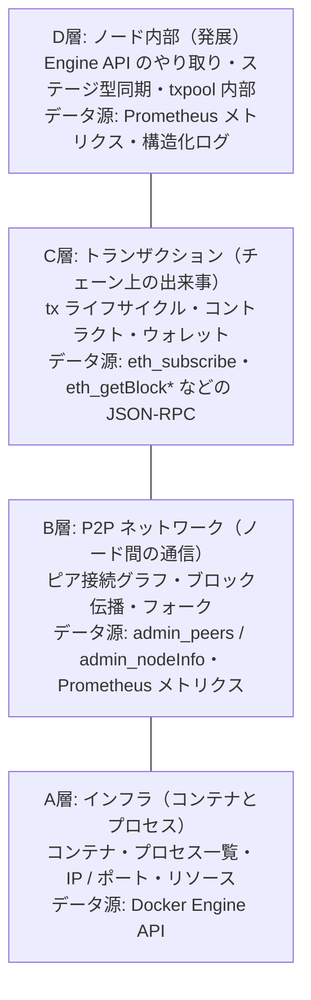
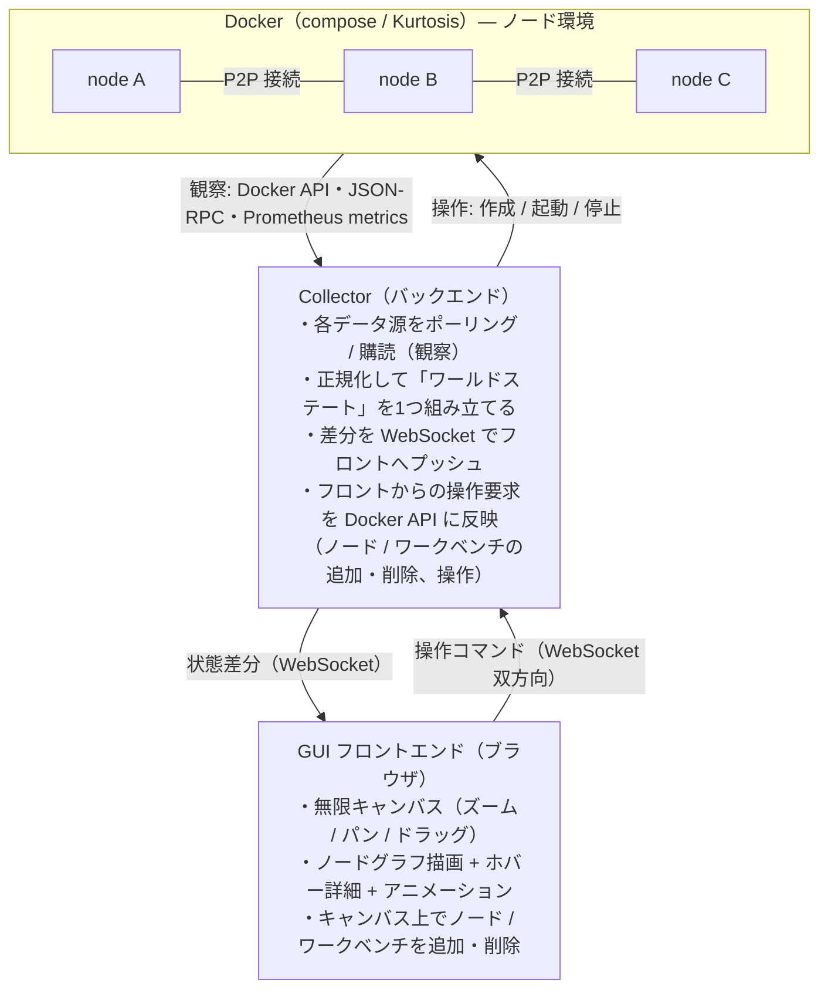
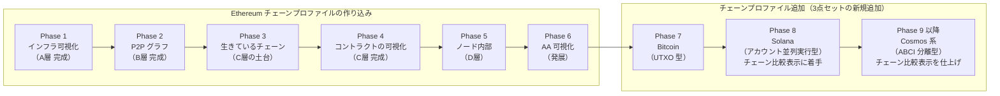

# chainviz — ブロックチェーン内部可視化キャンバス 構想メモ

## 一言でいうと

Docker 上に Ethereum ノード群を立ち上げ、その「ノード・プロセス・通信」をリアルタイムに
**Miro のようなインタラクティブキャンバス**で可視化する学習・開発支援アプリ。

ブロックチェーンシステムの開発を理解するために、普段はログや CLI の向こうに隠れている
ノードの内部動作を「見て・触って」把握できるようにする。

**対象チェーン**: 最初は Ethereum を軸に作る（reth / lighthouse、JSON-RPC、
Engine API など Ethereum のエコシステムに直接乗る）。ただし将来的に他チェーン
（Ethereum 以外の L1、あるいは EVM 互換チェーン）にも対応できるよう、
Collector 以降は Ethereum 固有の名前・概念に縛られない設計を心がける
（詳細は「アーキテクチャ案」参照）。

## 体験イメージ（UI コンセプト）

- 画面全体が無限キャンバス。ズーム・パン・ノードのドラッグ移動ができる（Miro / Figma 的操作感）
- Docker で起動した各ノードがキャンバス上のカードとして現れる
- **キャンバス上のボタン操作でノード/ワークベンチを追加・削除できる**。
  観察するだけでなく、環境そのものをその場で操作できる（後述）
- **マウスカーソルを当てると**その場でポップオーバー表示：
  - コンテナの IP アドレス・公開ポート
  - 中で動いているプロセス（`reth node`、`lighthouse bn` など）と CPU / メモリ
  - クライアント種別・バージョン、同期状態、ブロック高
- **ノード同士は「紐」（エッジ）でつながる**：
  - P2P のピア接続をエッジとして描画
  - どのチェーン（ネットワーク）に所属しているかをエッジの色やグループ枠で表現
  - ブロックが伝播すると、エッジ上をパルスが走るアニメーション
  - 紐にカーソルを当てると、それがどの P2P ネットワークの接続かと、
    ピア接続はノード発見によって時間とともに自動で増減する正常な動き
    であることがその場でわかる。画面隅の凡例にネットワークごとの色と
    接続数を常時表示し、ブートノード役（新規ノードが最初に接続する
    入口役）のノードはカード上のバッジで明示する
- **「最新状態が波のように広がる」様子を、ネットワーク全体で表現**（後述）
- ノードをクリックすると詳細パネル（mempool の中身、直近ブロック、ログのテール表示など）
- 画面上の専門用語（mempool、peer、gas など）はホバーでその場に解説が出る（後述の用語解説機能）
- **ユーザーが操作するマシン（ワークベンチ）もキャンバス上の1ノード**として、
  チェーンのノードと同じレベルで表示される（後述）
- **ウォレット（アドレス）もキャンバス上の要素**として表示され、残高・nonce・
  紐づく鍵の在り処（どのワークベンチが秘密鍵を持つか）が見える（後述）
- **デプロイされたスマートコントラクトもキャンバス上のカード**として表示される。
  特定のノードには紐付けず、「チェーンに複製され全ノードが同じ実行をする
  プログラム」であることをカード表現・用語解説で示す（後述）
- レイヤー切り替えで見る階層を変えられる。既定は全レイヤー同時表示で、
  レイヤーを選ぶとその層の要素だけが通常表示になり他は薄く残る
  「レンズ」方式（後述）
- **UI 言語は画面の片隅の切り替えボタンでいつでも変更できる**。デフォルトは
  日本語、対応言語はまず日本語・英語の2つ。オプション画面でデフォルト言語
  自体も変更できる（後述）

## ブロック伝播のリアルタイム表現

「新しいブロックがネットワーク全体に広がっていく」様子を、単発のエッジパルスより
一段リアルに見せる。B層（P2P ネットワーク）の核となる見せ場。

- **実際の受信タイミングで動かす**: 各ノードの `eth_subscribe`（newHeads）が
  新しいブロックを受け取った**実時刻**を Collector が記録し、その時刻差分で
  アニメーションを駆動する。演出として一斉に光らせるのではなく、
  「ノード A が最初に受信 → 0.3 秒後に B・C へ伝播 → さらに遅れて D」のように、
  実データに基づいた波として見せる
  - 時刻は Collector が newHeads を受信した時刻をそのまま使う。全ノードが
    同一 Docker ホスト上でシステムクロックを共有し、Collector までの
    ネットワークホップもほぼ均等に無視できるため、ノード側ログまで遡って
    補正する必要はない
  - ノード数が少なく同一ホスト内では伝播がミリ秒単位で終わり体感差が
    出にくいことがある。その場合はアニメーション側を誇張するのではなく、
    `tc netem` 等でノード間に人為的なネットワーク遅延を仕込み、本物の
    遅延を作り出して解決する
- **ノードの状態を色/発光で表現**: 各ノードカードに「最新ブロックに追従済みか」を
  色や発光の強さで表す。最新ブロックを受信した瞬間にパッと光り、次の新ブロックが
  出るまでその状態を保つ。追従が遅いノード（同期中・ネットワーク遅延）は
  暗いまま残るので、どのノードが遅れているか一目でわかる
- **フォーク（一時的な分岐）も表現**: 複数ノードが一瞬異なる tip を指す状態
  （フォーク直後の未収束状態）を、ノードの色分け（どちらの tip を見ているか）で
  区別して見せる。収束すると全ノードの色が揃う、という流れ自体が学習ポイントになる
- **状態のスコープ**: まずはブロックヘッダ（ブロック高・ハッシュ）の伝播を対象にする。
  状態（state root）レベルの変化まで見せるかは発展として別途検討

## 用語解説（グロッサリー）機能

学習支援アプリとしての柱。画面に登場する Blockchain / Contract 関連の用語を、
実データと突き合わせながらその場で理解できるようにする。

- **インライン解説**: UI 上の用語（ポップオーバーのフィールド名、詳細パネルの
  見出し、イベントラベルなど）に点線下線を付け、ホバーで定義をポップオーバー表示
  - 例: 「mempool」にカーソルを当てると定義 + 今まさに表示中の mempool の中身と
    対応していることがわかる
- **用語集パネル**: サイドパネルで全用語の一覧・検索。用語から関連するレイヤーや
  キャンバス上の該当要素へジャンプできる（例: 「peer」→ B層のエッジをハイライト）
- **用語データはコードから分離**: `glossary.yaml`（または JSON）に
  `キー / 用語名 / 定義 / 関連レイヤー / 関連用語 / 関連サービス / 他チェーンでの違い`
  を持たせ、UI からはキーで参照。用語の追加・修正だけならデータファイルの編集で
  済むようにする（`他チェーンでの違い` は複数チェーンプロファイルがそろってから
  埋まっていく任意項目。詳細は「チェーン比較表示」参照）
- **多言語対応**: 用語名・定義文などテキスト系フィールドは
  `{ja: "...", en: "..."}` の形で言語ごとに持たせる。対応言語は当面
  日本語・英語の2つのみ。UI 言語切り替え（画面隅のボタン／オプション画面の
  デフォルト言語設定）に連動して、参照する言語を切り替える。将来言語を
  追加する場合もキーを増やすだけで済む構造にしておく
- **関連サービス TIPS**: 定義本文とは別枠で、その概念を実際に扱っている
  実在サービス名を「TIPS」として一言添える。教科書的な定義だけでなく
  「実際に何がこれをやっているか」まで学べるようにする
  - 例: 「mempool」→ Blocknative Mempool Explorer / 「鍵管理・カストディ」→
    Fireblocks / 「RPC プロバイダ」→ Alchemy・Infura・QuickNode /
    「Bundler（AA）」→ Pimlico・Stackup / 「コントラクトウォレット」→
    Safe（旧 Gnosis Safe）/ 「L2」→ Arbitrum・Optimism・Polygon /
    「デプロイ」→ Foundry（forge/cast。chainviz のワークベンチが採用）・
    Hardhat（JS/TS ベース、プラグインが豊富）といった開発ツールの比較も
    ここで一言添える
  - `glossary.yaml` 側は `関連サービス: [{名前, 一言, url}]` の配列を持たせ、
    件数は 0〜数件（無理に埋めず、代表的なものだけ）
  - 実在サービスは変化が速い領域（買収・撤退・改名）なので、コードに埋め込まず
    データファイル側に閉じ込め、更新しやすくしておく
- **出典はリンクではなく「リソース」として持つ**: 定義の一次情報
  （EIP、公式ドキュメント、GitHub README など）を単なる脚注リンクにせず、
  `glossary.yaml` 側で名前を持つ1つのリソースとしてモデル化する
  （`出典: [{名前, url}]`。`関連サービス` と同じ配列構造）
  - **ホバーで逆引き**: キャンバスや用語集パネル上でその出典（リソース名）に
    マウスカーソルを当てると、そのリソースが解説対象にしている用語の一覧を
    画面右側のタブに表示する。「この一次資料は何を説明しているものか」を
    出典の側からも辿れる、用語→出典とは逆方向の導線になる
  - 同じ出典を複数の用語が指すのは自然なことなので、1つのリソースに
    複数用語がぶら下がる構造を前提にする
- **レイヤーと同じ刻みで拡充**: 各 Phase でそのレイヤーの用語を追加
  - A層（インフラ）: コンテナ、ポートマッピング、EL/CL クライアントなど
  - B層（P2P ネットワーク）: peer、network id、フォーク、ブロック伝播など
  - C層（トランザクション）: transaction、mempool、gas、nonce、contract、ABI、
    calldata、イベントログ、デプロイなど（Contract 系はここが中心）。
    チェーン分類としての L1（基盤チェーン）/ L2（ロールアップ）もここで解説する
  - D層（ノード内部）: Engine API、ステージ型同期、txpool 内部など
- **データの置き場所（メンテナンス性）**: `glossary.yaml` 1枚に全部詰め込まず、
  更新頻度・見直しの単位ごとにファイルを分ける。関連サービス TIPS は
  実在サービスの改名・買収・撤退で見直しが要る（人手でのメンテナンス前提）ため、
  他のフィールドと分けて1ファイルにまとめ、「このファイルだけ棚卸しすれば
  鮮度チェックが完結する」形にする
  ```
  glossary/
    ethereum/
      terms/
        a-infra.yaml     # A層の用語（用語名・定義・関連レイヤー/用語など）
        b-p2p.yaml       # B層
        c-tx.yaml        # C層
        d-internal.yaml  # D層
    bitcoin/ ...           # 他チェーンプロファイル追加時、同じ形で並べる
    solana/  ...
    cosmos/  ...
    services.yaml        # 関連サービス TIPS（用語キー → サービス一覧）。
                          # ここだけ定期的に見直せば鮮度チェックが完結する
    sources.yaml         # 出典リソース（リソース名 → url・対象の用語キー一覧）
    cross-chain.yaml     # 「他チェーンでの違い」。複数プロファイルにまたがる
                          # 内容なので特定チェーンのフォルダには置かない
  ```
  用語本体（terms）はレイヤー単位、チェーン間比較・出典・関連サービスは
  それぞれ横断的な関心事なので独立ファイルに分ける、という切り分けが基本方針

## チェーン比較表示（発展）

チェーンプロファイルが複数（Ethereum → Bitcoin → Solana → Cosmos系）そろって
きたら、「同じ概念がチェーンごとにどう違うか」をグラフィカルに比較できるように
する。知識として読むより、実際に並べて見るほうが学びになるという発想。

- **並べて表示**: 2つのチェーンプロファイルを選び、キャンバスを左右分割
  （または同一画面に重ねて）表示。例えば Ethereum の tx ライフサイクルと
  Bitcoin の UTXO 消費の流れを同時に眺めて、「アカウントベース」と「UTXO」の
  構造の違いを実際のアニメーションの違いとして体感する
- **層の有無を明示**: そのチェーンに存在しない層（例: 非 EVM チェーンの D層）は
  グレーアウトして「このチェーンにはこの概念がない」ことを積極的に見せる。
  存在しないことを隠すのではなく、違いとして提示する
- **用語解説と連動**: `glossary.yaml` の各用語に `他チェーンでの違い` という
  任意フィールドを持たせる（例: 「mempool」→ Ethereum は待機プールに保持、
  Solana はリーダーへ直接転送しため込まない、Bitcoin は手数料順に並ぶ待機プール）。
  複数プロファイルが存在する用語だけこの比較 TIPS が増えていく、という
  自然な育ち方にする
- **前提**: チェーンプロファイルが1つ（Ethereum）だけの間は作れない機能なので、
  Phase 8（2つ目のプロファイル = Solana 追加時点）から着手する

## 環境スナップショットの共有（発展）

いま見ている環境の状態を1枚のファイルに保存し、Docker 環境を持たない相手にも
渡して同じ景色を見てもらえるようにする。

- **エクスポート**: 「アーキテクチャ案」で触れている Collector の
  ワールドステート（全量スナップショット）を、そのまま JSON ファイルとして
  書き出すボタンを用意する。キャンバスの手動レイアウト（位置の永続化。前述）も
  同じファイルに含める。新しいスキーマを作る必要はなく、既存のスナップショット
  形式を1回ファイルに落とすだけ
- **含める範囲は「復元後の動きが壊れない最小限」**: 単純な瞬間スナップショット
  だけだと、読み込んだ側でブロック伝播の波アニメーションや tx ライフサイクル
  表示が再生できず不自然に静止した見た目になる。そのため tx 履歴・mempool の
  中身は全量ではなく、直近のブロック数件分＋その伝播タイミングのような
  「アニメーションの再生に足りる分だけの直近ウィンドウ」を持たせる。
  それ以前の履歴は保持しない（ファイル肥大化を避ける）
- **インポート / 静的表示モード**: 受け取った側は Docker もノードも動かして
  いなくても、そのファイルを chainviz に読み込ませるだけでキャンバス上に
  同じ状態を再現できる（WebSocket からのライブ差分の代わりに、ファイルの
  内容をそのまま描画する「静的モード」として動作させる）
- **含めないもの**: ワークベンチが保持する秘密鍵などの機密情報は対象外。
  ワールドステートはもともと公開情報（アドレス・残高・tx・ブロックなど）
  だけで構成する設計なので、素朴にエクスポートしても鍵が漏れる心配はない
- **発展の発展**: 単発のスナップショットだけでなく、差分イベントの時系列を
  録画しておけば「ブロック伝播の波」や「AA の UserOperation の流れ」といった
  “動き”そのものを録画・再生できる（セッションリプレイ）。まずは静止スナップ
  ショットから始め、余力があれば録画再生に広げる

## ユーザー操作マシン（ワークベンチ）の投影

ユーザーが tx 送信・コントラクトデプロイ・CLI 操作を行うマシン自体も Docker 上に
立て、チェーンのノードと**同じレベルのキャンバス上ノード**として投影する。
「自分の操作」がネットワークにどう波及するかを、外から観察するのではなく
グラフの内側の出来事として追えるようにする。

- **ワークベンチコンテナ**: Foundry（`cast` / `forge`）などの開発ツールを入れた
  コンテナを、ノード群と同じ Docker ネットワークに接続して起動する。
  **環境には複数のワークベンチを立てられる**ようにし、1 ワークベンチ = 1 人の
  ユーザー（登場人物）として扱う。「Alice のワークベンチ」「Bob のワークベンチ」
  のように分けることで、「誰が」操作したかをコンテナという実体そのもので
  区別できるようにする
- **同じスキーマで扱う**: Collector のワールドステート上では、ワークベンチも
  ノードと同種のエンティティ（種別が違うだけ）。A層のコンテナ情報
  （IP・プロセス・リソース）はそのまま無改造で見える
- **操作がエッジになる**: ワークベンチからノードへの JSON-RPC 呼び出し
  （`eth_sendRawTransaction`、`eth_call` など）をエッジ＋パルスで描画。
  「自分の tx がノード A の mempool に入り、B・C へ伝播する」一連の流れが
  1 つのアニメーションでつながる。観測は、ワークベンチとノードの間に挟んだ
  薄いロギングプロキシが受け取った RPC 呼び出しをログに残しつつそのまま
  転送し、そのログを Collector が拾ってワールドステートに組み込む方式で行う
- **GUI からの操作**（発展）: キャンバス上のワークベンチをクリックして
  ターミナルを開く（`docker exec` 相当）、あるいは定型操作
  （tx 送信・デプロイ）をボタン化する

## ウォレット・アカウントの可視化

「誰が」チェーンを操作しているかを、アドレス単位でキャンバスに表す。C層
（トランザクション）の一部として位置づけ、ワークベンチ・コントラクトと同じ
グラフの中に配置する。

- **ウォレット（EOA）をエンティティとして表示**: アドレス、残高、nonce、
  直近の tx 履歴をカードで表示。ノードやワークベンチと同様にホバー/クリックで詳細
- **鍵の在り処とのリンク**: ワークベンチ（秘密鍵を保持するコンテナ）から
  ウォレットへ「所有」のエッジを引く。基本形は**1 ワークベンチ = 1 ユーザー =
  1 つの主たる鍵**（＝上述の複数ワークベンチ運用）とし、「このエッジを辿れば
  誰の操作か一意に分かる」状態を優先する。1 ワークベンチが複数アドレス
  （複数鍵）を持つ場合（実務の Foundry キーストアのような使い方）にも技術的には
  対応できるようにしておくが、chainviz での主な見せ方は前者（誰が誰か区別できる
  複数ワークベンチ）とする
- **コントラクトウォレット（Smart Account）も同種の要素として表示**: EOA との
  違い（コードを持つ・独自の検証ロジックを持つ）をポップオーバーや用語解説で明示
- **データ源**: `eth_getBalance` / `eth_getTransactionCount`（nonce）を
  ウォレットとして追跡したいアドレスに対してポーリング、または対象アドレスが
  絡む tx をログ購読（`eth_subscribe` / `eth_getLogs`）で拾って差分更新

### アカウントアブストラクション（AA / ERC-4337）の可視化（発展）

ゆくゆく、Smart Account を使った操作フロー自体もグラフとして可視化する。
チェーンの本流の tx とは別の「もう一段上の層」が動いていることを目に見える形にする。

- **登場する新しいエンティティ**:
  - `UserOperation`（署名済みの「やりたい操作」。通常の tx とは別物）
  - Bundler（UserOperation を集めて本物の tx にまとめる役割）
  - EntryPoint コントラクト（Bundler が呼び出す、検証・実行の入口となるコントラクト）
  - Paymaster（ガス代の肩代わりをするオプションの仕組み）
- **描画イメージ**: ワークベンチ（または dApp）→ Bundler の alt-mempool
  （UserOperation 専用の待機列。通常の mempool とは別グラフ要素として区別）
  → EntryPoint.handleOps() 呼び出し → Smart Account の検証・実行、という
  多段の流れをエッジ＋パルスでつなげる。「普通の tx と何が違うか」が
  一目でわかることを目指す
- **位置づけ**: C層（トランザクション）の発展形。既存の tx ライフサイクル表示
  （Phase 3）が土台にある前提で、AA 対応チェーンでのみ追加要素として現れる
  レイヤーの上乗せにする（AA 非対応のチェーンでは何も増えない）
- **Bundler の実装**: 既存 OSS の **eth-infinitism/bundler**（ERC-4337
  リファレンス実装、TypeScript）を採用。alt-mempool の中身は、同実装が
  テストモードで対応する debug RPC（`debug_bundler_dumpMempool` 等）を
  ChainAdapter と同じ「RPC をポーリングする」パターンで取得する

## 可視化の階層（レイヤー）

最終的に 1 つのアプリ内で切り替えられるようにする。作る順番はこの順を想定。

切り替えは排他的な表示切り替え（選んだ層以外を消す）ではなく「レンズ」方式に
する: 既定は全レイヤーを同一キャンバスに同時表示し、レイヤーを 1 つ選ぶと
その層に属する要素（カード・エッジ・パルス）だけが通常表示のまま、他の要素は
低不透明度で薄く残る（ホバー・ポップオーバーは薄い要素でも機能する）。
「全部が見える」既定の見え方を壊さずに、注目したい層だけを浮かび上がらせる
（Issue #299 で決定。ユーザーの「現状の見え方も残しつつ、切り替えできると
嬉しい」という方向性に基づく。UX 設計の詳細は `docs/worklog/issue-299.md`）。

※ 階層の略号は A層〜D層 と呼ぶ。「L1」「L2」はブロックチェーン用語の
L1（基盤チェーン）/ L2（ロールアップ）と紛らわしいため使わない。

下から順（A層 → D層）に作る。上の層ほど「チェーンの中身」に近く、
下の層はチェーンを問わない土台になる:



### A層: インフラ（コンテナとプロセス）

- Docker コンテナの起動・停止・リソース使用状況
- コンテナ内プロセス一覧、IP・ポートマッピング
- データ源: Docker Engine API（`/containers/json`, `/containers/{id}/top`, `/containers/{id}/stats`）

### B層: P2P ネットワーク（ノード間の通信）

- ピア接続グラフ、チェーン（ネットワーク ID）ごとのグルーピング
- ブロック伝播・フォーク発生の様子
- データ源: JSON-RPC `admin_peers` / `admin_nodeInfo`、Prometheus メトリクス（reth は標準対応）

### C層: トランザクション（チェーン上の出来事）

- mempool 投入 → ブロック取り込み → 状態変化 のライフサイクルをアニメーション表示
- コントラクト呼び出しやイベントログの可視化:
  - デプロイされたコントラクトは、ノード・ワークベンチ・ウォレットと同格の
    キャンバス上のカードとして表示する。コントラクトは特定の 1 ノードの中で
    動くものではなく「チェーンに複製され、全ノードが同じ実行をするプログラム」
    なので、カードは特定のノードに従属させず、この誤解を招かない見せ方・
    用語解説をセットにする
  - 関数呼び出し（関数名・引数）と発生したイベントログは、チェーン
    プロファイルに同梱するサンプルコントラクト（最小の ERC20 トークンと
    カウンタ）のインターフェース定義（コントラクトカタログ）を使って
    人が読める形に復号して見せる。カタログに無いコントラクトも
    「未知のコントラクト」として存在自体は可視化する
  - ワークベンチからの定型操作（送金・トークン transfer・デプロイ・
    コントラクト関数呼び出し）をキャンバス上のボタンから実行できるようにする
    （「ユーザー操作マシン」の「GUI からの操作（発展）」のうち定型操作の
    ボタン化をこの層の仕上げとして取り込む）
- ウォレット（EOA / Smart Account）のアドレス・残高・nonce・所有関係の可視化。
  カタログに載っているトークンコントラクトがデプロイされたら、各ウォレットの
  トークン残高もここに加える（トークンの transfer で残高が動く様子を見せる）
- （発展）AA 対応チェーンでの UserOperation / Bundler / EntryPoint / Paymaster の可視化
- データ源: WebSocket `eth_subscribe`（newHeads / newPendingTransactions）、
  `eth_getBlock*`、`eth_getLogs`、`eth_getBalance` / `eth_getTransactionCount`
  （ウォレット追跡）、（発展）Bundler の RPC・EntryPoint の `UserOperationEvent` ログ

### D層: ノード内部（発展）

- 実行クライアント（EL）とコンセンサスクライアント（CL）の間の Engine API のやり取り
- reth のステージ型同期の進行状況、txpool の内部状態
- データ源: 各クライアントの Prometheus メトリクス、構造化ログ

## アーキテクチャ案



ポイント:

- **Collector が唯一の集約点であり、唯一の操作の窓口**。フロントは Docker や
  ノードに直接触らず、Collector が組み立てた統一スキーマ（ワールドステート）
  を見るだけでなく、ノードやワークベンチの追加・削除といった操作も
  Collector 経由でしか行わない。観察と操作の両方をこの1点に集約することで、
  後からデータ源・操作対象（別クライアント、別チェーン）を足してもフロントは
  変わらない
- 状態は「全量スナップショット + 差分イベント」の二段構え。
  接続直後はスナップショット、以後は差分だけ流す
- **チェーン対応は ChainAdapter で切る**: Collector 内部で「Ethereum 用の
  データ取得・正規化ロジック」を1枚のアダプタとして切り出す
  （`EthereumAdapter` が JSON-RPC / Engine API / Prometheus を叩いてワールド
  ステートに正規化する、というイメージ）。ワールドステートのスキーマ自体は
  `chainType`（例: `"ethereum"`）のようなフィールドを持たせつつ、フィールド名は
  「block」「peer」「mempool」など EVM 系チェーンに広く通用する語彙で設計し、
  Ethereum の RPC メソッド名（`eth_getLogs` 等）をスキーマに直接持ち込まない。
  実装は Ethereum 決め打ちで進めてよいが、この 1 枚の境界線だけは最初から意識する
- **非 EVM チェーンを見据えると、階層ごとの影響度が違う**（Bitcoin の UTXO 型、
  Solana のアカウント並列実行、Cosmos 系の ABCI 分離を比較して判明）:
  - A層（インフラ）: ほぼ無傷。コンテナ・プロセスという単位はチェーンを問わず共通
  - B層（P2P）: RPC の形はチェーンごとに全く違うが、「ピア」「伝播」という概念自体は
    存在するので ChainAdapter で吸収できる
  - C層（トランザクション）: **最も影響が大きい**。mempool・nonce・contract/ABI と
    いった語彙がチェーンによっては存在しない（UTXO 型に nonce はない）、あるいは
    構造ごと違う（Solana はリーダー転送方式でため込み型 mempool を持たない）ため、
    ワールドステートのスキーマを「EVM 系の語彙」のまま固定してよいか、非 EVM を
    実際に足す際に見直しが要る
  - D層（ノード内部/Engine API）: **Ethereum 固有の階層と割り切る**。EL/CL 分離は
    The Merge 後の Ethereum 特有の構成で、Bitcoin・Solana・Cosmos 系は基本的に
    合意と実行を1つのノードプロセスが担う（Cosmos の ABCI 分離は似て見えるが
    実装は別物）。非 EVM チェーンではこの階層は「無い」ものとして扱う
- **環境作成は「チェーンプロファイル」を選ぶところから始める**: チェーンごとに
  表現方法（どの階層が存在するか、mempool や D層 をどう見せるかなど）が変わる
  ため、環境を立ち上げる時点で対象チェーンを1つ選び、以下の3点をセットで
  切り替える単位として扱う
  - ノード環境テンプレート（compose / Kurtosis の構成一式）
  - Collector 側の ChainAdapter（そのチェーンの RPC を叩いてワールドステートに
    正規化するロジック）
  - フロント側の表現セット（どの階層をどう描画するか。例えば非 EVM チェーンの
    プロファイルでは D層 自体を持たない、C層 の mempool 表現を差し替える、など）
  - 最初は **Ethereum プロファイルのみ**を作り込む。他チェーンは「新しい
    チェーンプロファイルを1つ追加する」作業として後乗せしていく
    （既存の Ethereum プロファイルの実装には手を入れない）
- **キャンバス上でのノード/ワークベンチの追加・削除（操作）**: 環境作成時に
  決めた初期構成だけでなく、動いている環境に対しても後からノードやワークベンチを
  足したり止めたりできるようにする
  - 追加: フロントからの「追加」要求を Collector が受け取り、選択中の
    チェーンプロファイルのノード環境テンプレートに従って Docker Engine API で
    新しいコンテナを作成・起動する
  - **新しいノードが P2P に参加できるようにする**のが技術的な要点。genesis は
    生成時刻を埋め込む都合上ノード環境テンプレートに静的ファイルとして
    コミットできないため、環境起動時に一度生成し、その環境が動いている間は
    共有ボリュームとして全ノードにマウントして使い回す（同じ環境内であれば
    後から追加するノードも同じ生成済み genesis を参照するので「共有」自体は
    変わらない）。bootnode 情報は、ノードイメージに HTTP クライアントが無く
    `admin_nodeInfo` を Collector から問い合わせて渡す方式が使えないため、
    lighthouse（CL）の boot ENR 共有と同じ「boot 役が自分の接続情報を共有
    ボリュームへファイルとして書き出し、peer 役がそれを読む」方式に統一した
    （reth（EL）は固定の p2p 秘密鍵から enode を決定的に組み立てて書き出す。
    詳細は `profiles/ethereum/README.md`）
  - ワークベンチの追加は「1 ワークベンチ = 1 ユーザー」の運用に沿って、
    新しい登場人物を1人増やす操作として扱う（新しい鍵の生成込み）
  - 削除はコンテナを停止・削除する。コンテナ固有の観測データ（リソース・
    プロセス情報など）は観測対象が無くなり自然に消えるが、ウォレットの
    残高・nonce・tx 履歴は「チェーン側の状態」であってコンテナの持ち物では
    ないため削除後も残す。ワークベンチ削除時は、そのウォレットへの
    「所有」エッジに元の所有者が削除済みである旨を示しつつ、ウォレット
    自体のカードは残す

## 技術候補

### ノード環境（被可視化対象）

| 候補                                                                     | 特徴                                                                                                       |
| ------------------------------------------------------------------------ | ---------------------------------------------------------------------------------------------------------- |
| docker compose + reth `--dev` ×N                                         | 一番手軽だが各ノードが独立した別チェーンになり P2P が成立しない（B層以降には使えない）                     |
| docker compose + genesis 共有の PoS ネット（reth + lighthouse 最小構成） | genesis を共有した複数ノードで本物の P2P 接続・合意を観察できる                                            |
| Kurtosis ethereum-package                                                | EL+CL フルセットのマルチノード環境を1コマンド構築。最小バリデーター構成・短い slot time のプリセットも持つ |

→ reth は The Merge 後の実行クライアント専用設計で独自の PoA 合意機能を持たないため、
本格ネットは実質的に **reth（EL）+ lighthouse（CL）による PoS 一択**。
バリデーター数を絞り slot time を短く（1〜2 秒程度）設定すれば、待ち時間も小さく抑えられる
（署名や合意そのものの計算コストは PoW のマイニングと違って元々軽い）。
Phase 1〜2 は compose で 2〜3 ノードの最小 PoS 構成から始め、D層（ノード内部）の段階で
セットアップの手間を減らすために Kurtosis への切り替えを検討する。

### キャンバス描画

| 候補           | 特徴                                                                            |
| -------------- | ------------------------------------------------------------------------------- |
| React Flow     | ノード＋エッジ＋ズーム/パン/ドラッグが最初から揃っている。Miro 的 UI の最短経路 |
| d3-force + SVG | 自由度最大だが操作系を全部自作することになる                                    |
| PixiJS         | 数百ノード超の大規模描画向け。今回の規模では過剰か                              |

→ **React Flow を第一候補**。物理配置が欲しくなったら d3-force をレイアウト計算だけに使う併用も可能。

### バックエンド（Collector）

| 候補                                    | 特徴                                                     |
| --------------------------------------- | -------------------------------------------------------- |
| TypeScript (Node.js) + viem + dockerode | フロントと言語統一、型を共有できる。WebSocket 購読も自然 |
| Python + web3.py + docker-py + FastAPI  | 書き慣れている場合はこちら。asyncio で購読も可能         |

→ フロントが React 確定なら **TypeScript 統一**が保守しやすい（スキーマ型を共有できる）。

## ロードマップ（MVP の刻み方）

Phase 1〜6 はすべて「Ethereum チェーンプロファイル」を作り込む工程。
他チェーンの追加は、この一式が完成した後の別プロファイルとして扱う（後述）。



1. **Phase 1 — インフラ可視化**:
   compose で reth ノードを2台起動。キャンバスにコンテナが並び、
   ホバーで IP・プロセス・リソースが見える（A層 完成）。
   ワークベンチコンテナもこの時点で compose に加えておく
   （A層の仕組みだけで他ノードと同様に表示される）
2. **Phase 2 — P2P グラフ**:
   ノードをピア接続させ、エッジ描画とチェーン所属のグルーピング表示（B層 完成）。
   各ノードの newHeads 受信タイミングを記録し、実データに基づくブロック伝播の
   波アニメーションもここで作る
3. **Phase 3 — 生きているチェーン**:
   ブロック生成・tx 投入をリアルタイム反映。ブロック伝播パルス、tx ライフサイクル表示。
   tx 投入はワークベンチから行い、ワークベンチ → ノードの RPC 呼び出しも
   エッジとして描画する。ワークベンチが持つウォレット（アドレス・残高・nonce）も
   このタイミングで可視化に加える（コントラクト呼び出し・イベントログの
   可視化は Phase 4 へ先送り）
4. **Phase 4 — コントラクトの可視化（C層 完成）**:
   Phase 3 で先送りにしたコントラクト呼び出し・イベントログの可視化を
   仕上げる。チェーンプロファイルにサンプルコントラクト（最小の ERC20
   トークンとカウンタ）を同梱し、デプロイされたコントラクトをキャンバス上の
   カードとして表示、関数呼び出し（関数名・引数）と発生したイベントログを
   人が読める形に復号して見せる。あわせて送金・トークン transfer・デプロイと
   いった定型操作をキャンバス上のボタンから実行できるようにし
   （「GUI からの操作」の前倒し）、「支払いのような一般的な操作」を GUI で
   体験しながら、コントラクトが特定ノードではなく全ノードで実行される
   プログラムであることを用語解説とセットで学べるようにする
5. **Phase 5 — ノード内部**:
   EL/CL 構成（Kurtosis 検討）にして Engine API・同期ステージを可視化（D層）
6. **Phase 6 — AA 可視化（発展）**:
   AA 対応チェーン環境（EntryPoint・Bundler を含む）を構築し、UserOperation の
   alt-mempool 投入から EntryPoint.handleOps() 実行までの流れを、通常の tx フロー
   と見分けられる形でグラフに追加する
7. **Phase 7 — Bitcoin プロファイル追加**:
   UTXO 型の非 EVM チェーンとして最初に追加。ノード環境テンプレート・
   ChainAdapter・フロント表現セットの3点セットを新規に作る
   （既存の Ethereum プロファイルには手を入れない）
8. **Phase 8 — Solana プロファイル追加**:
   アカウント並列実行型を追加。Bitcoin で1周してプロファイル追加の型ができて
   いる前提で、2つ目からは「チェーン比較表示」（後述）も作り始める
9. **Phase 9 以降 — Cosmos 系プロファイル追加**:
   ABCI 分離型を追加し、3チェーン目としてチェーン比較表示を仕上げる

各 Phase が単体で「動くデモ」になるように刻む。
用語解説は各 Phase でそのレイヤーの用語を `glossary.yaml` に追加していく
（Phase 1 でインライン解説の仕組み自体を作り、以後はデータ追加が中心）。
環境スナップショットの共有は、ワールドステートの土台ができる Phase 1 以降
いつでも追加できる発展機能なので、どこかの Phase の合間に余力があれば挟む。

## 未決事項

- [x] リポジトリ名 `chainviz` のままでよいか → `chainviz` で確定
- [x] プライベートネットの合意方式 → genesis 共有の PoS ネット（reth + lighthouse 最小構成、
      バリデーター数を絞り slot time を短縮）に決定。理由・詳細は「技術候補 > ノード環境」参照
- [x] Collector のポーリング間隔 → いったん 3 秒に設定。stats API は重めのため、
      実装後に負荷を見ながら調整する
- [x] 対象チェーンの方針 → 最初は Ethereum に絞って実装するが、Collector は
      ChainAdapter で切り分け、他チェーン（EVM 互換 or それ以外）を後から
      足せる設計にする（詳細は「アーキテクチャ案」参照）
- [x] Ethereum 以外のチェーンをどこまで見据えるか → 非 EVM チェーンまで視野に入れて
      進める（Bitcoin=UTXO型、Solana=アカウント並列実行、Cosmos系=ABCI分離、を
      比較検討し、C層のスキーマ設計・D層の扱いへの影響を「アーキテクチャ案」に反映）
- [x] 環境作成の単位 → チェーンごとに「ノード環境テンプレート・ChainAdapter・
      フロント表現セット」の3点セットを「チェーンプロファイル」として切り替える。
      Ethereum プロファイルを作り込んでから他チェーンを追加する
      （詳細は「アーキテクチャ案」「ロードマップ」参照）
- [x] 非 EVM チェーンの着手順（Phase 7 以降） → 知名度順に決定。
      ① Bitcoin（UTXO型）② Solana（アカウント並列実行型）③ Cosmos系（ABCI分離型）
      の順で1つずつプロファイルを追加していく
- [x] キャンバス上の配置の永続化 → 保持する方向で決定。手で並べたレイアウトは
      再読み込み後も復元したい。ただし Docker のコンテナ ID は再起動のたびに
      変わるため、位置はコンテナ ID ではなく安定した識別子（コンテナ名 /
      ノードのアドレス・enode ID など）をキーに保存する必要がある。
      まずはブラウザの localStorage に保存する程度から始め、環境をまたいで
      共有したくなったらバックエンド側の永続化を検討する
- [x] 環境スナップショットのファイル仕様 → 全履歴ではなく「復元後にアニメーション
      が壊れない最小限の直近ウィンドウ」（直近ブロック数件分＋伝播タイミングなど）
      を含める方針に決定（詳細は「環境スナップショットの共有」参照）。
      具体的な件数・秒数は実装時に調整。録画再生機能まで作るかは別途判断
- [x] UI・用語解説の言語 → デフォルト日本語、画面隅の切り替えボタンでいつでも
      変更可能、オプション画面でデフォルト言語自体も変更できる。対応言語は
      当面日本語・英語の2つのみ（詳細は「体験イメージ」「用語解説」参照）
- [x] 用語解説の定義文の出典の示し方 → 出典を単なるリンクではなく
      「リソース」としてモデル化し、リソースにホバーするとそのリソースが
      解説対象にしている用語一覧を画面右側のタブに表示する逆引き UI にする
      （詳細は「用語解説」参照）
- [x] 関連サービス TIPS の鮮度維持の仕組み → 自動化はせず手動メンテナンス前提。
      その代わり `services.yaml` を他の用語データと分離し、この1ファイルだけ
      棚卸しすれば鮮度チェックが完結するファイル構成にする
      （詳細は「用語解説」の「データの置き場所」参照）
- [x] 関連サービスの選定基準 → 個人利用のため厳密な基準は設けない。
      自分が学びになる・実際に触ったことがあるサービスを気軽に載せてよい
- [x] ワークベンチの RPC 呼び出しの観測方法 → 薄いロギングプロキシを挟む方式に
      決定。ワークベンチの接続先をノードではなくプロキシに向け、受け取った
      RPC 呼び出しをログに残してそのまま転送する。Collector がそのログを
      拾ってワールドステートに組み込む
- [x] ワークベンチに入れるツールセット → いったん Foundry のみで進める。
      Hardhat は必要になったタイミングで検討。Foundry と Hardhat の違いは
      実装を待たず、用語解説の「デプロイ」の関連サービス TIPS で先に解説する
      （詳細は「用語解説」参照）
- [x] ウォレット（ワークベンチ）と鍵の対応 → 案B（1 ワークベンチ = 1 ユーザー）を
      基本形に決定。環境には複数の VM/コンテナを立て、それぞれ別々の登場人物
      として扱うことで「誰が操作したか」をコンテナという実体そのもので区別
      する。1 ワークベンチに複数鍵を持たせる案Aの構成にも技術的には対応できる
      ようにしておくが、主な見せ方ではない（詳細は「ユーザー操作マシン」
      「ウォレット・アカウントの可視化」参照）
- [x] AA（ERC-4337）のBundler実装の選定 → 既存 OSS の
      **eth-infinitism/bundler**（ERC-4337 リファレンス実装、TypeScript で
      Collector と言語が揃う）を採用。alt-mempool の観測は、同実装がテスト
      モードで対応する debug RPC 名前空間（`debug_bundler_dumpMempool` 等）を
      ChainAdapter と同じ「RPC をポーリングする」パターンでそのまま使う。
      機能不足が判明したら自前の最小実装への切り替えを検討する
- [x] ブロック伝播の波アニメーションの時刻取得 → Collector が newHeads を
      受信した時刻をそのまま使う（ノード側ログへの遡り補正はしない）。
      全ノードが同一 Docker ホスト上でシステムクロックを共有し、
      Collector までのネットワークホップもほぼ均等に無視できるため、
      相対的な伝播順序・間隔を見せる目的には十分な精度が出る。
      体感差が出にくい問題は、アニメーション側を誇張するのではなく
      `tc netem` 等でノード間に人為的なネットワーク遅延を仕込むことで
      本物の遅延を作り出して解決する（「実データに基づく波」という
      設計方針を崩さない）
- [x] Collector を「観察だけでなく操作もできる窓口」にする → 決定。
      キャンバス上でノード/ワークベンチの追加・削除ができるようにする
      （詳細は「アーキテクチャ案」参照）
- [x] 新規ノード追加時の P2P 参加方法 → 決定。genesis は生成時刻を埋め込む
      ため静的ファイルとしてコミットはできず、環境起動時に一度生成して
      共有ボリュームとして全ノードにマウントする（同じ環境内で後から
      ノードを追加する場合も同じ生成済み genesis を参照する）。bootnode
      情報は、ノードイメージに HTTP クライアントが無く `admin_nodeInfo` を
      Collector 経由で渡す方式が使えなかったため、lighthouse（CL）の boot
      ENR 共有と同じ「boot 役が自分の接続情報を共有ボリュームへファイルで
      書き出し、peer 役がそれを読む」方式に統一した（reth（EL）は固定の
      p2p 秘密鍵から enode を決定的に組み立てて書き出す。ステップ5・
      Issue #44 で実装）
- [x] コントラクト呼び出し・イベントログの可視化（Phase 3 で先送りにした分）の
      位置づけ → 新しい Phase 4（C層 完成）として繰り込み、旧 Phase 4 以降は
      1 つずつ後ろへずらす（D層 → Phase 5、AA → Phase 6、Bitcoin → Phase 7、
      Solana → Phase 8、Cosmos 系 → Phase 9）。あわせて「GUI からの操作」の
      うち定型操作のボタン化（送金・デプロイ・コントラクト呼び出し）も
      この Phase に取り込む（「支払いのような一般的な操作を GUI で体験できる」
      ことがこの Phase の狙いのため）
- [x] コントラクトの ABI（インターフェース定義）の扱い → チェーンプロファイルに
      サンプルコントラクトのソースと「コントラクトカタログ」（表示名・
      インターフェース定義を持つデータファイル）を同梱し、Collector の
      ChainAdapter がカタログを読んで関数呼び出し・イベントログを復号する。
      ワールドステートには復号済みの結果（関数名・引数・イベント名）だけを
      チェーン非依存の語彙で載せ、ABI そのものはフロントへ渡さない
      （ChainAdapter 境界の維持）。カタログに無いコントラクトは
      「未知のコントラクト」として存在だけを可視化する
- [x] 「コントラクトはどこで動いているか」の見せ方 → 特定ノードに従属しない
      独立したカードとして描き、「チェーンに複製され全ノードが同じ実行をする
      プログラム」であることをカード上の表現と用語解説で明示する（特定の
      1 ノードの中で動いているという誤解を積極的に防ぐ。ブロックチェーンの
      性質上「動いている場所」を 1 点で指し示すことはできない）
- [x] D層（Phase 5）の環境構成とデータ源 → 「EL/CL 構成にして」は Phase 2
      以降の compose 構成（reth + lighthouse、Engine API + JWT）で既に実現
      済みであり、構成変更は不要。「Kurtosis 検討」は**不採用**で確定
      （compose 構成が安定稼働しており、移行すると addNode/removeNode・
      genesis 自動再生成・E2E テストの前提が壊れる一方、得られるはずだった
      セットアップ簡略化は既に不要のため）。データ源は各クライアントの
      Prometheus メトリクスのみとし、構造化ログのパースは採らない
      （現スコープはメトリクスで足りる。呼び出し 1 回ごとの離散イベントが
      必要になった時の拡張手段として残す）。Engine API のやり取りは受け手で
      ある reth 側のメトリクスで観測する（詳細は
      `docs/ARCHITECTURE.md` §7）
- [x] ノード/ワークベンチを削除したときの過去データの扱い → データの種類で
      分けて決定。コンテナ固有の観測データ（CPU/メモリ、プロセス情報、
      ピア接続状況）は観測対象が無くなるので自然に消える。一方ウォレットの
      残高・nonce・tx 履歴は「コンテナの持ち物」ではなく「チェーン側の状態」
      なので削除後も残す（チェーンに直接問い合わせれば返ってくる実データを
      可視化から消すと実態とズレるため）。ワークベンチを削除した場合、
      そのウォレットへの「所有」エッジは元の所有者が削除済みである旨を
      示しつつ、ウォレット自体のカードは残す
